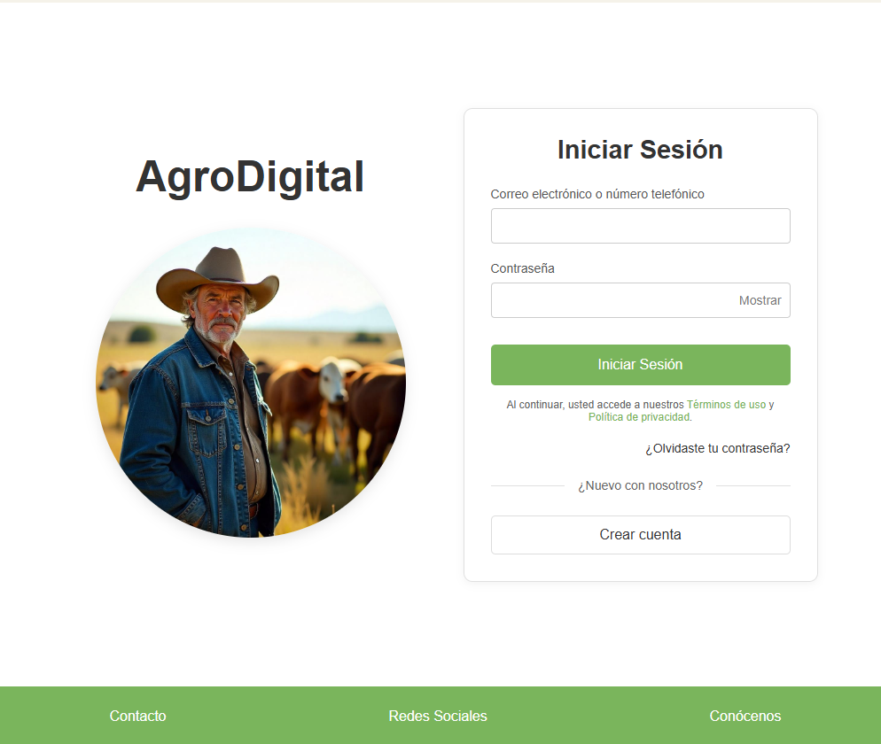
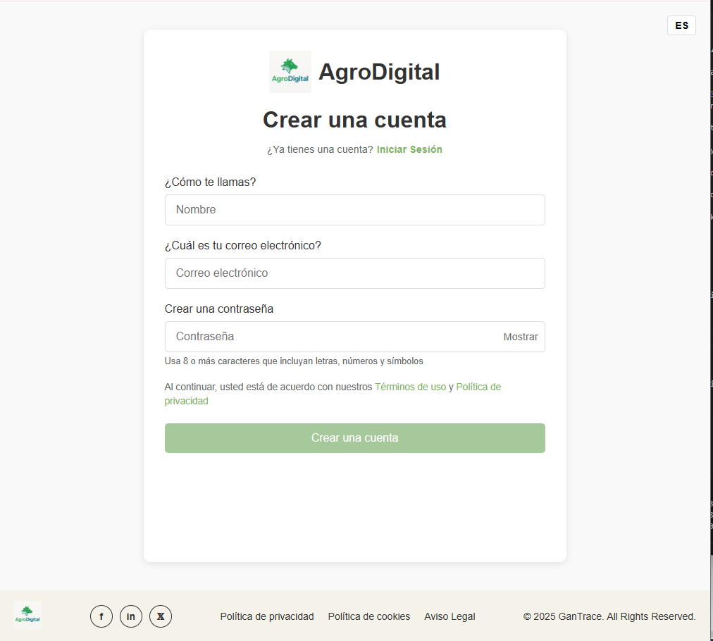
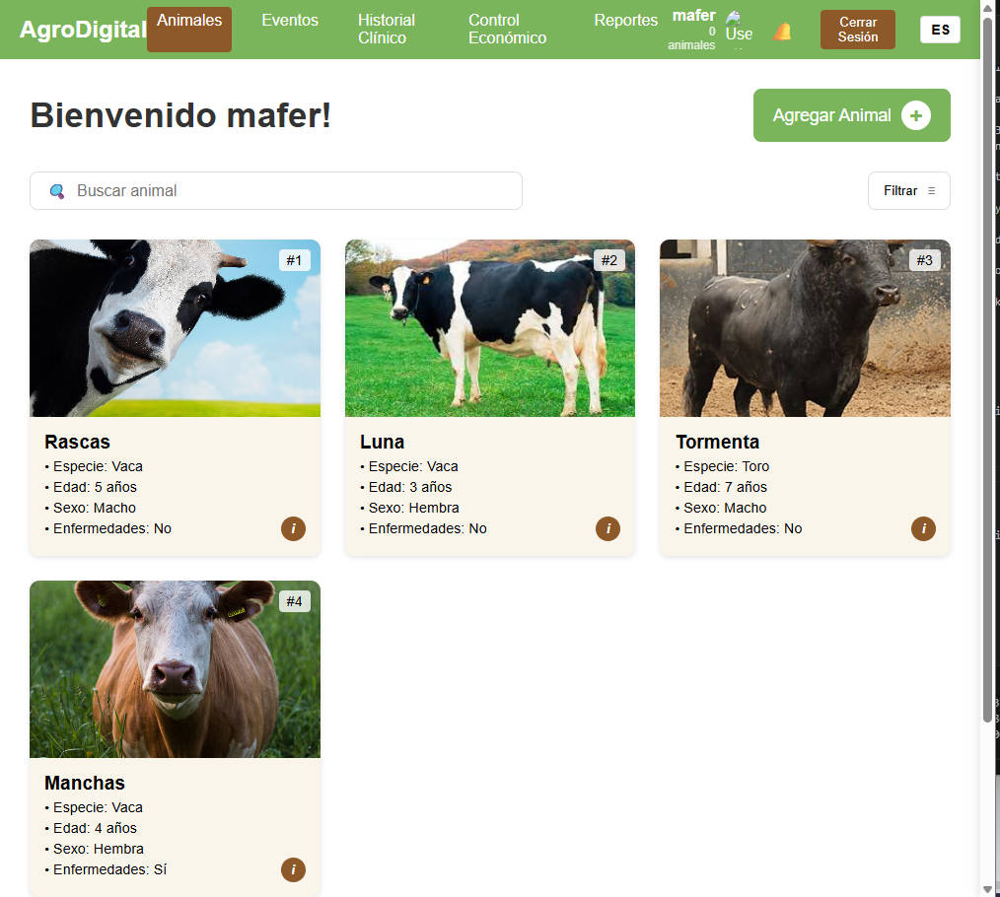
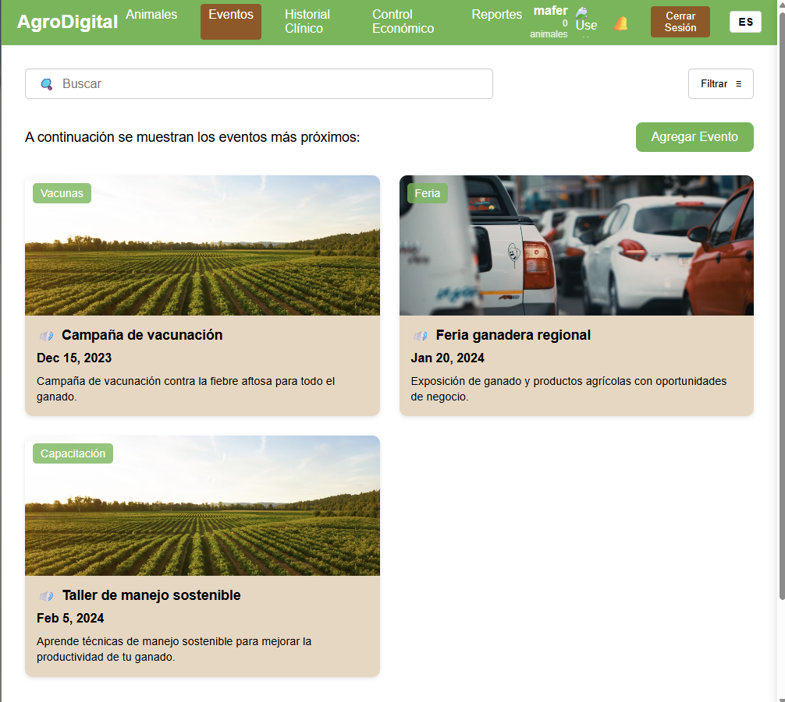
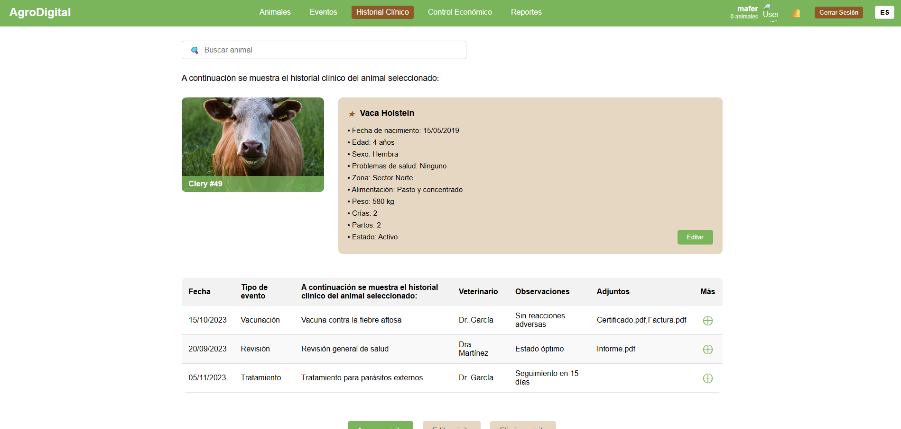

<h1 style="text-align: center;"> Informe del Trabajo Final </h1>
<h3 style="text-align: center;"> Universidad Peruana de Ciencias Aplicadas </h3>

<h5 style="text-align: center"> Ingeniería de Software </h5>

<h5 style="text-align: center"> Desarrollo de Aplicaciones Open Source - 1ASI0729 </h5>

<h5 style="text-align: center"> Docente: Rafael Oswaldo Castro Veramendi </h5>

<h5 style="text-align: center"> Startup: GanTrace </h5>

<h5 style="text-align: center"> Producto: AgroDigital </h5>

## Team members:

| Nombre                                      | Código     |
|:--------------------------------------------:|:----------:|
| Guerrero Tomas, Nelson Fabrizio             | U202222745 |
| Peña Riofrio, María Fernanda                | U202113279 |
| Pilares Pocohuanca, María                   | U202215528 |
| Salvador Rodriguez, Rodrigo Jesus            | U202213646 |
| Sanchez Silva, Luciana Celeste              | U202215979 |

<h5 style="text-align: center"> Ciclo 2025-010 </h5>

## Registro de versiones del informe

|Versión|Fecha|Autor|Descripción de modificación|
|:-:|:-:|:-:|-|
|1.0|09/04/2025|Guerrero, Peña, Pilares, Salvador, Sanchez|Creación del documento de trabajo en formato markdown|
|1.1|10/04/2025|Salvador R.|Desarrollo del capítulo 1 completo del documento en formato markdown|
|1.2|13/04/2025|Sanchez L.|Desarrollo del capítulo 4.1 del documento en formato markdown al 4.4|
|1.3|17/04/2025|Salvador R.|Creación del logo de la startup y el servicio/producto|
|1.4|17/04/2025|Salvador R.|Actualización de la información de la startup profile|
|1.5|19/04/2025|Sanchez L.|Actualización del ui design, incluyendo landing page y web application|
|1.6|19/04/2025|Peña M.|Desarrollo del Domain-Driven Software Architecture, Software Object-Oriented Design y Database Design|
|1.7|19/04/2025|Salvador R.|Desarrollo del ToBe Scenario Mapping, User Stories, Impact Mapping y Product backlog|
|1.8|20/04/2025|Salvador R.|Avance del Capítulo V: Product Implementation, Validation & Deployment (del 5.1 al 5.1.4)|
|1.9|20/04/2025|Guerrero N.|Desarrollo del Capítulo II: User Personas, User Task Matrix, User Journey Mapping, Empathy and As-Is Scenario Mapping|
|1.10|20/04/2025|Peña M., Salvador R.|Desarrollo del Capítulo V: Landing Page Services & Applications Implemention|
|2.1|08/05/2025|Salvador R.|Inicio del Desarrollo del Frontend Web Applications|
|2.2|14/05/2025|Salvador R.|Finalización del primer avance del Frontend Web Applications|
|2.3|14/05/2025|Salvador R.|Desarrollo de Correcciones en base al TB1 y desarrollo del Sprint 2|
|2.4|14/05/2025|Pilares M.|Desarrollo de Correcciones en base al TB1 (Ortografía, links, imágenes)|
|2.5|14/05/2025|Guerrero N.|Desarrollo de correcciones en el User Story y Product Backlog|
|2.6|14/05/2025|Peña M.|Desarrollo de Correcciones del Product Design (Diagramas)|
|2.7|14/05/2025|Peña M.|Desarrollo del Sprint 2|
|3.1|12/06/2025|Sanchez L.|Corrección de secciones del frontend|
|3.2|15/06/2025|Sanvador R.|Inicio del Desarrollo del Backend Web Applications|
|3.3|19/06/2025|Sanchez L.|Desarrollo de las validation interviews|
|3.4|20/06/2025|Guerrero N.|Desarrollo de correcciones en el User Story y Frontend Web Applications|
|3.5|20/06/2025|Peña M.|Desarrollo del Sprint 3|
|3.6|20/06/2025|Pilares M.|Desarrollo del Sprint 3|

## Project Report Collaboration Insights

URL del repositorio para el reporte del proyecto: (https://github.com/GanTrace/upc--2510-daos-4344-fp-grupo4)
URL del repositorio para el Landing Page: (https://github.com/GanTrace/LandingPage-AgroDigital)
URL del repositorio para el desarrollo del frontend web applications: (https://github.com/GanTrace/AgroDigital--FrontendApp)
URL del repositorio para el desarrollo del Backend Web Services: (https://github.com/GanTrace/AgroDigital-Backend)

**TB1**

Para el desarrollo del informe perteneciente a la entrega TB1, se dividió la implementación de secciones de la siguiente forma para cada integrante del equipo:

|Integrante|Tareas Asignadas|
|-|-|
|Nelson Guerrero|Desarrollo del Capítulo II: Analisis Competitivo 2.1.1, así como la parte final del Capítulo II, del 2.3.3 al 2.3.5|
|María Peña|Desarrollo del Capítulo IV: Product Design del 4.6 al 4.8.1|
|María Pilares| Desarrollo del Capítulo II: Requirements Elicitation & Analysis, del 2.1 al 2.3.1|
|Rodrigo Salvador|Desarrollo del Capítulo I: Introducción, Capítulo III: Requirements Specification y Capítulo V: Product Implementation, Validation & Deployment del 5.1 al 5.1.4|
|Luciana Sanchez|Desarrollo del Capítulo IV: Product Design del 4.1 al 4.4. del documento en formato markdown. Incluyendo diseño del landing page y web application|

El proceso de colaboración en el informe se realizó mediante commits constantes al repositorio de la organización GanTrace.

**TP**

Para el desarrollo del informe perteneciente a la entrega TP, se dividió la implementación de secciones de la siguiente forma para cada integrante del equipo:

|Integrante|Tareas Asignadas|
|-|-|
|Nelson Guerrero|Correciones de las User Stories y Product Backlog|
|María Peña|Correcciones del Capítulo IV: Product Design del 4.6 al 4.8.1|
|María Pilares|Desarrollo de correcciones del documento y Avance del Sprint 2|
|Rodrigo Salvador|Desarrollo de correcciones, Sprint 2 y desarrollo del Frontend Web Applications|
|Luciana Sanchez|Desarrollo de correcciones del documento, Mejoras del Landing Page y Avance del Sprint 2|

**TB3**

Para el desarrollo del informe perteneciente a la entrega TB3, se dividió la implementación de secciones de la siguiente forma para cada integrante del equipo:

|Integrante|Tareas Asignadas|
|-|-|
|Nelson Guerrero|Desarrollo de las validations interviews, correcciones del Frontend (i18n y footer) y documentación (user stories, ortografía, etc)|
|María Peña|Desarrollo de la documentación del Sprint 3 y correcciones de sprints pasados|
|María Pilares|Desarrollo de la documentación del Sprint 3 y correcciones de sprints pasados|
|Rodrigo Salvador|Desarrollo de mejorías y correcciones en el frontend web applications e inicio del Backend Web Services|
|Luciana Sanchez|Desarrollo de las validations interviews y documentación del Sprint 3|

El proceso de colaboración en el informe se realizó mediante commits constantes al repositorio de la organización GanTrace.

**Github Collaboration Insights**

Github también presenta un timeline de las ramas principales y los procesos de merge a los que se han sometido. Todas las ramas se crearon tomando en cuenta el diseño de GitFlow para una buena organización cuando se usa un software de control de versiones.

Los integrantes son:

* Nelson Guerrero (Nelsoondev)
* María Peña (mariafep)
* María Pilares (mariapilares)
* Rodrigo Salvador (Rodrigojsr12)
* Luciana Sanchez (Luccsss)

Se explican las ramas más prominentes:

- **main**: Es representada por el color blanco. Se trata de la rama principal del proyecto y se actualiza para cada entregable.
- **develop**: Es representada por el color morado. Se trata de la rama principal para el proceso del desarrollo del proyecto.
- **feature-sprint1**: Es representada por el color morado. Esta rama incluye los artefactos relacionados al sprint 1 en el informe.
- **feature-sprint2**: Es representada por el color celeste. Esta rama incluye los artefactos relacionados al sprint 2 en el informe.
- **feature-sprint3**: Es representada por el color verde. Esta rama incluye los artefactos relacionados al sprint 3 en el informe.
- **release1.0**: Es representada por el color azul. Esta rama incluye los puntos trabajados y corregidos en el proyecto.

Los siguientes gráficos representan analíticos de commits en el repositorio del informe. En los gráficos se incluye la cantidad de lineas de texto añadidas por cada integrante del equipo. 

**TB1**

**TP**

**TB2**

.png)
.png)
.png)

.png)

## Student Outcomes
|Criterio especifico|Acciones realizadas|Conclusiones|
|-|:-|-|
|Comunica en forma escrita ideas y/o resultados con objetividad a público de diferentes especialidades y niveles jerarquicos, en el marco del desarrollo de un proyecto en ingeniería|**Nelson Guerrero**   TB1: Para esta primera entrega del proyecto, me he encargado de realizar secciones del Capítulo II, como el análisis competitivo y el needfinding, haciendo uso de las herramientas adecuadas.   **TP:** Para la entrega final, documenté los procesos técnicos del módulo de reportes y actualicé la documentación API.   **TB2:** Para esta tercera entrega del proyecto me he encargado de ver correcciones en el frontend, para un apartado de mejoras, como el i18n o la mejora del footer.   **María Peña**   TB1: Para la primera entrega realicé el capítulo 4 la creación de los diagramas de contexto, de componentes y de contenedor con c4, diagrama de clases y base de datos.   **TP:** En la fase final, redacté los manuales técnicos y de usuario para los nuevos módulos implementados.   **TB2:** Para esta tercera entrega me he encargado de desarrollar los puntos de la documentación del Sprint 3, además de ver correcciones y opciones de mejora para el proyecto en general.  **María Pilares**   TB1: Para la primera entrega, comuniqué por escrito de manera clara y efectiva el análisis de los competidores, el diseño de las entrevistas y la creación de user personas.   **TP:** Elaboré la documentación completa del sistema de notificaciones y actualicé el registro de versiones del proyecto.   **TB2:** Para esta tercera entrega me he encargado de desarrollar los puntos de la documentación del Sprint 3, además de ver correcciones y opciones de mejora para el proyecto en general.   **Rodrigo Salvador**   TB1: En el informe me he encargo de la realización del capítulo 1, el desarrollo de los puntos importantes de la startup profile, los lean ux y los segmentos objetivos. Además de la resolución del capítulo 3, en donde se definieron las user stories que se desarrollarán en el proyecto.   **TP:** Coordiné la redacción del paper técnico que describe la arquitectura final del sistema y su implementación.   **TB2:** Para esta tercera entrega me he encargado del desarrollo completo del Frontend web applications en su mejora total de todos los apartados, además de ello comencé con el desarrollo del Backend Web Services para su funcionamiento junto al Frontend, creando los endpoints necesarios para ser tomados en cuenta en esta entrega.  **Luciana Sanchez**   TB1: Para el trabajo se definen las reglas de diseño y organización de un sitio web, incluyendo su estilo visual, estructura de contenido y navegación.   **TP:** Documenté los procesos de diseño finales y creé las guías de estilo para desarrolladores frontend.   **TB2:** Para esta tercera entrega me he encargado de desarrollar los puntos de la documentación del Sprint 3, además realizar las validations interviews que forman parte del proyecto.|El documento redactado se presenta como un sustento escrito para todo aquel que desee conocer a detalle los pasos seguidos para planificar, desarrollar y enviar el proyecto a producción|
|Comunica oralmente sus ideas y/o resultados con objetividad a público de diferentes especialidades y niveles jerarquicos, en el marco del desarrollo de un proyecto en ingeniería.| **Nelson Guerrero**   TB1: Para este entregable fue necesario aprender el uso de nuevas herramientas y tener buena comunicación con el equipo para colaborar de manera uniforme y apoyarnos ante cualquier evento.   **TP:** Presenté la demo del módulo de reportes económicos en la revisión final con stakeholders.  **TB2:** Para este tercer entregable fue necesario el conocimiento previo adquirido a lo largo del curso, además de guías tutoriales en base a lo realizado por nuestro profesor hasta la fecha.   **María Peña**   TB1:  A la hora de realizar el trabajo me comuniqué con mis compañeros sobre las mejoras del trabajo progresivamente..   **TP:** Coordiné las reuniones técnicas para la integración de APIs externas y presentación de avances.   **TB2:** Para este tercer entregable fue necesario el conocimiento previo adquirido a lo largo del curso, además de guías tutoriales en base a lo realizado por nuestro profesor hasta la fecha.  **María Pilares**   TB1: A lo hora de realizar el trabajo comunique activamente mis avances y desarrollo del proyecto a mi equipo de trabajo.   **TP:** Expuse el funcionamiento del sistema de notificaciones en las revisiones de sprint con el cliente.   **TB2:** Para este tercer entregable fue necesario el conocimiento previo adquirido a lo largo del curso, además de guías tutoriales en base a lo realizado por nuestro profesor hasta la fecha.   **Rodrigo Salvador**   TB1: Para culminar la entrega de esta primera versión del trabajo final, resultó necesario la comunicación con todos los miembros de mi equipo, para una mejor organización y distribución del trabajo en grupo, dividiéndonos de forma equitativa el trabajo y apoyándonos cuando sea necesario.   **TP:** Lideré las presentaciones finales del proyecto ante el jurado académico y los stakeholders clave.   **TB2:** Para este tercer entregable fue necesario el conocimiento previo adquirido a lo largo del curso, además de guías, tutoriales, investigación previa, instalaciones de programas necesarios para lo que se requiere aprender los lenguajes de programación, además de reforzar los conocimientos realizados en clase por nuestro profesor.   **Luciana Sanchez**   TB1: Para el entregable fue necesario definir las reglas del estilo visual de nuestro producto.   **TP:** Realicé la demostración del sistema de autenticación mejorado y su integración con los diferentes módulos.   **TB2:** Para este tercer entregable fue necesario el conocimiento previo adquirido a lo largo del curso, además de guías tutoriales en base a lo realizado por nuestro profesor hasta la fecha.|Como equipo pudimos establecer medios de comunicación para poder entregar un trabajo completo ante el obstáculo que suponen los cortos períodos de tiempo para la entrega del proyecto. De la misma manera, se comunicaron los resultados obtenidos a los stakeholders, quienes a través de una serie de entrevistas demostraron su satisfacción con el programa. |

## Contenido
1. [**Capítulo I: Introducción.**](#1.)  
1.1. [Startup Profile.](#1.1.)  
1.1.1. [Descripción del startup.](#1.1.1.) 
1.1.2.[Perfiles de los integrantes del equipo.](#1.1.2.) 
1.2. [Solution Profile.](#1.2.) 
1.2.1. [Antecedentes y Problemática.](#1.2.1.) 
1.2.2. [Lean UX Process.](#1.2.2.) 
1.2.2.1. [Lean UX Problem Statements.](#1.2.2.1.) 
1.2.2.2. [Lean UX Assumptions.](#1.2.2.2.) 
1.2.2.3. [Lean UX Hypothesis Statements.](#1.2.2.3.) 
1.2.2.4. [Lean UX Canvas.](#1.2.2.4.) 
1.3. [Segmentos objetivo.](#1.3.) 
2. [**Capítulo II: Requirements Elicitation & Analysis.**](#2.) 
2.1. [Competidores.](#2.1.) 
2.1.1. [Análisis competitivo.](#2.1.1.) 
2.1.2. [Estrategias y tácticas frente a competidores.](#2.1.2.) 
2.2. [Entrevistas.](#2.2.) 
2.2.1. [Diseño de entrevistas.](#2.2.1.) 
2.2.2. [Registro de entrevistas.](#2.2.2.) 
2.2.3. [Análisis de entrevistas.](#2.2.3.) 
2.3. [Needfinding.](#2.3.) 
2.3.1. [User Personas.](#2.3.1.) 
2.3.2. [User Task Matrix.](#2.3.2.) 
2.3.3. [User Journey Mapping.](#2.3.3.) 
2.3.4. [Empathy Mapping.](#2.3.4.) 
2.3.5. [As-is Scenario Mapping.](#2.3.5.) 
3. [**Capítulo III: Requirements Specification.**](#3.) 
3.1. [To-Be Scenario Mapping.](#3.1.) 
3.2. [User Stories.](#3.2.) 
3.3. [Impact Mapping.](#3.3.) 
3.4. [Product Backlog.](#3.4.) 
4. [**Capítulo IV: Product Design.**](#4.) 
4.1. [Style Guidelines.](#4.1.) 
4.1.1. [General Style Guidelines.](#4.1.1.) 
4.1.2. [Web Style Guidelines.](#4.1.2.) 
4.2. [Information Architecture.](#4.2.) 
4.2.1. [Organization Systems.](#4.2.1.) 
4.2.2. [Labeling Systems.](#4.2.2.) 
4.2.3. [SEO Tags and Meta Tags](#4.2.3.) 
4.2.4. [Searching Systems.](#4.2.4.) 
4.2.5. [Navigation Systems.](#4.2.5.) 
4.3. [Landing Page UI Design.](#4.3.) 
4.3.1. [Landing Page Wireframe.](#4.3.1.) 
4.3.2. [Landing Page Mock-up.](#4.3.2.) 
4.4. [Web Applications UX/UI Design.](#4.4.) 
4.4.1. [Web Applications Wireframes.](#4.4.1.) 
4.4.2. [Web Applications Wireflow Diagrams.](#4.4.2.) 
4.4.3. [Web Applications Mock-ups.](#4.4.3.) 
4.4.4. [Web Applications User Flow Diagrams.](#4.4.4.) 
4.5. [Web Applications Prototyping.](#4.5.) 
4.6. [Domain-Driven Software Architecture.](#4.6.) 
4.6.1. [Software Architecture Context Diagram.](#4.6.1.) 
4.6.2. [Software Architecture Container Diagrams.](#4.6.2.) 
4.6.3. [Software Architecture Components Diagrams.](#4.6.3.) 
4.7. [Software Object-Oriented Design.](#4.7.) 
4.7.1. [Class Diagrams.](#4.7.1.) 
4.7.2. [Class Dictionary.](#4.7.2.) 
4.8. [Database Design.](#4.8.) 
4.8.1. [Database Diagram.](#4.8.1.) 
5. [**Capítulo V: Product Implementation, Validation & Deployment.**](#5.) 
5.1. [Software Configuration Management.](#5.1.) 
5.1.1. [Software Development Environment Configuration.](#5.1.1.) 
5.1.2. [Source Code Management.](#5.1.2.) 
5.1.3. [Source Code Style Guide & Conventions.](#5.1.3.) 
5.1.4. [Software Deployment Configuration.](#5.1.4.) 
5.2. [Landing Page, Services & Applications Implementation.](#5.2.) 
5.2.1. [Sprint 1.](#5.2.1.) 
5.2.1.1. [Sprint Planning 1.](#5.2.1.1.) 
5.2.1.2. [Aspects leaders and collaborators.](#5.2.1.2.) 
5.2.1.3. [Sprint Backlog 1.](#5.2.1.3.) 
5.2.1.4. [Development Evidence for Sprint Review.](#5.2.1.4.) 
5.2.1.5. [Execution Evidence for Sprint Review.](#5.2.1.5.) 
5.2.1.6. [Services Documentation Evidence for Sprint Review.](#5.2.1.6.) 
5.2.1.7. [Software Deployment Evidence for Sprint Review.](#5.2.1.7.) 
5.2.1.8. [Team Collaboration Insights during Sprint.](#5.2.1.8.) 
5.2.2. [Sprint 2.](#5.2.2.) 
5.2.2.1. [Sprint Planning 2.](#5.2.2.1.) 
5.2.2.2. [Aspects leaders and collaborators.](#5.2.2.2.) 
5.2.2.3. [Sprint Backlog 2.](#5.2.2.3.) 
5.2.2.4. [Development Evidence for Sprint Review.](#5.2.2.4.) 
5.2.2.5. [Execution Evidence for Sprint Review.](#5.2.2.5.) 
5.2.2.6. [Services Documentation Evidence for Sprint Review.](#5.2.2.6.) 
5.2.2.7. [Software Deployment Evidence for Sprint Review.](#5.2.2.7.) 
5.2.2.8. [Team Collaboration Insights during Sprint.](#5.2.2.8.) 
5.2.3. [Sprint 3.](#5.2.3.) 
5.2.3.1. [Sprint Planning 3.](#5.2.3.1.) 
5.2.3.2. [Aspects leaders and collaborators.](#5.2.3.2.) 
5.2.3.3. [Sprint Backlog 3.](#5.2.3.3.) 
5.2.3.4. [Development Evidence for Sprint Review.](#5.2.3.4.) 
5.2.3.5. [Execution Evidence for Sprint Review.](#5.2.3.5.) 
5.2.3.6. [Services Documentation Evidence for Sprint Review.](#5.2.3.6.) 
5.2.3.7. [Software Deployment Evidence for Sprint Review.](#5.2.3.7.) 
5.2.3.8. [Team Collaboration Insights during Sprint.](#5.2.3.8.) 
5.3. [Validation Interviews.](#5.3.) 
5.3.1. [Diseño de entrevistas.](#5.3.1.) 
5.3.2. [Registro de Entrevistas.](#5.3.2.) 
5.3.3. [Evaluaciones según heurísticas.](#5.3.3.) 
5.4. [Video About-the-Product](#5.4.)  

6. [**Conclusiones.**](#6.) 
7. [**Bibliografía.**](#7.) 
8. [**Anexos.**](#8.) 

<h2>Capítulo I: Introducción</h2>

<h3> 1.1 Startup Profile.</h3>

En esta sección se presenta la descripción del startup y los perfiles de los miembros del equipo.

<h4> 1.1.1. Descripción del startup.</h4>

GanTrace es una startup enfocada en brindar soluciones tecnológicas accesibles y efectivas para los pequeños y medianos ganaderos de Latinoamérica. A través de una plataforma web intuitiva, GanTrace digitaliza la gestión del ganado, permitiendo llevar un control preciso sobre cada animal, su salud, productividad y trazabilidad, todo desde un celular o computadora.

La plataforma organiza la vida productiva del ganado en módulos clave: registro individual de animales (raza, edad, reproducción), calendario sanitario con alertas automáticas para vacunas y tratamientos, control económico (registro de leche, peso, ingresos y gastos), historial completo para cumplir con las exigencias de trazabilidad, y una academia ganadera con contenido educativo práctico.

Gracias a la integración de datos históricos y actualizados en tiempo real, GanTrace permite tomar decisiones informadas que mejoran la productividad, reducen pérdidas por descuidos y fortalecen la competitividad del pequeño ganadero en los mercados más exigentes. De esta forma, se transforma la gestión tradicional en una ganadería inteligente, eficiente y sostenible.

**Misión:** Revolucionar la gestión y trazabilidad del ganado en pequeños y medianos hatos ganaderos de Latinoamérica, a través de una plataforma digital accesible que optimice los procesos productivos y sanitarios.

**Visión:** AgroDigital se proyecta como la plataforma más destacada del sector ganadero en cuanto al registro y control de animales durante los próximos tres años.
La startup busca consolidarse como un modelo de negocio sostenible, confiable y comprometido con la mejora continua de la productividad rural mediante el uso de tecnología simple y efectiva.

##### Logotipo de la Startup:

##### Logotipo del servicio

<h4> 1.1.2. Perfiles de los integrantes del equipo.</h4>

|Biografía del los integrantes del equipo |Perfiles de los integrantes del equipo|
| :--------| :--------: |
| Mi nombre es **Nelson Fabrizio Guerrero Tomas**. tengo 20 años, estudiante de la carrera Ingenieria de Software (UPC), actualmente estoy cursando mi 5to ciclo de la carrera. Considero que soy colaborativo y me gusta consultar cualquier duda que tengo, para realizar un buen proyecto, esto se evidente en los proyectos entregados por mi equipo de trabajo. Uno de mis pasatiempos favoritos es nadar y escuchar musica, pero ultimamente la lectura y las artes marciales me esta agrando muchisimo.|| 
|Mi nombre es **Maria Fernanda Peña Riofrio**, tengo 21 años, estudio el 6to ciclo de la carrera de Ingeniería de Software en la Universidad Peruana de Ciencias Aplicadas (UPC). Soy una persona responsable y me gusta ayudar a las demás personas, esto sera evidenciado en el transcuros del proyecto ayudando a mis demás compañeros de equipo. En mis tiempos libres me gusta mucho leer, escuchar música e investigar sobre temas de mi interes.|  |  
|Mi nombre es **Maria Pilares Pocohuanca** tengo 22 años y estudio la carrera de ingeniería de software en la UPC. Desde niña tuve mucho interés por las matemáticas y la tecnología, motivo por el cual estudio una ingeniería enfocada más a la programación. Me considero una persona perseverante aunque algo impaciente. Sin embargo, como miembro del equipo me comprometo a colaborar con mis compañeros y realizar todas las indicaciones que se dicten, todo con el fin de presentar un buen proyecto.|  | 
|Mi nombre es **Rodrigo Jesus Salvador Rodriguez**, tengo 19 años, estudio la carrera de Ingeniería de Software en la Universidad Peruana de Ciencias Aplicadas (UPC). Me considero una persona responsable y puntual en todo tipo de aspectos, esto lo voy a ver reflejado en este proyecto, como miembro de este equipo me comprometo a seguir las indicaciones al pie de la letra, seguir recomendaciones y apoyar siempre a mis compañeros para presentar el mejor proyecto grupal.||
|Mi nombre es **Luciana Celeste Sanchez Silva**, tengo 19 años y vivo en Lima. En la actualidad, me encuentro estudiando el 5to ciclo de la carrera de ingeniería de software en la UPC debido a que desde una edad temprana tuve una fascinación relacionada con el uso de la tecnología y la programación. En mi tiempo libre trato de crecer y expandir mi conocimiento en todas las áreas posibles. De igual forma, me gusta nadar, escuchar música y tocar la guitarra. Me comprometo a colaborar en todo momento con la elaboración de esta startup, y llegar a un trabajo sobresaliente. Mis habilidades son: responsabilidad, resolución de problemas, y disciplina.||

<h3> 1.2. Solution Profile.</h3>

<h4> 1.2.1. Antecedentes y Problemática.</h4>

###### What (Qué)
###### ¿Cuál es el problema?
Pequeños y medianos ganaderos no gestionan adecuadamente la información de su ganado. Usan métodos manuales (cuadernos, hojas sueltas) para llevar registros de salud, vacunas, productividad y reproducción, lo que genera errores, olvidos y baja eficiencia. Esto dificulta la trazabilidad, impide cumplir con normativas y limita el acceso a mejores precios en el mercado.

###### When (Cuando)
###### ¿Cuándo sucede el problema?
El problema ocurre de forma constante durante todo el ciclo de vida del ganado: desde el nacimiento, pasando por los controles sanitarios y reproductivos, hasta la venta o comercialización. La falta de control impacta día a día en la operación del productor.

###### Where (Dónde)
###### ¿A dónde se dirige?
Se dirige a convertirse en una problemática estructural que limita el crecimiento de la ganadería rural, afectando la competitividad y sostenibilidad del sector en los mercados nacionales e internacionales.

###### ¿Dónde surge el problema?
El problema surge principalmente en zonas rurales de América Latina, donde se concentra una gran parte de la producción ganadera de pequeña y mediana escala.

###### Who (Quién)
###### ¿Quiénes están involucrados?
Están involucrados pequeños y medianos ganaderos, asociaciones ganaderas, técnicos agropecuarios y entidades públicas que promueven la trazabilidad y formalización del sector.

###### ¿Quién lo utilizará?
Principalmente ganaderos que buscan mejorar la productividad, el control y la trazabilidad de su ganado, así como técnicos que los asesoran en el campo.

###### Why (Por qué)
###### ¿Cuál es la causa del problema?
La falta de acceso a herramientas tecnológicas adaptadas al contexto rural, el desconocimiento sobre la importancia de la trazabilidad y el escaso acompañamiento técnico hacen que muchos productores mantengan métodos manuales e ineficientes para el control de su ganado.

##### ¿Cuáles son las 2H?
###### How (Cómo)
###### ¿Cómo se utilizará el producto?
AgroDigital será una plataforma web accesible desde celular o computadora, en la que los ganaderos podrán registrar fácilmente los datos de cada animal, recibir alertas sanitarias, controlar ingresos y gastos, acceder a reportes, y consultar contenido educativo. Todo de forma intuitiva, aún sin conocimientos técnicos.

###### ¿Cómo lograremos desarrollar una gestión eficiente dentro de la plataforma?
A través del diseño de una interfaz sencilla, modular y adaptable, que permita registrar y visualizar información clave del ganado. Se integrarán funcionalidades como alertas automáticas, reportes descargables y acceso offline. Además, se ofrecerá capacitación mediante la "Academia Ganadera" para fomentar el uso adecuado de la plataforma.

###### How much (Cuánto)
###### ¿Cuál es la magnitud del problema?
Según datos de organismos agrícolas en la región, más del 70% de los pequeños ganaderos no cuentan con sistemas de registro adecuados. Esto repercute directamente en la pérdida de animales, baja productividad, incumplimiento de normas sanitarias y dificultades para acceder a mercados formales.

###### ¿Qué porcentaje del personal de la industria se verá beneficiado por el servicio?
Se estima que un 40% a 60% de los ganaderos familiares y asociaciones ganaderas podrían beneficiarse del uso de AgroDigital, especialmente en regiones rurales donde el acceso a tecnología aún es limitado pero creciente.

<h4> 1.2.2. Lean UX Process.</h4>

<h5> 1.2.2.1. Lean UX Problem Statements.</h5>

###### **Problem Statement:** 

El propósito de AgroDigital es brindar a pequeños y medianos ganaderos una plataforma digital simple y accesible que les permita registrar, organizar y supervisar la información clave de su hato ganadero, optimizando los procesos sanitarios, reproductivos y económicos que muchas veces se gestionan de forma manual y desordenada.

Actualmente, la mayoría de ganaderos lleva un control limitado o inexistente de su ganado, usando cuadernos físicos o herramientas digitales improvisadas. Esta dependencia de métodos tradicionales conlleva a errores en los registros, omisión de vacunas o tratamientos, pérdida de datos y baja trazabilidad, afectando directamente la productividad, el cumplimiento de normativas y la posibilidad de comercializar a mejores precios.

La falta de herramientas adecuadas impide que los productores tomen decisiones informadas y sostenibles, limitando su crecimiento y competitividad en el sector.

¿Cómo podríamos digitalizar y automatizar la gestión de información del ganado para que los pequeños productores puedan optimizar sus procesos sin depender de registros manuales ni perder datos relevantes?

<h5> 1.2.2.2. Lean UX Assumptions.</h5>

###### **Business Assumptions:**
1.  **Creemos que nuestros usuarios necesitan**  una forma más eficiente y confiable de registrar y monitorear la información relacionada con la salud, productividad y trazabilidad del ganado.
2.  **Estas necesidades se pueden satisfacer** mediante el desarrollo de una plataforma web accesible que permita registrar datos clave del hato ganadero, emitir alertas automáticas y generar reportes útiles para la toma de decisiones.
3.  **Nuestros clientes iniciales serán** pequeños y medianos ganaderos que cuenten con un teléfono móvil o una computadora, así como técnicos agropecuarios que brindan asistencia directa en el campo.
4.  **El valor más importante que un cliente quiere de nuestros servicios es** llevar un control ordenado y automatizado del ganado, evitar pérdidas por descuidos y cumplir con los requisitos de trazabilidad para vender mejor.
5.  **El cliente también va a obtener** beneficios adicionales como alertas sanitarias, reportes económicos, acceso a historial de cada animal, y contenido dentro de la plataforma.
6.  **Vamos a obtener la mayoría de los clientes mediante** alianzas con asociaciones ganaderas, programas rurales de desarrollo y campañas digitales dirigidas a zonas con alta actividad ganadera.
7.  **Vamos a obtener ingresos mediante** un modelo de suscripción mensual con planes diferenciados según el tamaño del hato ganadero, así como licencias institucionales para asociaciones o entidades del agro.
8.  **Nuestra competencia en el mercado serán** aplicaciones de gestión ganadera con modelos genéricos, hojas de cálculo digitales, o métodos tradicionales como cuadernos de registro.
9.  **Vamos a tener ventaja frente a nuestra competencia debido a** que ofrecemos una solución específica para el contexto rural, fácil de usar, con enfoque educativo y con funciones diseñadas especialmente para pequeños y medianos productores.
10.  **El mayor riesgo del servicio es** que algunos ganaderos, por factores culturales o falta de experiencia digital, no se adapten fácilmente al uso de una plataforma tecnológica para la gestión de su ganado.
11.  **Lo resolveremos realizando** capacitaciones virtuales, diseñando una interfaz intuitiva, integrando tutoriales paso a paso, y promoviendo el uso de la Academia Ganadera como soporte educativo.

###### **User Assumptions:**
###### **¿Quién es el usuario?**   
Los usuarios principales de AgroDigital son pequeños y medianos ganaderos, así como técnicos agropecuarios que brindan asesoría directa en el campo. En una segunda etapa, la plataforma también podría ser utilizada por asociaciones ganaderas, cooperativas y entidades públicas que trabajan con productores rurales en programas de formalización, sanidad y trazabilidad.

###### **¿Qué problemas tiene nuestro producto? ¿Resolver?**
Uno de los principales problemas que AgroDigital busca resolver es la desorganización en el manejo de la información ganadera, así como la pérdida de datos clave por el uso de registros manuales. Actualmente, muchos productores no tienen una forma clara de hacer seguimiento a vacunas, partos, tratamientos, ni control económico, lo que afecta su rentabilidad y cumplimiento de requisitos de mercado.

###### **¿Qué características son importantes?**
Las características más valoradas por el usuario incluyen: el registro individual de cada animal (edad, raza, salud, productividad), alertas automáticas para vacunas y tratamientos, reportes económicos simples, historial completo de cada animal, y el acceso a contenido educativo práctico en video o audio. La facilidad de uso, incluso sin conexión a internet, es clave para la adopción en zonas rurales.

###### **¿Dónde encaja nuestro producto en su trabajo o vida?**
El producto se integra directamente en las actividades cotidianas del ganadero, ya que mejora su capacidad de planificación, reduce pérdidas por descuido, facilita el cumplimiento de normativas, y permite tomar decisiones informadas sobre la gestión del hato. Esto se traduce en mayor rentabilidad y en una mejora de su calidad de vida.

###### **¿Cuándo y cómo es nuestro producto? ¿Usado?**
El producto se usa cada vez que el productor necesita registrar un nuevo animal, aplicar un tratamiento, ingresar un parto, controlar ingresos o revisar la productividad. También se utiliza para evaluar datos históricos del hato y tomar decisiones estratégicas, como vender, separar animales o planificar la reproducción. La plataforma está diseñada para ser usada desde el celular o computadora, en el campo o en casa.

###### **¿Cómo debe verse nuestro producto y cómo debe comportarse?**
AgroDigital debe tener una interfaz visualmente amigable, intuitiva y fácil de usar, pensada para usuarios con poca experiencia tecnológica. Debe comportarse de forma estable y segura, protegiendo los datos personales del productor y su información ganadera. El diseño debe transmitir confianza, ruralidad tecnológica y eficiencia, y ofrecer una experiencia cálida, sin tecnicismos innecesarios.

###### **Feature Assumptions:**

**Creemos que** la plataforma debe contar con una interfaz intuitiva, accesible desde dispositivos móviles y computadoras, que permitirá a los ganaderos usarla fácilmente incluso si no tienen experiencia tecnológica previa.

**Creemos que** AgroDigital debe incluir un sistema de alertas personalizables que notifique al usuario sobre vacunas, tratamientos sanitarios, partos y fechas clave, ayudando a prevenir pérdidas por descuidos.

**Creemos que** la plataforma debe permitir el registro detallado de cada animal (peso, salud, reproducción, ingresos y egresos), lo que facilitará el análisis histórico del desempeño productivo y económico.

**Creemos que** AgroDigital debe contar con un módulo de reportes y gráficos visuales para que los ganaderos puedan entender rápidamente la evolución de su hato, tomar decisiones informadas y demostrar trazabilidad ante compradores o autoridades.

<h5> 1.2.2.3. Lean UX Hypothesis Statements.</h5>

* **Hypothesis Statement 01:**
    
    **Creemos que** los pequeños y medianos ganaderos estarán dispuestos a adoptar AgroDigital para registrar digitalmente la información sanitaria, productiva y económica de su ganadero.
  
    **Sabremos** que hemos tenido éxito.
    
    **Cuando** al menos el 50% de los usuarios registrados usen activamente la plataforma durante el primer trimestre posterior al lanzamiento.
  
* **Hypothesis Statement 02:**
    
    **Creemos que** la inclusión de alertas automáticas sobre vacunas, partos y tratamientos sanitarios ayudará a los ganaderos a reducir los descuidos y pérdidas relacionadas con la salud del ganado.
    
    **Sabremos** que hemos tenido éxito.
    
    **Cuando** al menos un 40% de los usuarios reporten haber evitado incidentes sanitarios importantes gracias a las alertas emitidas por la plataforma.

* **Hypothesis Statement 03:**
    
    **Creemos que** el acceso a reportes visuales y al historial individual de los animales permitirá a los usuarios tomar mejores decisiones económicas y reproductivas.
    
    **Sabremos** que hemos tenido éxito.
    
    **Cuando** al menos un 60% de los ganaderos indiquen haber tomado decisiones de venta, reproducción o tratamiento basadas en la información provista por AgroDigital.

* **Hypothesis Statement 04:**
    
    **Creemos que** el uso de AgroDigital reducirá los errores de registro comunes en los métodos tradicionales (cuadernos, hojas de cálculo) y mejorará la organización de la información ganadera.
    
    **Sabremos** que hemos tenido éxito.
    
    **Cuando** se identifique una disminución del 50% en errores de registro (omisiones, datos incompletos o duplicados) tras tres meses de uso continuo de la plataforma.

<h5> 1.2.2.4. Lean UX Canvas.</h5>

El Lean UX Canvas es una herramienta empleada dentro del enfoque de diseño centrado en el usuario (UX) y la metodología Lean, destinada a facilitar la creación y evolución de productos de forma ágil y eficiente. Su finalidad es ofrecer una estructura organizada que promueva la colaboración entre equipos multidisciplinarios. A continuación, se muestra el Lean UX Canvas desarrollado por el equipo mediante el uso de la plataforma digital **Mural**:

Enlace para acceder al [Canvas](https://app.mural.co/t/gantrace0893/m/gantrace0893/1744306574834/552a13a829bb727c323c017d591c372115eb601a?sender=u10ba1755a935234d144c5633)

<h3> 1.3. Segmento objetivo.</h3>

Según el Ministerio de Desarrollo Agrario y Riego (MIDAGRI, 2023), el Perú cuenta con más de 5 millones de cabezas de ganado vacuno, siendo la ganadería una de las actividades más relevantes en regiones como Cajamarca, Puno, Cusco y La Libertad. El valor bruto de la producción ganadera en el país supera los 3 mil millones de soles anuales, y más del 65 % de las unidades ganaderas son gestionadas por pequeños y medianos productores, quienes muchas veces carecen de acceso a herramientas tecnológicas para el manejo eficiente de sus hatos.
A pesar del avance en otros sectores agropecuarios, la ganadería peruana aún depende, en su mayoría, de métodos manuales para el registro de eventos como vacunaciones, nacimientos, control de peso, alimentación y reproducción. Esta falta de sistematización impide una adecuada trazabilidad y toma de decisiones estratégicas en el negocio ganadero.
Frente al crecimiento de la demanda mundial de alimentos en un 70 % para el año 2050 (FAO, 2021), se vuelve necesario implementar tecnologías digitales en el sector ganadero. GanTrace propone automatizar y centralizar la gestión del ganado mediante una plataforma accesible, capaz de registrar datos en tiempo real y proyectar indicadores clave de desempeño. Esto no solo elevaría la rentabilidad y eficiencia de las unidades ganaderas, sino que también aumentaría la competitividad del país frente a mercados de exportación de carne y leche.
Empresas formales como Gloria S.A., Laive, o cooperativas ganaderas como COLPA de Cajamarca, podrían convertirse en usuarios potenciales, al igual que asociaciones de pequeños productores que buscan digitalizar sus procesos y facilitar su acceso a créditos, certificaciones sanitarias o mercados más exigentes.

<h4> 1.3.1 Stakeholders.</h4>

* **Stakelholder Internos:** Equipo GanTrace y resto de integrantes del equipo de desarrollo.
* **Stakelholder Externos:** Técnicos ganaderos, veterinarios y responsables de campo en unidades ganaderas, Administradores de cooperativas o asociaciones ganaderas, estudiantes de medicina veterinaria y carreras agropecuarias.

<!-- capitulo 2 -->

<h2> Capítulo II: Requirements Elicitation & Analysis.</h2>

<h3> 2.1. Competidores.</h3>

Entender el entorno competitivo es crucial para el éxito de cualquier negocio. En esta sección analizaremos detalladamente quiénes son nuestros competidores, tanto directos como indirectos y examinaremos las estrategias que utilizan como también sus fortalezas y debilidades.

<h4> 2.1.1. Análisis competitivo.</h4>

Realizar un análisis competitivo es fundamental para identificar las oportunidades y amenazas en el mercado, así como para posicionar estratégicamente a GanTrace. Este proceso permite entender cómo los competidores satisfacen las necesidades del cliente, qué brechas existen y cómo nuestra solución puede destacar mediante ventajas diferenciadoras. Además, ayuda a diseñar estrategias de marketing, precios y distribución más efectivas, asegurando una propuesta de valor única y sostenible.

<html>
<head>
    <title>Tabla HTML</title>
    
</head>
<body>
    <table >
        <tr>
           <td colspan="6" class="sub">  <h1>Competitive Analysis Landscape</h1></td>
        </tr>
        <tr>
            <td colspan="2" rowspan="2" class="sub">¿Por qué llevar acabo este análisis?</td>
            <td colspan="4" class="sub"><h3>¿Quiénes son nuestros principales competidores?</h3></td>
        </tr>
        <tr>
            <td colspan="4">Gracias al análisis de la competencia perteneciente al mercado, se logra comprender el entorno competitivo 
                en el que operará nuestro producto. Ello proporciona una visión detallada de quienes son nuestros competidores 
                directos e indirectos, trazar estrategia a través de información recopilada sobre  su posicionamiento actual en el mercado.</td>
        </tr>
        <tr>
            <td rowspan="3" class="sub">PERFIL</td>
            <td rowspan="2" class="sub">Overview</td>
            <td> GanTracer  </td>
            <td> Livestock Manager  </td>
            <td> AgriTrack  </td>
            <td> FarmLogs  </td> 
        </tr>
        <tr>
            <td>Plataforma web y móvil diseñada para pequeños y medianos ganaderos en Latinoamérica, enfocada en trazabilidad, gestión sanitaria y educación.</td>
            <td>Aplicación móvil y web para gestión de hatos ganaderos, enfocada en registro sanitario y productividad.</td>
            <td>Plataforma multifuncional para gestión agrícola y ganadera, con módulos de cultivo, inventario y finanzas.</td>
            <td>Herramienta global para gestión agrícola, con funcionalidades básicas de ganadería.</td>      
        </tr>
        <tr>
            <td class="sub">Ventaja Competitiva ¿Qué valor ofrece a los clientes?</td>
            <td>Enfocado a la ganadería y la trazabilidad individual el hato a precios accesibles para los ganaderos</td>
            <td>Integración con dispositivos IoT. Reportes automatizados para exportación a autoridades sanitarias.</td>
            <td>Versatilidad: integra cultivos y ganado en una sola plataforma. Análisis predictivo basado en clima y mercado.</td>
            <td>Reconocimiento de marca internacional. Integración con mercados globales de commodities.</td>      
        </tr>
        <tr>
            <td rowspan="2" class="sub">PERFIL DEL MARKETING</td>
            <td class="sub" >Mercado Objetivo</td>
            <td>Pequeños productores (5-100 cabezas de ganado) y técnicos agropecuarios.</td>
            <td>Medianos y grandes ganaderos con acceso a tecnología avanzada.</td>
            <td>Agricultores y ganaderos diversificados en zonas semiurbanas.</td>
            <td>Grandes empresas agroindustriales con enfoque exportador.</td>
        </tr>
        <tr>
            <td class="sub">Estrategias de Marketing</td>
            <td>Alianzas con asociaciones ganaderas y programas gubernamentales. Talleres presenciales en zonas rurales.</td>
            <td>Alianzas con empresas de insumos veterinarios. Publicidad en ferias ganaderas y redes sociales especializadas.</td>
            <td>Contenido educativo en YouTube y webinars. Descuentos por volumen para cooperativas.</td>
            <td>Campañas en medios internacionales (The Economist, Bloomberg).Acuerdos con distribuidores de maquinaria agrícola.</td>
        </tr>
        <tr>
            <td rowspan="3" class="sub">PERFIL DEL PRODUCTO</td>
            <td class="sub">Productos & Servicios</td>
            <td>Plataforma móvil y web para gestión de hatos ganaderos</td>
            <td>Plataforma móvil y web para gestión de hatos ganaderos.</td>
            <td>Plataforma multifuncional para gestión agrícola y ganadera.</td>
            <td>Herramienta global para gestión agrícola y ganadera, con énfasis en mercados formales.</td>
        </tr>
        <tr>
            <td class="sub">Precios & Costos</td>
            <td>Basico: $10/mes Premium: $25/mes y Empresarial: $50/mes</td>
            <td>Básico: $20/mes Premium: $100/mes.</td>
            <td>Solo ganado: $15/mes Full agro: $50/mes.</td>
            <td>Básico: $30/mes Empresarial: $200/mes.</td>
        </tr>
        <tr>
            <td class="sub">Canales de distribución (web/móvil)</td>
            <td>Plataforma web, app móvil y colaboración con ONGs rurales.</td>
            <td>Venta directa en su sitio web y app stores.</td>
            <td>Distribución mediante cooperativas agrícolas.</td>
            <td>Venta directa y partners estratégicos en EE.UU. y Europa.</td>        
        </tr>
        <tr>
            <td rowspan="4" class="sub">ANÁLISIS SWOT</td>
            <td class="sub">Fortalezas</td>
            <td>Diseño accesible para baja conectividad. Costos accesibles y planes de acuerdo al tamaño de la finca.</td>
            <td>Tecnología IoT innovadora. Cumplimiento normativo automático.</td>
            <td>Solución integral para agro. Precios accesibles.</td>
            <td>Enfoque en mercados globales. Datos en tiempo real de mercados.</td>
        </tr>
        <tr>
            <td class="sub">Debilidades</td>
            <td>Dependencia de alianzas para distribución. </td>
            <td>Alto costo para pequeños productores. Interfaz compleja para usuarios rurales.</td>
            <td>Funcionalidades ganaderas menos desarrolladas. Falta de enfoque en trazabilidad sanitaria.</td>
            <td>Precios elevados para Latinoamérica. Poca adaptación a necesidades locales.</td>  
        </tr>
        <tr>
            <td class="sub">Oportunidades</td>
            <td>Demanda creciente de trazabilidad en exportaciones.Subsidios gubernamentales para digitalización rural.</td>
            <td>Expansión a mercados formales (exportación). Alianzas con gobiernos para subsidios.</td>
            <td>Crecimiento de la agricultura de precisión. Demanda de análisis predictivo.</td>
            <td>Expansión a Latinoamérica con socios locales. Demanda de trazabilidad para exportación.</td> 
        </tr>
        <tr>
            <td class="sub">Amenazas</td>
            <td>Competidores globales con más recursos. Resistencia a adoptar tecnología en productores tradicionales.</td>
            <td>Competencia con soluciones low-cost. Resistencia al cambio en ganaderos tradicionales.</td>
            <td>Especialización de competidores como GanTrace. Saturación de plataformas multifuncionales.</td>
            <td>Competencia de startups regionales. Barreras culturales y idiomáticas.</td>          
        </tr>
    </table>
</body>
</html>

<h4> 2.1.2. Estrategias y tácticas frente a competidores.</h4>

Entre las principales estrategias y tácticas que ejecutaremos como startup son las siguientes:

Por un lado, estas son las estrategias preliminares:

- Penetración en zonas rurales mediante convenios con asociaciones ganaderas locales y ONGs.
- Educación digital progresiva con contenido audiovisual adaptado a usuarios sin experiencia.
- Fortalecimiento del soporte técnico con canales simples como WhatsApp o llamadas.
- Ofrecer valor desde el primer uso, con alertas inmediatas, reportes útiles y herramientas gratuitas.

Por otro lado, estas son nuestras tácticas específicas:

- Promociones por recomendación entre productores.
- Plataforma gamificada para incentivar registros constantes.
- Versiones por región con lenguaje local y soporte contextualizado.
- Participación en ferias rurales y jornadas agropecuarias.

<h3> 2.2. Entrevistas. </h3>

Las entrevistas son fundamentales porque nos permiten conocer mejor a nuestro público objetivo, estas deben tener una estructura clara y concisa, preguntas específicas para que cumplan su objetivo que es la recolección de datos e información de los entrevistados.

<h4> 2.2.1. Diseño de entrevistas. </h4>

Objetivo: Identificar frustraciones, necesidades, dispositivos disponibles, grado de digitalización y percepción sobre el registro de información ganadera.

###### Segmentos entrevistados:

- Ganaderos

- Veterinarios

Formato: Entrevistas semiestructuradas, de 25-30 minutos, registradas en video con consentimiento.

Preguntas dirigidas al personal de **Ganaderos**.

Preguntas principales:

- ¿Podría indicarnos su nombre completo y su edad?

- ¿Cuánto tiempo lleva dedicado a la ganadería? ¿Qué tipo de ganado maneja actualmente?

- ¿Cuál es el tamaño aproximado de su ganado? ¿Y cuántas personas trabajan en su unidad ganadera?

- ¿Qué herramientas utiliza actualmente para llevar el control de sus animales y sus actividades?

- ¿Lleva algún registro sobre la salud, alimentación o reproducción de su ganado? ¿Cómo lo hace?

- ¿Cuáles son las principales dificultades que enfrenta en la gestión diaria del ganado?

- ¿Cómo monitorea actualmente la productividad y salud de su ganado?

- ¿Qué tan importante considera llevar un control digital del historial veterinario y productivo de cada animal?

- ¿Ha enfrentado problemas por no tener registros claros (por ejemplo, en ventas, enfermedades o reproducción)?

- ¿Confía en herramientas digitales o ha probado alguna aplicación para el manejo ganadero?

- ¿Cuánto tiempo promedio dedica al registro manual de datos (si lo realiza)?

- ¿Qué tipo de información considera más importante tener a la mano sobre su ganado?

- ¿Estaría dispuesto a usar una aplicación móvil/web para llevar el control del ganado si fuera sencilla y funcional?

- ¿Qué funcionalidades le gustaría que tenga esta herramienta (alertas, historial médico, reproductivo, reportes, etc.)?
  
- ¿Qué beneficios espera al adoptar una herramienta digital para su ganadería?

###### Preguntas dirigidas a los **Veterinarios**

Preguntas principales:

- ¿Podría proporcionarnos su nombre completo y su edad?

- ¿Cuánto tiempo lleva ejerciendo como veterinario y en qué región trabaja principalmente?

- ¿Está especializado en atención ganadera? ¿Qué tipo de ganado atiende con más frecuencia?

- ¿Cómo realiza el seguimiento del historial médico de los animales que atiende?

- ¿Utiliza actualmente alguna herramienta digital para llevar registros veterinarios?

- ¿Qué información considera fundamental registrar tras una consulta o intervención (vacunas, tratamientos, diagnóstico)?

- ¿Cómo se comunica con los ganaderos respecto al seguimiento o tratamientos posteriores?

- ¿Con qué frecuencia atiende emergencias ganaderas? ¿Cómo coordina este tipo de intervenciones?

- ¿Ha tenido casos donde la falta de información del animal haya afectado la efectividad del tratamiento?

- ¿Qué retos encuentra en su trabajo relacionado con el registro o gestión de información?

- ¿Le resultaría útil tener acceso al historial médico del animal antes de una consulta?

- ¿Qué tan dispuesto estaría a utilizar una aplicación móvil/web para registrar y acceder al historial de sus pacientes?

- ¿Qué funcionalidades considera clave en una herramienta digital veterinaria (calendario, historial, recordatorios, fichas clínicas)?

- ¿Cómo podría mejorar su trabajo con una solución que conecte a veterinarios con ganaderos en tiempo real?

- ¿Qué tan importante considera el análisis de datos (estadísticas de salud, tratamientos más comunes, etc.) en su labor?

###### Preguntas complementarias (para ambos segmentos):

- ¿Qué expectativas tendría sobre una plataforma digital que centralice la información ganadera y veterinaria?

- ¿Qué dispositivos usa con más frecuencia para sus actividades laborales (celular, laptop, tablet)? ¿Está familiarizado con el uso de apps?

- ¿Qué es lo que más valora en una herramienta digital: rapidez, facilidad de uso, seguridad de datos u otro aspecto?

###### Preguntas principales (comunes):

1. ¿Cómo lleva actualmente el registro de su ganado (peso, salud, vacunas)?

2. ¿Qué desafíos ha enfrentado por llevar registros manuales?

3. ¿Qué tan cómodo se siente utilizando un celular o computadora?

4. ¿Le sería útil recibir alertas de vacunación o reproducción?

5. ¿Ha perdido información relevante alguna vez?

6. ¿Qué contenido educativo le interesaría tener en una app?

7. ¿Qué canales digitales usa actualmente (WhatsApp, redes sociales, etc.)?

Variables demográficas a recolectar: Edad, género, distrito de residencia, educación, tipo de hacienda, frecuencia de registros, ocupación alterna, herramientas digitales que maneja, tipo de celular, acceso a internet, objetivos personales, frustraciones, marcas preferidas, influencia de técnicos o asociaciones.

<h4> 2.2.2. Registro de entrevistas. </h4>

**Entrevista a Ganaderos**

|Entrevistado 1|Josep Melgarejo|
|-|-|
|Edad|22|
|Distrito|Lima|
||Josep Melgarejo a pesar de ser una persona de corta edad, cuenta con experiencia en el sector de ganadero debido a haber vivido toda su vida con una familia dedicada a la ganadería, trabaja en una unidad de ganadería de 45 animales y ocho personas apróximadamente. Se evidencia la falta de seguridad en el traslado de datos, puesto que lo realizan de manera manual con libros y cuadernos en donde realizan apuntes sobre la alimentación de los animales, vacunas, controles, etc. Sus principales dificultades son que las vacas y cerdos, debido al corto espacio pueden sufrir el tema de la convivencia diaria en el ganado, lo cual esto perjudicaría en la producción de alimentos, calidad de vida, entre otras cosas. Considera importante un registro digital, de esta forma facilitaría los procesos de producción y registro de vacunas de sus animales.  |
|Timing: 0:01-5:28 |URL: [upc-pre-202510-1asi0729-GanTrace](https://www.youtube.com/watch?v=VVIPcymbLgw)|

|Entrevistado 2|Angel Berrospi|
|-|-|
|Edad|25|
|Distrito|Lima|
||Angel es una persona que cuenta con 7 años de experiencia en el sector de la ganadería, empezando desde muy joven hasta el día de hoy, en su ganadería cuenta con 60 animales entre 3 personas en la que esas personas se encuentra su padre como principal responsable del sector ganadero. En su experiencia cuenta que un momento complicado en la gestión fue cuando al momento de querer gestionar y saber el registro de vacunas de las vacas, esta no era posible debido a una posible confusión en la selección de los animales que les corresponda la vacuna. Lo que a él le gustaría para su gestión es encontrar un medio digital en el que se le pueda proporcionar la información acerca del historial de salud, comida, vacunas, tratamientos, etc. En su momento, un registro básico. Nunca ha usado una aplicación que le ayude a gestionar y para él sería una gran oportunidad para solucionar estas problemáticas que complican la gestión de su ganado.|
|Timing: 5:30-9:27 |URL: [upc-pre-202510-1asi0729-GanTrace](https://www.youtube.com/watch?v=VVIPcymbLgw)|

|Entrevistado 3|Jose Galvez|
|-|-|
|Edad|25|
|Distrito|Lima|
||José Galvez lleva 7 años en la dedicación de la ganadería, decidiendo ayudar a su padre en la gestión, maneja ganado bovino que es su principal especialidad. En su ganado cuenta con 120 animales de las cuales trabajan 3 personas, las cuales son: Un vaquero fijo, un ayudante eventual y él. Cuenta en su experiencia que el lleva los registros de su ganado en un cuaderno para apuntar las vacunas y también los pesos de los animales, también cuenta con un excel básico en su laptop portatil, pero no es de mucha ayuda. Considera de gran importancia una plataforma digital que ayude en su registro, pues un problema constante que pasa en su ganado es que suele olvidarse el día y/o animal al cual ha vacunado, por lo que tener ese registro digital lo ayudaría un montón a mejorar la calidad de la producción del ganado. |
|Timing: 9:28-16:28 |URL: [upc-pre-202510-1asi0729-GanTrace](https://www.youtube.com/watch?v=VVIPcymbLgw)|

**Entrevista a Veterinarios**

|Entrevistado 4|Marco Rodriguez|
|-|-|
|Edad|28|
|Ciudad|Arequipa|
|| Marco es una persona que lleva ejerciendo 3 años como veterinario, sin embargo contando desde sus prácticas, serían 5 años en el medio de la veterinaria. El seguimiento y sus registros lo digitaliza en un excel, de esta forma le facilita en el almacén de datos y la búsqueda de los mismos en caso de ser necesario. Según él, al utilizar una plataforma digital que no le requiera complicaciones debido a una interfaz sencilla y amigable, le ayudaría a despreocuparse del tema de la búsqueda de datos y solo tendría que buscar la información en la misma página web. La escasez de los datos de los animales, retrasa y complica el diagnóstico de los animales, por lo que contar con esa información de antemano facilitaría el tratamiento, inspección o registro del animal. |
|Timing: 16:37-19:56 |URL: [upc-pre-202510-1asi0729-GanTrace](https://www.youtube.com/watch?v=VVIPcymbLgw)|

|Entrevistado 5|Milagros Chavez|
|-|-|
|Edad|27|
|Ciudad|Cajamarca|
|| Milagros cuenta con 2 años de experiencia como veterinaria, trabajando en la ciudad de Cajamarca pero en ciudades rurales como Cajabamba, se especializa en la atención de ganado bovino. Cuenta que la ganadería lechera es muy demandada, por lo que la mayoría de sus atenciones se relacionarían con las vacas. Su registro lo lleva de manera física en cuadernos y/o fichas clínicas, de acuerdo al tipo de cliente. Cuenta que no lleva un registro digital de forma sistemática. Intentó probar aplicaciones, sin embargo no se adecúan al contexto que es necesario y al ser zona rural es muy dificil trabajar con internet.|
|Timing: 19:57-29:00 |URL: [upc-pre-202510-1asi0729-GanTrace](https://www.youtube.com/watch?v=VVIPcymbLgw)|

|Entrevistado 6|Eric Agama|
|-|-|
|Edad|23|
|Distrito|Lima|
|| Eric cuenta que lleva estudiando como veterinario durante 6 años y que actualmente se encuentra terminando su carrera en lima. Se especializa en medicina preventiva y ganado bovino. Cuenta que registra su historial médico con una libreta de acuerdo al ganadero con el que trabaja y utiliza un registro en Excel que mayormente se encuentra desactualizado por el constante trato con los animales. Según su experiencia es muy complejo encontrar algunas apps que se puedan adaptar a este contexto rural que enfrentan en su día a día, por lo que una aplicación que sea sencilla de entender y sea fácil de adaptarse para él, sería la mejor opción para su trabajo.|
|Timing: 29:03-35:26 |URL: [upc-pre-202510-1asi0729-GanTrace](https://www.youtube.com/watch?v=VVIPcymbLgw)|

<h4> 2.2.3. Análisis de entrevistas. </h4>

##### Análisis del segmento de Ganaderos

En primer lugar, el 100% de los entrevistados cuenta con la edad promedio entre los 20-30 años, de los cuáles el 66% casualmente tiene 25 años de edad. Asímismo, Un 100% de los entrevistados considera un proceso tedioso el tener que realizar los registros de forma manual, puesto que al manejar datos en un cuaderno, muchas veces la información se pierde o se mezcla con otras, por ende complica los registros y es posible la confunsión con otros registros. Además, el 100% cuenta con más de dos años de experiencia en el sector de la ganadería, de los cuáles el 66% cuenta con más de 6 años de experiencia. El 100% de los entrevistados cuenta que la relación para iniciar en el sector de la ganadería, fue debido a los lazos familiares, esto específicamente a ayudar a sus padres en la ganadería. El 100% de los entrevistados cuenta que ninguna plataforma digital ha podido solucionar sus problemas al momento de traslado de información de datos o registros en su ganado, por lo que sería el principal problema a tratar dentro de sus medios y que ayudaría mucho a facilitar la gestión del mismo. Finalmente, el 100% de los entrevistados cuenta que uno de los problemas más comunes que sufre, es que se suelen olvidar los datos que registran, sea de las vacunas, pesos y/o datos importantes de los animales.

##### Análisis del segmento de Veterinarios

En primer lugar, el 100% de los entrevistados pertenece al sector de jóvenes veterinarios que cuentan entre 20 a 30 años, específicaamente 28, 27 y 23. A su vez, todos los entrevistados cuentan con menos de 5 años de experiencia en el sector de la veterinaria. El 66% de los entrevistados trabaja en zonas rurales, debido a que la gestión de la ganadería es más común en otras regiones que en Lima. El 66% de los entrevistados menciona que atiende el ganado bovino, especializado en las vacas como principal medio ganadero y de trato para ellos. El 100% de los entrevistados cuenta con un cuaderno en el que llevan los registros de cada paciente con el que trabajan, posteriormente a ello, el 66% de los mismos, lo traslada a un excel, para poder almacenar la información necesaria. Finalmente el 66% de los entrevistados cuenta que buscó la utilización de otras aplicaciones, sin embargo para su mala fortuna, no los ayudó.

<h3> 2.3. Needfinding. </h3>

En esta sección se presentarán los artefactos resultantes del proceso de análisis de la información recolectada de los segmentos objetivos. Aquí se incluyen secciones para User Personas, User Task Matrix, User Journey Maps, Empathy Mapping y As-is Scenario Mapping.

<h4> 2.3.1. User Personas. </h4>

Aquí mostraremos perfiles ficticios que representan a los segmentos de usuarios identificados y entrevistados. Incluimos detalles sobre su demografía, personalidad, motivaciones, preferencias, objetivos, desafíos y comportamientos, además de cómo interactúan con productos similares. Estos datos se basan en las entrevistas realizadas y se han organizado utilizando la herramienta UXPressia.

###### User Persona: Ganaderos

###### User Persona: Veterinarios

<h4> 2.3.2. User Task Matrix. </h4>

La User Task Matrix nos permite descomponer las actividades y tareas que nuestros usuarios llevan a cabo al utilizar nuestra startup. Al clasificar estas tareas según su frecuencia e importancia para los usuarios, podemos priorizar nuestros recursos en desarrollo y diseño para optimizar su experiencia.

| **User Task**                                      | **César (Frecuencia)** | **César (Importancia)** | **Carla (Frecuencia)** | **Carla (Importancia)** |
|------------------------------------------------|------------------------|-------------------------|------------------------|-------------------------|
| Registrar un nuevo animal                      | Sometimes              | High                    | Rarely                 | Medium                  |
| Actualizar registro sanitario                  | Often                  | High                    | Always                 | High                    |
| Consultar calendario de vacunación             | Often                  | High                    | Often                  | High                    |
| Recibir alertas automáticas                    | Sometimes              | High                    | Sometimes              | High                    |
| Registrar peso y ganancia media diaria         | Often                  | Medium                  | Often                  | Medium                  |
| Generar y revisar reportes de productividad    | Sometimes              | Medium                  | Often                  | Medium                  |
| Compartir registros con asociación o compradores | Rarely               | Medium                  | Rarely                 | Low                     |
| Acceder a módulos de formación ("Academia ganadera") | Sometimes         | Low                     | Sometimes              | Medium                  |
| Planificar ciclos de reproducción              | Rarely                 | Medium                  | Rarely                 | Medium                  |
| Revisar historial completo de un animal        | Sometimes              | High                    | Sometimes              | High                    |

La User Task Matrix revela que tanto César como Carla comparten tareas críticas de actualización sanitaria (vacunas, tratamientos) y recepción de alertas automáticas, con alta frecuencia e importancia, seguidas por consulta del calendario de vacunación y registro de peso y ganancia media. César, en su día a día, prioriza también el registro inicial de animales y la revisión puntual de históricos para ventas o inspecciones, mientras que Carla, en cada visita, hace énfasis en actualizar datos sanitarios y generar reportes semanales. Al clasificar las tareas según su recurrencia y valor, el equipo puede enfocar el MVP en las funciones de mayor impacto (alertas y gestión de salud), dejando los módulos de formación y reportes avanzados para fases posteriores.

<h4> 2.3.3. User Journey Mapping. </h4>

Esta sección detalla el ciclo completo de experiencia del usuario en la aplicación Gantracer de AgroDigital, enfocada en sus públicos objetivo: productores ganaderos y profesionales veterinarios. El análisis del recorrido del usuario abarca desde el primer contacto con la plataforma, continuando con el proceso de decisión para implementarla, la creación de cuentas, la interacción con sus herramientas, hasta la eventualidad de abandonar su utilización.

El Mapeo del Recorrido del Usuario inicia cuando el cliente descubre la aplicación, pasando por las etapas de considerar su adopción, registrarse en la plataforma, utilizar sus funcionalidades y finalmente contemplar escenarios de posible deserción. El proceso incluye todos los puntos críticos desde la adquisición del conocimiento inicial hasta la experiencia operativa completa y la retención del usuario.

User Ganadero:

User Veterinario:

<h4> 2.3.4. Empathy Mapping. </h4>

User Ganadero:

User Veterinario:

<h4> 2.3.5. As-is Scenario Mapping. </h4>

As-Is Scenario Mapping Ganaderos

<a href="https://miro.com/app/board/uXjVI-QsOY4=/" target="_blank"> Acceder al Miro </a>

As-Is Scenario Mapping Veterinarios

<a href="https://miro.com/app/board/uXjVI-QsOY4=/" target="_blank"> Acceder al Miro </a>

<!-- capitulo 3 -->

<h2> Capítulo III: Requirements Specification.</h2>

<h3> 3.1. To-Be Scenario Mapping.</h3>

Para la realizar el To-be Scenario Mapping el equipo determinó como se vería el flujo de trabajo luego de que nuestra solución, AgroDigital, haya sido implementada para ambos segmentos objetivos.
* Ganadero:

Enlace para acceder al [Miro](https://miro.com/app/board/uXjVIA6IBtM=/?share_link_id=517790232719)

* Veterinario:

Enlace para acceder al [Miro](https://miro.com/app/board/uXjVIA6IBtM=/?share_link_id=517790232719)

<h3> 3.2. User Stories.</h3>

Las user stories son una forma de convertir el lenguaje informal de los clientes del producto a un requisito de software que debe ser considerado en el desarrollo del sistema. Una user story construida adecuadamente explica al desarrollador la naturaleza de la funcionalidad que construyen, su razón de ser, y el valor que esta genera para el usuario. Para el producto AgroDigital, GanTrace presenta un conjunto de user stories para el desarrollo de la Landing Page, la aplicación web y user stories técnicas.

|Epic/User Story ID| Título | Descripción | Criterios de aceptación |Relacionado con (Epic ID)|
|-|-|:-|:-|:-|
|EP01|Contacto con Soporte|**Como** visitante de la landing page **Quiero** contactar al equipo de la aplicación AgroDigital **Para** resolver dudas o solicitar información.|No corresponde|No corresponde|
|EP02|Información relacionada con la aplicación|**Como** visitante de la landing page **Quiero** entender los beneficios y funcionalidad clave de Agrodigital **Para** tener un alcance sobre el propósito del producto|No corresponde|No corresponde|
|EP03|Establecer vínculo entre la landing page y la aplicación|**Como** visitante de la landing page **Quiero** acceder rápidamente a la aplicación web **Para** comenzar a disfrutar de los beneficios y funcionalidades que AgroDigital ofrece |No corresponde|No corresponde| 
|EP04|Gestión Básica de Animales|**Como** ganadero **Quiero** registrar y actualizar información básica de cada animal **Para** mantener un inventario digitalizado y accesible desde cualquier dispositivoa|No corresponde|No corresponde|
|EP05|Registro de Eventos Clave|**Como** veterinario **Quiero** anotar manualmente eventos importantes (vacunas, partos, enfermedades) **Para** tener un historial completo que me ayude a tomar decisiones sanitarias y reproductivas|No corresponde|No corresponde|
|EP06|Control Económico|**Como** ganadero **Quiero** registrar ingresos por ventas y gastos **Para** calcular la rentabilidad de mi hato ganadero y optimizar recursos|No corresponde|No corresponde|
|EP07|Historial Clínico|**Como** veterinario **Quiero** acceder y registrar detalles médicos de cada animal **Para** garantizar un seguimiento preciso y personalizado de su salud|No corresponde|No corresponde|
|EP08|Gestión de Visitas|**Como** veterinario **Quiero** programar visitas a fincas y asignar tareas específicas a los ganaderos **Para** optimizar el tiempo y asegurar que se cumplan los protocolos sanitarios|No corresponde|No corresponde|
|EP09|Reportes Básicos|**Como** veterinario **Quiero** generar informes sanitarios (ej: tratamientos pendientes) **Para** cumplir con normativas y compartir datos con asociaciones ganaderas.|No corresponde|No corresponde|
|US01|Contactar a la startup|**Como** visitante de la landing page **Quiero** proporcionar mi correo electrónico **Para** que los desarrolladores reciban mis comentarios, dudas e inquietudes relacionadas con la aplicación|**Escenario 1: Enviar mensaje al equipo de desarrollo**   **Dado que** el usuario tenga una consulta y/o comentario relacionado con la aplicación   **Cuando** redacte un mensaje y adjunte una dirección de correo electrónico para contactar al equipo de desarrollo   **Entonces** el sistema remitirá la consulta a los desarrolladores|EP01|
|US02|Obtener información de la aplicación|**Como** visitante de la landing page **Quiero** quiero obtener información relacionada con el producto ofrecido **Para** conocer los beneficios que puedo adquirir mediante el uso de la aplicación |**Escenario 1: Visualizar información**   **Dado que** el visitante se encuentre dentro de la landing page   **Cuando** navegue a través de todas las secciones de la página   **Entonces** podrá encontrar información clara y concisa que me permita entender de inmediato el propósito principal del software |EP02|
|US03|Acceder a la aplicación desde la landing page|**Como** visitante de la landing page **Quiero** poder acceder a la aplicación directamente desde la landing page **Para** comenzar a utilizar las funcionalidades ofrecidas en la aplicación| **Escenario 1: Usuario ingresa a aplicación**   **Dado que** el usuario desee comenzar a utilizar la aplicación   **Cuando** ingrese a la landing page y seleccione la opción que permite el acceso al software elaborado   **Entonces** deberá ser redirigido a la página desplegada   **Escenario 2: Fallo en el acceso a la aplicación**   **Dado que** el usuario desee comenzar a utilizar la aplicación   **Cuando** ingrese a la landing page y seleccione la opción que permite el acceso al software elaborado y ocurra un error en el proceso de redirección o el servidor de la aplicación no responde **Entonces** el usuario deberá obtener el mensaje de error generado. |EP03|
|US04|Registrar nuevo animal|**Como** ganadero **Quiero** agregar animales al sistema **Para** tener un inventario digital|**Escenario 1: Registro exitoso**   **Dado que** el usuario completa los campos obligatorios (ID, raza, nacimiento)   **Cuando** haga clic en "Guardar"   **Entonces** el animal aparecerá en mi listado.   **Escenario 2: Registro Fallido**   **Dado que** el usuario dejó el campo "ID" vacío   **Cuando** intente guardar   **Entonces** el sistema mostrará "Campo obligatorio" en rojo y no guardará los datos|EP04|
|US05|Buscar animal por nombre|**Como** ganadero **Quiero** encontrar un animal específico **Para** consultar su información|**Escenario 1: Búsqueda exitosa**   **Dado que** el ganadero ingresó el nombre existente   **Cuando**  haga clic en "Buscar"   **Entonces** el sistema mostrará la ficha completa del animal   **Escenario 2: Búsqueda sin resultados**   **Dado que** ingresó un nombre inexistente   **Cuando** haga clic en "Buscar"   **Entonces** el sistema mostrará "No se encontraron coincidencias" |EP04|
|US06|Iniciar sesión|**Como** ganadero/veterinario **Quiero** iniciar sesión **Para** acceder a los beneficios que ofrece la aplicación AgroDigital|**Escenario 1: Credenciales válidas**   **Dado que** el usuario está registrado en AgroDigital   **Cuando**  ingrese su email y contraseña correctos   **Entonces** el sistema redirigirá a su dashboard según su rol (ganadero/veterinario)   **Escenario 2: Credenciales inválidas**   **Dado que** el usuario ingresa una contraseña incorrecta   **Cuando** intente iniciar sesión   **Entonces** el sistema mostrará "Credenciales incorrectas" y no permitirá el acceso|EP03|
|US07|Registrar vacunación|**Como** ganadero **Quiero** anotar vacunas aplicadas **Para** mantener un historial sanitario|**Escenario 1: Registro completo**   **Dado que**  selecciono un animal y completo tipo de vacuna, fecha y dosis   **Cuando** guarde el registro   **Entonces** el sistema agregará el evento al historial del animal   **Escenario 2: Fecha futura no permitida**   **Dado que** ingreso una fecha posterior al día actual   **Cuando** intente guardar   **Entonces** el sistema mostrará "La fecha no puede ser futura"|EP05|
|US08|Registrar transacción| **Como** ganadero **Quiero** anotar la transacción de un animal **Para** controlar ingresos| **Escenario 1: Transacción registrada**   **Dado que** ingreso precio, fecha y datos del comprador   **Cuando** guarde la transacción   **Entonces** el sistema actualizará el inventario y el balance económico   **Escenario 2: Precio inválido**   **Dado que** ingreso un precio negativo o cero   **Cuando** intente guardar   **Entonces**  el sistema mostrará "El precio debe ser mayor a cero"|EP06|
|US09|Agregar diagnóstico|**Como** veterinario **Quiero** actualizar el peso de los animales **Para** llevar un control de su crecimiento|**Escenario 1: Registro exitoso**   **Dado que** selecciono un animal y ingreso su peso actual   **Cuando** guarde los datos   **Entonces**  el sistema actualizará su ficha y mostrará "Peso registrado"   **Escenario 2: Peso inválido** **Dado que** ingreso un valor negativo o cero   **Cuando** intente guardar   **Entonces** el sistema mostrará "El peso debe ser mayor a cero"|EP04|
|US10|Configurar Perfil| **Como** ganadero/veterinario **Quiero** modificar mi información personal (p.e. foto de perfil) **Para** mantener mis datos actualizados en la aplicación| **Escenario 1: Edición exitosa** **Dado que** el usuario desea actualizar su información personal  **Cuando** ingrese a la sección de configuración y edite sus datos  **Entonces** el sistema mostrará un mensaje "Perfil actualizado correctamente" y reflejará los cambios   **Escenario 2: Datos inválidos** **Dado que** el usuario ingresa un correo mal formado o un número inválido  **Cuando** intente guardar los cambios  **Entonces** el sistema mostrará mensajes de error indicando qué datos deben corregirse   **Escenario 3: Cambio de contraseña** **Dado que** el usuario desea cambiar su contraseña  **Cuando** proporcione la contraseña nueva (con confirmación)  **Entonces** el sistema actualizará la contraseña y mostrará "Contraseña actualizada con éxito" | EP03|
|US11|Filtrar animales enfermos|**Como** ganadero/veterinario **Quiero** filtrar animales con problemas de salud **Para** priorizar atenciones|**Escenario 1: Filtro con resultados**   **Dado que** hay animales marcados como "enfermos"   **Cuando**  aplique el filtro "Estado: Enfermo"   **Entonces** veré solo esos animales en la lista   **Escenario 2: Filtro sin resultados**   **Dado que**  no hay animales enfermos   **Cuando** aplique el filtro "Estado: Enfermo"   **Entonces** en el sistema veré "No hay animales con este estado"|EP07|
|US12|Programar visita|**Como** veterinario **Quiero** agendar visitas a fincas **Para** organizar mi trabajo|**Escenario 1: Visita programada**   **Dado que** ingreso fecha, la finca que quiero visitar y el motivo de la visita   **Cuando** guarde la visita   **Entonces** aparecerá en mi calendario con recordatorio   **Escenario 2: Fecha pasada**   **Dado que** ingreso una fecha anterior al día actual   **Cuando** intente guardar   **Entonces**  el sistema mostrará "La fecha no puede ser pasada"|EP08|
|US14|Ver estadísticas|**Como** ganadero **Quiero** ver porcentajes de animales tratados **Para** evaluar salud|**Escenario 1: Estadísticas calculadas**   **Dado que** hay cierta cantidad de animales vacunados   **Cuando** acceda a "Estadísticas"   **Entonces** veré los porcentajes de la cantidad de animales vacunados y pendientes   **Escenario 2: Sin datos disponibles**   **Dado que** no hay animales registrados   **Cuando** acceda a "Estadísticas"   **Entonces** veré "No hay datos para mostrar"|EP09|
|US15|Registrar tratamiento veterinario|**Como** veterinario **Quiero** documentar material medico aplicados a un animal **Para** mantener un historial clínico preciso|**Escenario 1: Tratamiento registrado**   **Dado que** selecciono un animal y completo con el medicamento y/o tratamiento   **Cuando** guarde el registro   **Entonces** el sistema lo agregará al historial del animal   **Escenario 2: Datos incompletos**   **Dado que** no ingreso la dosis requerida   **Cuando** intente guardar   **Entonces** el sistema mostrará "La dosis es obligatoria" y no guardará|EP07|
|US16|Registrar nuevo usuario|**Como** ganadero/veterinario **Quiero** poder registrarme en la aplicación **Para** acceder a las funcionalidades del sistema con mis credenciales|**Escenario 1: Registro exitoso** **Dado que** soy un nuevo usuario **Cuando** completo el formulario de registro con datos válidos y lo envío **Entonces** el sistema me crea una cuenta para poder iniciar sesión  **Escenario 2: Campos obligatorios incompletos** **Dado que** el usuario omite uno o más campos obligatorios **Cuando** intente enviar el formulario **Entonces** el sistema mostrará un mensaje indicando qué campos deben completarse|EP01|
|TS01|POST Animal|**Como** desarrollador **Quiero** registrar un nuevo animal mediante API **Para** mantener el inventario digitalizado|**Escenario 1: Error en registro**   **Dado que** envío datos válidos (ID, raza, fecha_nacimiento)   **Cuando** hago POST /api/animals   **Entonces** recibo un mensaje con los datos guardados.   **Escenario 2: Datos incompletos**   **Dado que** omito el campo "ID"   **Cuando**  hago POST   **Entonces** recibo un error con mensaje "ID es obligatorio"||
|TS02|GET Animal|**Como** desarrollador **Quiero** recuperar la lista de animales **Para** mostrar el inventario|**Escenario 1: Listado exitoso**   **Dado que** existen animales registrados   **Cuando** hago GET /api/animals   **Entonces** recibo el mensaje de ok con array JSON.   **Escenario 2: Filtros aplicados**   **Dado que** que añado un filtro para un tipo de animal   **Cuando** hago GET   **Entonces** recibo solo animales de la raza seleccionada||
|TS03|PATCH Actualizar Animal|**Como** desarrollador **Quiero** actualizar datos de animales **Para** corregir información|**Escenario 1: Actualización exitosa**   **Dado que** proporciono datos válidos   **Cuando** envío la actualización   **Entonces** recibo confirmación con los nuevos datos.   **Escenario 2: Animal no encontrado**   **Dado que** proporciono un ID inexistente   **Cuando** intento actualizar   **Entonces** recibo un mensaje de error indicando que no existe||
|TS04|DELETE Animal|**Como** desarrollador **Quiero** eliminar animales **Para** mantener datos precisos|**Escenario 1: Eliminación exitosa**   **Dado que** proporciono un ID válido   **Cuando** solicito la eliminación   **Entonces** recibo confirmación de eliminación.   **Escenario 2: ID inválido**   **Dado que** proporciono un ID que no existe   **Cuando** intento eliminar   **Entonces** recibo un mensaje de error||
|TS05|POST Tratamiento|**Como** desarrollador **Quiero** registrar tratamientos **Para** historial médico|**Escenario 1: Registro exitoso**   **Dado que** completo todos los datos del tratamiento   **Cuando** envío la solicitud   **Entonces** recibo confirmación con los detalles registrados   **Escenario 2: Fecha inválida**   **Dado que** ingreso una fecha futura   **Cuando** intento registrar   **Entonces** recibo un mensaje de error sobre fecha no válida||
|TS06|GET Historial Médico|**Como** desarrollador **Quiero** consultar historial médico **Para** generar reportes|**Escenario 1: Historial encontrado**   **Dado que** el animal tiene tratamientos registrados   **Cuando** solicito su historial   **Entonces** recibo la lista completa ordenada por fecha   **Escenario 2: Sin historial**   **Dado que** el animal no tiene tratamientos   **Cuando** solicito su historial   **Entonces** recibo una lista vacía||
|TS07|POST Incomes|**Como** desarrollador **Quiero** registrar ventas **Para** control financiero|**Escenario 1: Venta exitosa**   **Dado que** el animal tiene tratamientos registrados   **Cuando** solicito su historial   **Entonces** recibo la lista completa ordenada por fecha   **Escenario 2: Sin historial**   **Dado que** el animal no tiene tratamientos   **Cuando** solicito su historial   **Entonces** recibo una lista vacía||
|TS08|POST Login|**Como** desarrollador **Quiero** autenticar usuarios **Para** control de acceso|**Escenario 1: Login exitoso**   **Dado que** ingreso credenciales válidas   **Cuando** inicio sesión   **Entonces** recibo un token de acceso   **Escenario 2: Credenciales inválidas**   **Dado que** ingreso contraseña incorrecta   **Cuando** intento iniciar sesión   **Entonces** recibo un mensaje de error||

<h3> 3.3. Impact Mapping.</h3>

Enlace para acceder al [UXPressia](https://uxpressia.com/w/vszcw/i/NfjHK?tagId=noTag)

<h3> 3.4. Product Backlog.</h3>

| # Orden | User Story ID | Título | Descripción| Story Points |
|:-:|:-:|-|:-|:-:|
|1|US03|Acceder a la aplicación desde la landing page|**Como** visitante de la landing page **Quiero** poder acceder a la aplicación directamente desde la landing page **Para** comenzar a utilizar las funcionalidades ofrecidas|5|
|2|US02|Obtener información de la aplicación|**Como** visitante de la landing page **Quiero** quiero obtener información relacionada con el producto ofrecido **Para** conocer los beneficios que puedo adquirir|5|
|3|US01|Contactar a la startup|**Como** visitante de la landing page **Quiero** proporcionar mi correo electrónico **Para** que los desarrolladores reciban mis comentarios, dudas e inquietudes relacionadas con la aplicación|5|
|4|US06|Iniciar sesión|**Como** ganadero o veterinario **Quiero** iniciar sesión **Para** acceder a los beneficios que ofrece la aplicación AgroDigital|5|
|5|US04|Registrar nuevo animal|**Como** ganadero **Quiero** agregar animales al sistema **Para** tener un inventario digital|3|
|6|US05|Buscar animal por ID|**Como** ganadero **Quiero** encontrar un animal específico **Para** consultar su información|3|
|7|US07|Registrar vacunación|**Como** ganadero **Quiero** anotar vacunas aplicadas **Para** mantener un historial sanitario|3|
|8|US08|Registrar venta|**Como** ganadero **Quiero** anotar la venta de un animal **Para** controlar ingresos|3|
|9|US09|Actualizar peso animal|**Como** ganadero **Quiero** actualizar el peso de mis animales **Para** llevar un control de su crecimiento|1|
|10|US10|Agregar diagnóstico|**Como** veterinario **Quiero** registrar diagnósticos **Para** documentar tratamientos|3|
|11|US11|Filtrar animales enfermos|**Como** veterinario **Quiero** filtrar animales con problemas de salud **Para** priorizar atenciones|3|
|12|US12|Programar visita|**Como** veterinario **Quiero** agendar visitas a fincas **Para** organizar mi trabajo|1|
|13|US14|Ver estadísticas|**Como** veterinario **Quiero** ver porcentajes de animales tratados **Para** evaluar salud|1|
|14|US15|Registrar tratamiento veterinario|**Como** veterinario **Quiero** documentar medicamentos aplicados a un animal **Para** mantener un historial clínico preciso|3|

<h2>Capítulo IV: Product Design</h2>

<h3> 4.1. Style Guidelines</h3>

Estas directrices de estilo establecen los principios visuales y de diseño que deben seguirse al desarrollar la interfaz de usuario (UI) de AgroTrace. El objetivo es crear una experiencia digital clara, accesible e intuitiva que responda a las necesidades de pequeños y medianos ganaderos en Latinoamérica.

El concepto visual se centra en transmitir confianza, simplicidad y eficiencia rural. A través del uso de una paleta de colores naturales (verdes, marrones suaves y tonos tierra), combinada con tipografías limpias y legibles, AgroTrace busca generar una atmósfera amigable y funcional que conecte con el entorno productivo del usuario.

El diseño debe priorizar la facilidad de uso, incluso para personas con poca experiencia tecnológica, reforzando así la inclusión digital en el campo. La interfaz debe permitir una navegación fluida desde cualquier dispositivo, y ofrecer información clara y accesible para fomentar la toma de decisiones informadas. Este enfoque visual fortalece la misión de AgroTrace de modernizar la gestión ganadera con herramientas tecnológicas simples pero poderosas.

<h4> 4.1.1. General Style Guidelines</h4>

Los colores resultan ser fundamental para transmitir la identidad visual de la marca. En este sector, la paleta cromática seleccionada fue inspirada en la naturaleza y el entorno rural, utilizando tonos tierra, verdes orgánicos y acentos neutros. Colores que reflejan sostenibilidad, confianza y cercanía con el campo.

Además, la selección de colores debe estar alineada con los valores de innovación, simplicidad y eficiencia, transmitiendo al usuario una sensación de claridad y profesionalismo sin perder la conexión con el entorno agrícola.

<h5> Colores principales:</h5>
 

|Código HEX|Color|
|-|-|
|#925930||
|#79B267||
|#f5f0e6||

<h5> Colores secundarios:</h5>
 

|Código HEX|Color|
|-|-|
|#A3794F||
|#A3C4A8||
|#d1bfa5||

<h5>Typography</h5>
La combinación de Tajawal y Work Sans aporta una estética moderna y accesible que conecta tanto con el origen humano del campo como con la eficiencia del mundo digital. Tajawal, con su estilo limpio pero con un sutil toque cultural, transmite cercanía y adaptabilidad, ideal para un sector que valora la conexión entre la tradición agrícola y la innovación tecnológica. Por su parte, Work Sans añade una estructura profesional y contemporánea, optimizada para la lectura en plataformas digitales.

Juntas comunican una marca que se dedica al agro digital con un enfoque en la inclusión, sostenibilidad e innovación, logrando un balance perfecto entre raíces locales y visión global.

 

<h5>Icons</h5>
Se ha seleccionado el set de íconos Circum Icons diseñado por Klarr Agency. Este set, disponible en Iconify.design, ofrece una estética limpia, redondeada y moderna, ideal para reflejar los valores de accesibilidad, innovación y cercanía del sector agropecuario digital.

Los íconos utilizados mantienen una línea uniforme y amigable, facilitando la navegación y mejorando la experiencia de usuario.

  

<h4> 4.1.2. Web Style Guidelines</h4>

El Web Style Guide de AgroTrace nos ayudó a mostrar una identidad visual coherente y accesible en toda la plataforma. Definimos colores, tipografías y elementos de diseño inspirados en el entorno rural para transmitir confianza, tecnología cercana y facilidad de uso.

Nuestra paleta refleja valores como sostenibilidad y cercanía, mientras que las tipografías priorizan la legibilidad. Esta guía fortalece la presencia visual de AgroTrace y mejora la experiencia del usuario.

Se incluyen imágenes que ilustran los principales lineamientos: colores, fuentes, espaciado y componentes clave, garantizando una interfaz clara y funcional.

<h3> 4.2. Information Architecture</h3>

<h4> 4.2.1. Organization Systems</h4>

En esta sección, se han aplicado sistemas de organización adaptados a las necesidades de los pequeños y medianos ganaderos, facilitando el acceso y comprensión de la información ganadera. La organización visual del contenido ha sido implementada de las siguientes formas:

- Jerárquica (visual hierarchy): Para destacar módulos clave como el registro de animales, alertas sanitarias y reportes económicos, asegurando que los usuarios identifiquen rápidamente las funciones más relevantes para su gestión diaria.

- Organización secuencial (step-by-step): Aplicada en procesos que requieren seguimiento cronológico, como el registro de eventos sanitarios, partos o tratamientos, permitiendo al usuario llevar un control ordenado y lógico del historial del ganado.

Además, se categorizó el contenido según las funcionalidades de la plataforma: módulos de gestión (sanidad, reproducción, economía), tipo de usuario (ganadero, técnico, asociación), y acceso a recursos educativos (videos, guías, alertas). Estas estructuras permiten una navegación intuitiva y adaptada al entorno rural.

<h4> 4.2.2. Labeling Systems</h4>

Se han definido cuidadosamente los sistemas de etiquetado y categorización para asegurar que los usuarios naveguen de forma intuitiva y eficiente en la plataforma, implementando lo siguiente:

- Jerarquía visual: Aplicada en la estructura de módulos clave como "Sanidad", "Reproducción" y "Economía", destacando primero los datos más relevantes (por ejemplo, alertas de salud o gastos recientes). Esto permite a los usuarios tomar decisiones informadas rápidamente.

- Organización secuencial: Utilizada en procesos como el registro de eventos ganaderos (partos, tratamientos, vacunaciones), donde los pasos siguen una lógica temporal clara y guiada. Esto ayuda a evitar errores en la carga de datos y mejora la experiencia del usuario.

- Organización matricial: Empleada en los paneles de reportes y análisis, donde los usuarios pueden comparar indicadores entre animales, hatos o periodos de tiempo, con etiquetas claras que facilitan la interpretación visual.

Estos esquemas de etiquetado se han diseñado con base en el lenguaje y jerga ganadera, utilizando términos familiares como "Peso al destete" o "Última monta", para que cualquier usuario, independientemente de su nivel técnico, pueda comprender y usar la plataforma sin dificultad.

<h4> 4.2.3. SEO Tags and Meta Tags</h4>

<h5 align="center">Landing Page</h5>

- **Title:** AgroDigital - Plataforma Digital para la Gestión del Ganado  
- **Description:** AgroDigital es una plataforma accesible que permite a los ganaderos pequeños y medianos gestionar la salud, reproducción, y productividad de su ganado, optimizando procesos con tecnología innovadora.
- **Keywords:** gestión ganadera, plataforma ganaderos, AgroDigital, trazabilidad ganadera, ganadería digital, salud animal, control de ganado, plataforma para ganaderos, tecnología rural, organizador de ganado.
- **Author:** GanTrace

<h5 align="center">Aplication Web</h5>

- **Title:** AgroDigital - Gestión Completa del Ganado para Pequeños y Medianos Productores
- **Description:** Accede a AgroDigital, la plataforma web que digitaliza la gestión del ganado, con módulos de salud, productividad y trazabilidad para optimizar los procesos ganaderos.
- **Keywords:** plataforma ganadera, software para ganaderos, AgroDigital, gestión de ganado, salud animal, trazabilidad, control de ganado, aplicaciones para ganaderos, ganadería inteligente, ganadería digital, control de ganado.
- **Author:** GanTrace

<h4> 4.2.4. Searching Systems</h4>

El sistema de búsqueda en AgroDigital debe ser intuitivo y eficiente para que los usuarios puedan encontrar rápidamente la información relacionada con su ganado. A continuación, se detallan las opciones de búsqueda y los filtros disponibles: 

- **Barra de busqueda por ganado:** Los usuarios podrán buscar información sobre un animal específico usando filtros como número de identificación, raza, edad, fecha de nacimiento, estado de salud, entre otros.
- **Barra de busqueda por evento:** Los usuarios podrán buscar eventos específicos relacionados con el ganado, tales como vacunaciones, tratamientos, partos, inspecciones sanitarias, entre otros.
- **Filtro por categorias:** Los usuarios podrán filtrar por diferentes módulos como Sanidad, Reproducción o Economía, mejorando la accesibilidad a la información relevante.
- **Opciones de Ordenación:** Los resultados se pueden ordenar por criterios como relevancia

<h4> 4.2.5. Navigation Systems</h4>

Los sistemas de navegación deben estar diseñados para ser intuitivos, adaptados al contexto rural de los usuarios y fáciles de usar, incluso para aquellos con poca experiencia en tecnología. Aquí se detallan algunos de los aspectos a tener en cuenta:

<h5 >Menú Principal:</h5>

- Inicio: Acceso rápido a la página principal donde se visualizan las estadísticas más recientes del ganado.
- Registro de Ganado: Sección para registrar nuevos animales y sus detalles.
- Historial: Consulta de eventos pasados, como vacunas, tratamientos y eventos reproductivos.
- Reportes: Generación de informes económicos y sanitarios del ganado.
- Academia Ganadera: Acceso a contenido educativo y tutoriales sobre el cuidado del ganado.

<h5>Menú Secundario:</h5>

- Alertas: Notificaciones automáticas sobre eventos de salud, vacunación o reproducción.
- Soporte: Acceso a preguntas frecuentes, tutoriales y asistencia técnica.

<h5>Menú para Iniciar Sesión (Login):</h5>

- El diseño del menú debe ser limpio y directo para que los usuarios puedan acceder fácilmente a lo que necesitan, especialmente si no están familiarizados con la tecnología.
- Opción para nuevos usuarios que aún no tienen cuenta en AgroDigital
- Página de ayuda, preguntas frecuentes (FAQ), contacto para asistencia técnica.

<h5>Navegación por Categorías:</h5>

- Los usuarios podrán navegar por categorías de ganado, tipos de eventos o fechas, todo con una jerarquía visual clara que facilite el acceso a la información relevante.
- Este diseño asegura que AgroDigital sea accesible y fácil de usar para los ganaderos, maximizando su eficiencia en el uso de la plataforma.

<h3> 4.3. Landing Page UI Design</h3>

<h4> 4.3.1. Landing Page Wireframe</h4>

El wireframe de la landing page de AgroDigital actúa como una guía visual preliminar que organiza los elementos esenciales de la página sin entrar en detalles gráficos. Este esquema muestra la distribución de secciones clave como el encabezado con el logo y menú de navegación, una propuesta de valor centrada en la digitalización ganadera, testimonios de usuarios reales del campo, y llamadas a la acción destacadas que invitan a conocer la aplicación. El objetivo es garantizar una experiencia intuitiva para el visitante y facilitar su conversión en usuario activo de la plataforma. Enlace para acceder al [Diseño en Figma](https://www.figma.com/design/KC4w4IRG6LaWaMxuSxhKNp/AgroDigital?node-id=26-132&t=qT7oJSn8VnYsfiTX-1)

  

<h4> 4.3.2. Landing Page Mock-up</h4>

El mock-up de la landing page de AgroDigital representa una versión detallada y cercana al diseño final, integrando colores, tipografías e imágenes que reflejan la identidad visual de la plataforma. Este diseño ofrece una vista realista de cómo se presentará la página a los usuarios, destacando una estética moderna, accesible y alineada con el sector agroindustrial ganadero. Además, refuerza la importancia de mantener coherencia visual y claridad en la propuesta de valor, transmitiendo confianza, profesionalismo y compromiso con la innovación tecnológica en el campo. Enlace para acceder al [Diseño en Figma](https://www.figma.com/design/KC4w4IRG6LaWaMxuSxhKNp/AgroDigital?node-id=0-1&t=qT7oJSn8VnYsfiTX-1)

  

<h3> 4.4. Web Applications UX/UI Design</h3>

<h4> 4.4.1. Web Applications Wireframes</h4>

Los wireframes de la aplicación web de AgroDigital representan la estructura y organización de las pantallas clave orientadas al sector agroindustrial, específicamente ganadero. Estos esquemas visuales muestran la disposición de los elementos de la interfaz y la navegación entre secciones, ofreciendo una guía clara para el diseño final. De esta forma, se garantiza una experiencia de usuario intuitiva, eficiente y adaptada a las necesidades reales del productor.Fueron desarrollados a través de Figma. Enlace para acceder al [Diseño en Figma](https://www.figma.com/design/KC4w4IRG6LaWaMxuSxhKNp/AgroDigital?node-id=9-4&t=qT7oJSn8VnYsfiTX-1)

  
  
  
  
  
  
  
  

<h4> 4.4.2. Web Applications Wireflow Diagrams</h4>

En esta sección se presentan los Wireflows para cada objetivo del usuario. Para ello se consideró los User Persona correspondientes. Cada diagrama muestra el flujo de interacción.

- **Registro y Perfil del ganadero** El presente user flow corresponde con el formulario de registro que solicita el ingreso de la información del usuario.

 

- **Gestión de Usuario** El presente user flow corresponde con la gestión de usuario, en el cual el usuario puede iniciar sesión, registrarse e interatuar con las funciones elementales de la aplicación.

 

 - **Agregar un animal** El presente user flow corresponde con la agregación de un animal al registro de ganado, especificando sus detalles.

 - **Control Ganado y Finanzas** El presente user flow corresponde con el control de los animales, registro de finanzas del ganadero y cuadros estadísticos del ganado.

<h4> 4.4.3. Web Applications Mock-ups</h4>

En esta sección se presentan y explican los mock-ups de la aplicación web de AgroDigital, orientada al sector ganadero. Se evidencia la aplicación de principios clave de diseño visual, accesibilidad, arquitectura de información y el Design System desarrollado para este producto digital. Cada mock-up refleja cómo estos conceptos se integran en una interfaz pensada para facilitar la trazabilidad, el control sanitario y la gestión eficiente del ganado. Enlace para acceder al [Diseño en Figma](https://www.figma.com/design/KC4w4IRG6LaWaMxuSxhKNp/AgroDigital?node-id=21-575&t=qT7oJSn8VnYsfiTX-1)

  
  
  
  
  
  
  
  

<h4> 4.4.4. Web Applications User Flow Diagrams</h4>

  A continuación un diagrama que representa los user goals de AgroDigital:

  

<h3> 4.5. Web Applications Prototyping</h3>

A continuación, se detalla las interacciones entre el lading page y la aplicación web, incluyendo todos sus apartados principales.

Link para acceder al video explicando el prototipo en [Figma](https://upcedupe-my.sharepoint.com/:v:/g/personal/u202215979_upc_edu_pe/ESZcvYgAG-ZBvhVsG1Bek14Bb-op9udmxXXg0Xn47pbivQ?nav=eyJyZWZlcnJhbEluZm8iOnsicmVmZXJyYWxBcHAiOiJTdHJlYW1XZWJBcHAiLCJyZWZlcnJhbFZpZXciOiJTaGFyZURpYWxvZy1MaW5rIiwicmVmZXJyYWxBcHBQbGF0Zm9ybSI6IldlYiIsInJlZmVycmFsTW9kZSI6InZpZXcifX0%3D&e=jnao5x)

<h3> 4.6. Domain-Driven Software Architecture</h3>

El Domain Driven Design (DDD) busca crear un entendimiento compartido del dominio del negocio, facilitando la colaboración entre desarrolladores y expertos del dominio mediante un lenguaje común. Este enfoque va más allá del simple uso de terminología especializada, incorporando patrones de diseño, metodologías estructuradas y representaciones arquitectónicas que permiten alinear estrechamente el software con las necesidades reales del negocio, fortaleciendo así la conexión entre solución técnica y conocimiento del dominio para lograr sistemas más efectivos y adaptados a la problemática empresarial.

Se presenta tres niveles del modelo C4 trabajado con structurizr para el proyecto con el que veremos un mejor enfoque de lo que se está desarrollando.

<h4> 4.6.1. Software Architecture Context Diagram</h4>

<h4> 4.6.2. Software Architecture Container Diagrams</h4>

<h4> 4.6.3. Software Architecture Components Diagrams</h4>

**BC de autenticación**

**BC de eventos**

**BC de Gestion Animal**

**BC de Gestion Financiera**

**BC de Gestión Sanitaria**

**BC de Reportes**

<h3> 4.7. Software Object-Oriented Design</h3>

<h4> 4.7.1. Class Diagrams</h4>

 

Link del diagrama en [Lucidchart](https://lucid.app/lucidchart/0a62f2c2-3118-4a1d-8828-580a70e3321e/edit?viewport_loc=-3835%2C-5934%2C4252%2C1417%2C0_0&invitationId=inv_d46d805a-ec6c-4f2f-b48f-024381f58440)

<h4> 4.7.2. Class Dictionary</h4>

Diccionario de clases usado para el desarrollo de AgroDigital

| Clase | Descripción |
|-------|-------------|
|**Usuario**|Representa a los usuarios del sistema con sus credenciales y permisos. Atributos: nombre, email, password, rol, teléfono.|
|**Credenciales**|Almacena temporalmente datos de autenticación (email y contraseña sin hashear).|
|**Animal**|Entidad central que gestiona datos de animales. Atributos: especie, raza, sexo, fechaNacimiento, peso, estadoSalud.|
|**Evento**|Gestiona actividades programadas para animales. Atributos: tipo (vacunación, revisión), fecha, prioridad, estado.|
|**HistorialClinico**|Registro médico completo de un animal. Contiene todos los eventos y tratamientos aplicados.|
|**RegistroMedico**|Entrada individual en el historial clínico. Atributos: tipo, fecha, descripción, observaciones.|
|**Archivo**|Documentos adjuntos a registros médicos (PDFs, imágenes). Atributos: nombre, tipo, URL.|
|**ControlEconomico**|Gestiona el balance financiero. Atributos: fechaInicio, fechaFin, transacciones asociadas.|
|**Transaccion**|Movimiento económico (ingreso/gasto). Atributos: monto, fecha, categoría, descripción.|
|**Balance**| Resumen financiero calculado. Atributos: ingresosTotales, gastosTotales, utilidad.|
|**Reporte**|Genera análisis personalizados. Atributos: tipo (población, económico), filtros aplicados.|
|**FiltroReporte**|Criterios para generar reportes. Atributos: especie, rangoEdad, estadoSalud.|

<h3> 4.8. Database Design</h3>

Para este proyecto se optó por MySQL como sistema gestor de bases de datos debido a su escalabilidad, interfaz intuitiva y compatibilidad con los conocimientos previos del equipo en Microsoft SQL Server. Esta solución permite adaptar la capacidad de almacenamiento y procesamiento según las demandas evolutivas del negocio, garantizando un crecimiento acorde a los requerimientos del sistema.

<h4> 4.8.1. Database Diagram</h4>

Link del diagrama en [Vertabello](https://my.vertabelo.com/doc/HkMfD4RBQlSQgfXH9BeNvzXrga6xjzzb)

<h2> Capítulo V: Product Implementation, Validation & Deployment.</h2>

<h3> 5.1. Software Configuration Management.</h3>

<h4> 5.1.1. Software Development Environment Configuration.</h4>

**Requirements Management**
1. Trello: Herramienta para gestionar flujos de trabajo en proyectos ágiles. Se usará para monitorear y actualizar el estado de tareas e historias de usuario durante el sprint. Referencia: [https://trello.com/es](https://trello.com/es)

**Product UX/UI Design**
1. Figma: Plataforma de diseño de prototipos e interfaces digitales. Se empleará para crear los diseños de la aplicación en sus versiones web y móvil. Referencia: [https://www.figma.com/login](https://www.figma.com/login)
2. Lucidchart: Aplicación para crear diagramas. Se utilizará para diseñar flujos de usuario, wireflows y el diagrama de clases del sistema. Referencia: [https://www.lucidchart.com/](https://www.lucidchart.com/)

**Software Testing**
1. Gherkin: Lenguaje para especificar criterios de aceptación en formato Given-When-Then. Ayudará a definir los requerimientos de las user stories. Referencia: [https://cucumber.io/docs/gherkin/](https://cucumber.io/docs/gherkin/)

**Software Development**
1. Visual Studio Code: IDE seleccionado para desarrollo por su versatilidad, soporte multiplataforma y amplia gama de extensiones útiles para el proyecto. Referencia: [https://code.visualstudio.com/](https://code.visualstudio.com/)
2. HTML5: Lenguaje de marcado estándar para estructurar el contenido web. Base para la presentación de la aplicación. Referencia: [https://www.w3schools.com/html/html5_syntax.asp](https://www.w3schools.com/html/html5_syntax.asp)
3. CSS: Cascading Style Sheets es unLenguaje para estilizar y dar presentación visual a las páginas HTML. Referencia: [https://google.github.io/styleguide/htmlcssguide.html](https://google.github.io/styleguide/htmlcssguide.html)
4. JavaScript: Lenguaje de programación para implementar interactividad en la interfaz de usuario, interpretado y orientado a objetos. Referencia: [https://developer.mozilla.org/es/docs/Web/JavaScript](https://developer.mozilla.org/es/docs/Web/JavaScript)

**Software Deployment**
1. Git: Sistema de control de versiones diseñado para registrar y administrar las distintas iteraciones del código fuente. Será implementado para conservar un registro detallado de todas las modificaciones realizadas al proyecto, facilitando así la identificación y solución de incidencias. Los desarrolladores interactuarán con esta herramienta mediante terminal o línea de comandos en sus equipos locales. Ruta de referencia [https://git-scm.com/](https://git-scm.com/)

**Software Documentation and Project Management**
1. Github: Plataforma de alojamiento en la nube que servirá como repositorio centralizado para el código del proyecto. Esta solución permitirá la colaboración simultánea entre los miembros del equipo y el seguimiento detallado de todas las contribuciones individuales. El acceso a la plataforma se realizará mediante navegadores web convencionales. Ruta de referencia [https://github.com/](https://github.com/)

<h4> 5.1.2. Source Code Management.</h4>

El desarrollo del proyecto adoptará las convenciones del flujo de trabajo GitFlow para la gestión de versiones, empleando GitHub como plataforma principal para el control de versiones. A continuación, se explicará la implementación específica de GitFlow como metodología para el control de versiones, junto con los enlaces correspondientes a los repositorios de GitHub para cada componente: Landing Page, Web Services y Frontend Web Applications.

**Repositorio de GitHub:**
Enlace para acceder a la [organización en GitHub](https://github.com/GanTrace)
Enlace para acceder al repositorio de la [Landing Page](https://github.com/GanTrace/LandingPage-AgroDigital)
Enlace para acceder al repositorio del [GanTrace Documentation](https://github.com/GanTrace/upc--2510-daos-4344-fp-grupo4)

**Flujo de trabajo GitFlow:**
El flujo de trabajo a utilizar para el desarrollo del proyecto fue el planteado por Vincent Driessen en "A successful Git branching model".

**Estructura de branches (Ramas):**
1. **Master branch (Rama principal):** Constituirá el eje central del proyecto, albergando exclusivamente versiones estables y definitivas del producto. Los cambios solo se incorporarán tras superar rigurosas pruebas en otras ramas de desarrollo.

2. **Develop branch (Rama de desarrollo):** Servirá como núcleo para la evolución continua del proyecto, donde convergerán todas las contribuciones del equipo durante el proceso de desarrollo.

3. **Feature branches (Ramas de funcionalidad):** Cada funcionalidad específica contará con una rama independiente. Al completarse su desarrollo, se integrará a la rama principal de desarrollo. La nomenclatura seguirá el formato "feature/descripción-funcionalidad" para garantizar claridad y unicidad.

4. **Release branches (Ramas de lanzamiento):** Estas bifurcaciones representarán versiones candidatas de la rama develop, preparadas para su eventual incorporación a master. Su identificación se basará en el Versionamiento Semántico estándar.

5. **Hotfix branches (Ramas de corrección):** Se implementarán para resolver de manera ágil errores críticos detectados en producción que afecten directamente la funcionalidad del sistema.

**Versionamiento Semántico:**
El control de versiones aplicará estrictamente los principios del Versionamiento Semántico 2.0.0 (SemVer)

**Convenciones de Commits:**
Los mensajes de confirmación seguirán las directrices de Conventional Commits, inspiradas en Angular Commit Guidelines. La estructura básica será:

 `git commit -m "<type>[optional scope]:<title>" -m"<description">`

<h4> 5.1.3. Source Code Style Guide & Conventions.</h4>

**HTML:** Algunas de las prácticas que deben de seguirse para alcanzar un código coherente, sostenible y ordenado son las siguientes:

1. Cerrar todos los elementos HTML: Por ejemplo, `<h>Esto es un título.</h>`
2. A pesar de que HTML permite combinar mayúsculas y minúsculas en los nombres de los elementos y atributos, se limitará al uso de minúsculas para mantener el orden y garantizar la legibilidad.
3. Utilizar comillas en caso de que los atributos contengan espacios entre sí.
4. Procurar especificar el texto alt y las dimensiones width y height de las imágenes, ya que de esta manera se facilitará la disponibilidad del contenido. Por ejemplo: ``

**CSS:** Entre las prácticas empleadas se mencionan:

1. Los identificadores de clases deben ser concisos y descriptivos por sí mismos.
2. Separar los nombres de las clases y ID con un guión, por ejemplo: `#video-id` y `.hero-shadow{}`
3. Evitar especificar la unidad de medida luego de usar el valor 0, por ejemplo: `margin: 0` en lugar de `margin: 0px`.
4. Cada selector y declaración CSS debe ubicarse en líneas independientes para facilitar su lectura y mantenimiento.

**Gherkin:** Es un lenguaje especializado diseñado para abordar un desafío específico: facilitar la comunicación efectiva entre los equipos de negocio y técnicos al implementar Behavior Driven Development (BDD). Para optimizar su uso, se implementaron las siguientes prácticas:

1. **Organización visual**: Se emplearon saltos de línea estratégicos para estructurar claramente los diferentes escenarios y mejorar su legibilidad.

2. **Palabras clave**: Se utilizaron los términos fundamentales "Given", "When", "Then" y "And" para:

- Establecer el contexto inicial.

- Describir las acciones principales.

- Definir los resultados esperados.

- Agregar condiciones complementarias cuando fuera necesario.

Este enfoque garantiza que los criterios de aceptación sean:
✓ Claros para todos los stakeholders
✓ Fáciles de mantener
✓ Alienados con los requisitos del negocio

<h4> 5.1.4. Software Deployment Configuration.</h4>

**Landing page deployment:**

Para implementar la landing page, se requieren los siguientes elementos previos: una cuenta de usuario personal, una organización creada y un repositorio configurado donde se alojarán los archivos del proyecto. Una vez cumplidos estos prerrequisitos fundamentales, se podrá proceder con el despliegue efectivo de la página. A continuación se detalla el proceso paso a paso:

1. **Estructura de directorios:**

   - Generar una carpeta denominada "docs" como contenedor principal del proyecto.

2. **Organización de archivos:**

   - Garantizar que el archivo principal siga la nomenclatura estándar "index.html"

   - Incluir la hoja de estilos con el nombre "style.css"

   - Crear un directorio "img" para almacenar todos los recursos gráficos

3. **Sincronización con el repositorio:**

   - Subir los archivos mediante un commit siguiendo las convenciones establecidas

4. **Configuración en GitHub:**

   - Acceder a Settings > Pages

   - Seleccionar la rama de despliegue (comúnmente "main" o "master")

   - Especificar "/docs" como directorio fuente

5. **Publicación:**

   - Esperar la verificación automática por parte de GitHub

   - Obtener el enlace generado para visualizar la Landing Page en producción

Enlace para acceder a la [landing page](https://gantrace.github.io/LandingPage-AgroDigital/)

**Front End Web Application deployment**

Para poder desplegar el Front End Web Application resulta necesario contar con una serie de requisitos, entre ellos, es necesario contar con una cuenta personal, una organización y un repositorio al cual cargar los documentos. A partir de lo anterior, es posible comenzar el despliegue de la landing page. A continuación se enuncian los pasos a seguir:

[Ingresar a AgroDigital](https://gantrace.github.io/AgroDigital--FrontendApp/)

<h3> 5.2. Landing Page, Services & Applications implementation </h3>

<h4> 5.2.1. Sprint 1.</h4>

Esta sección presenta un resumen del progreso logrado durante el Sprint 1, que se centra en la creación de la Landing Page. Se describe el desarrollo del producto de manera concreta y funcional, abarcando aspectos de diseño, programación y funcionalidades implementadas. Asimismo, se expone la dinámica de trabajo en equipo, los canales de comunicación utilizados y las herramientas que facilitaron una colaboración eficiente. También se incluyen detalles sobre la planificación del sprint, el backlog de tareas,evidencias del desarrollo realizado, documentación de los servicios empleados.

<h5> 5.2.1.1. Sprint Planning 1</h5>

En el Sprint Planning 1, se muestran evidencias de la planeación y creación de la landing page, incluyendo avances del proyecto como colaboración en equipo que se registran en GitHub

| Sprint # | Sprint 1   |
|-------------------------|---------------------------------------|
| **Sprint Planning Background** |                              |
| Date | 10 de abril de 2025    |
| Time | 3:30 PM |
| Location | Modalidad remota|
| Prepared By | Rodrigo Salvador|
| Attendees (to planning meeting) | Maria Fernanda Peña, Maria Pilares, Luciana Sanchez, Rodrigo Salvador, Nelson Guerrero |
| Sprint 0 Review Summary  | Para esta entrega no hay un Sprint anterior por ende no hay un resumen del Sprint |
|Sprint 1 Retrospective Summary | Para esta entrega no hay un Sprint anterior por ende no hay un resumen del Sprint |
|**Sprint Goal & User Stories** |               |
|Sprint Goal 1         |En este sprint se tiene como objetivo, realizar la landing page con HTML y CSS. Anticipadamente, se habría diseñado la landing page en un figma con el punto de vista de los integrantes. Una vez realizado el sprint, la landing debe estar desplegada en GitHub Pages para que los usuarios puedan acceder a la misma a través del link.          |
|Sprint Velocity 1         | 15         |
|Sum of Story Points         |  15        |

<h5> 5.2.1.2. Aspects leaders and collaborators</h5>

Para lograr una adecuada distribución del trabajo y mayor claridad en las responsabilidades, se identificaron 4 aspectos clave del desarrollo: diseño de interfaz (UI/UX), redacción del contenido, publicación y documentación. A cada aspecto se le asignó un líder y uno o más colaboradores, teniendo en cuenta la experiencia previa de cada integrante y el balance de carga de trabajo. La siguiente tabla presenta la matriz de liderazgo y colaboración correspondiente a este Sprint.

|Team Member|GitHub Username | Diseño UX/UI | Landing Page| Deploy |Documentation|
|-----|----- |---- |---- |---- | ----- |
|Sanchez Silva, Luciana Celeste  |Luccsss | L |C|C |C |
|Salvador Rodriguez, Rodrigo Jesus     |Rodrigojsr12  | C|L |L |L |
|Peña Riofrio, María Fernanda     |mariafep  |C |C |C |C |
|Pilares Pocohuanca, María     |mariapilares  | C|C |C |C |
|Guerrero Tomas, Nelson Fabrizio     |Nelsoondev  |C |C |C |C |

<h5> 5.2.1.3. Sprint Backlog 1.</h5>

En el primer sprint backlog, el equipo tuvo la intención de comenzar la landing page. La herramienta utilizada para organizar y gestionar a los miembros del equipo fue Trello. Esta herramienta permitió que se pueda dividir todas las user stories en tareas manejables y asignarlas a los diferentes miembtros segun sus diferentes habilidades. El objetivo principal del sprint era construir en su totalidad la landing page, logrando que esta sea funcional y apto para todo el público. Sin embargo, por temas de tiempo consideramos que aún no está terminado al 100% su desarrollo.

Link del Trello: https://trello.com/b/I1kLkHX3

<table>
        <tr>
            <th>Sprint #</th>
            <th colspan="7">Sprint 1</th>
        </tr>
        <tr>
            <th colspan="2">User Story</th>
            <th colspan="6">WorkItem / Task</th>
        </tr>
        <tr>
            <th>Id</th>
            <th>Title</th>
            <th>Id</th>
            <th>Title</th>
            <th>Description</th>
            <th>Estimation(Hours)</th>
            <th>Assigned To</th>
            <th>Status(To-do/In-Process/To-Review/Done)</th>
        </tr>
        <tr>
            <td>US01</td>
            <td>Contacto con Soporte</td>
            <td>UT01</td>
            <td>Ver cajas de texto </td>
            <td>Permitir que el usuario pueda ver las cajas de texto en la página</td>
            <td>1</td>
            <td>Rodrigo Salvador</td>
            <td>Done</td>
        </tr>
        <tr>
            <td>US01</td>
            <td>Llenar Formulario a través del Contacto</td>
            <td>UT02</td>
            <td>Editar y llenar cajas de texto</td>
            <td>Permitir al usuario interactuar con las cajas de texto en la sección "Contacto"</td>
            <td>1</td>
            <td>Rodrigo Salvador</td>
            <td>Done</td>
        </tr>
        <tr>
            <td>US02</td>
            <td>Sobre Nosotros</td>
            <td>UT03</td>
            <td>Información acerca del producto</td>
            <td>Añadir un apartado que diga "Sobre Nosotros" en donde explicamos nuestra misión y visión</td>
            <td>2</td>
            <td>Rodrigo Salvador</td>
            <td>Done</td>
        </tr>
        <tr>
            <td>US02</td>
            <td>Testimonios</td>
            <td>UT04</td>
            <td>Comentarios y Testimonios acerca del producto</td>
            <td>Añadir un apartado que diga "Testimonios" en donde se visualizan comentarios de los usuarios</td>
            <td>2</td>
            <td>Rodrigo Salvador</td>
            <td>Done</td>
        </tr>
        <tr>
            <td>US02</td>
            <td>Sobre el Team</td>
            <td>UT05</td>
            <td>Información de los integrantes </td>
            <td>Añadir un apartado que diga "Sobre el Team" en donde se visualicen los dueños del producto (miembros de la startup)</td>
            <td>2</td>
            <td>Rodrigo Salvador</td>
            <td>Done</td>
        </tr>
        <tr>
            <td>US03</td>
            <td>Acceso al Inicio de Sesión</td>
            <td>UT06</td>
            <td>Iniciar Sesión/Crear Cuenta</td>
            <td>Desplegar menú de creación de cuenta al interactuar con botón de creación de "Comienza Ya"</td>
            <td>2</td>
            <td>Rodrigo Salvador</td>
            <td>To-Do</td>
        </tr>
</table>

<h5> 5.2.1.4. Development Evidence for Sprint Review.</h5>

|Repository| Branch | Commit id | Commit Message | Commit Message Body | Commited On(Date)|
|--- |---|---- |---- |---- |---- |
|GanTrace LandingPage-AgroDigital |AgroDigital/develop|cde40362c611bf6b6ce42b7ee0105686d4ed38e8 | chore: add first aceptance test | chore: add first aceptance test | 22/04/2025 |
|  |AgroDigital/develop|6b576f97e8c9f4fe9140a88021a8c3b9f89795aa |chore: add contact links feature|chore: add contact links feature |22/04/2025 |
|  |AgroDigital/develop|7fe1b45fea8e11d1c4585e9718b9eb4b0fc05945 |chore: add fill in contact feature|chore: add fill in contact feature |22/04/2025 |
|  |AgroDigital/develop|5e736db733a4165441ed91982d218ea668e81c1f |chore: add frequently asked questions feature |chore: add frequently asked questions feature |22/04/2025 |
|  |AgroDigital/develop|1724d8c67748fb76c436a74de249b9ac7b9fa115|chore: add team section feature|chore: add team section feature|22/04/2025 |
|  |AgroDigital/develop|57ebafd887a6a23de7921fb08b415fe20c07bc3e|chore: add footer section feature|chore: add footer section feature|22/04/2025|
|  |AgroDigital/develop|49778c46d75309f924440a81a981bfda5c11097a|chore: add header section feature|chore: add header section feature|22/04/2025|
|  |AgroDigital/develop|6c843ba1b7ffd8bf7aecde062cf6f5576797eb7d|chore: add information section feature|chore: add information section feature|22/04/2025|
|  |AgroDigital/develop|d7967e78eb5723d9180cfe46291bee54ef55e789|chore: add testimonials section feature|chore: add testimonials section feature|22/04/2025|
|  |AgroDigital/develop|bd65ecd010b7ba415ed78bf730b9c6aab3bb397f  |chore: add index.html| chore: add index.html|22/04/202|
|  |AgroDigital/develop|fbb0be519029058868997e0d09c02379041a0caa|chore: add styles.css|chore: add styles.css|22/04/202|

<h5> 5.2.1.5. Execution Evidence for Sprint Review.</h5>

En este sprint logramos desarrollar nuestra landing page, utilizango HTML y CSS con su respectivo despliegue. Acá se muestra evidencia: 

<h5> 5.2.1.6. Services Documentation Evidence for Sprint Review.</h5>

Para este Sprint, como es el primero y se desarrolló la landing page, por lo que no se evidencia el empleo de web services

<h5> 5.2.1.7. Software Deployment Evidence for Sprint Review.</h5>

Para la entrega del Sprint 1, se desarrolló y desplegó la landing page. El despliegue lo realizó nuestro compañero Rodrigo Salvador.

<h5> 5.2.1.8. Team Collaboration Insights during Sprint.</h5>

El desarrollo del informe se organizó repartiendo el trabajo, cada integrante realizó, aportes específicos:

|Alumno|Actividad|
|------|---------|
|Guerrero Tomas, Nelson Fabrizio|Desarrollo del Capítulo II: Analisis Competitivo 2.1.1, así como la parte final del Capítulo II, del 2.3.3 al 2.3.5 |
|Peña Riofrio, Maria Fernanda|Desarrollo del Capítulo IV: Product Design del 4.6 al 4.8.1, Capítulo V:  5.2. Landing Page, Services & Applications implementation |
|Pilares Pocohuanca, Maria|Desarrollo del Capítulo II: Requirements Elicitation & Analysis, del 2.1 al 2.3.1|
|Salvador Rodriguez, Rodrigo Jesus|Desarrollo del Capítulo I: Introducción, Capítulo III: Requirements Specification y Capítulo V: Product Implementation, Validation & Deployment del 5.1 al 5.1.4|
|Sanchez Silva, Luciana Celeste|Desarrollo del Capítulo IV: Product Design del 4.1 al 4.4. del documento en formato markdown. Incluyendo diseño del landing page y web application|

<h4> 5.2.2. Sprint 2.</h4>

<h5> 5.2.2.1. Sprint Planning 2.</h5>

| Sprint # | Sprint 2   |
|-------------------------|---------------------------------------|
| **Sprint Planning Background** |                              |
| Date | 05 de mayo de 2025    |
| Time | 14:00 PM |
| Location | Modalidad remota|
| Prepared By | Rodrigo Salvador|
| Attendees (to planning meeting) | Maria Fernanda Peña, Maria Pilares, Luciana Sanchez, Rodrigo Salvador, Nelson Guerrero |
| Sprint 1 Review Summary  | Se llegó a desplegar la LandingPage de AgroDigital, algunas de las correcciones fueron: Mejorar los diagramas de arquitectura, Refinar LandingPage, Documentar Proceso técnicos, Pulir comunicación, errores ortográficos, Priorizar la coherencia entre artefactos|
|Sprint 1 Retrospective Summary |Se evaluó la posibilidad de mejorar el LandingPage ya que no teníamos una sección planes. Comenzar con la creación del Front-end creando los componentes principales. |
|**Sprint Goal & User Stories** |               |
|Sprint Goal 1         |En este Sprint, se tiene como objetivo el desarrollar las principales páginas de la aplicación web y realizar su correspondiente despliegue.A lo largo de diferentes reuniones, se asignó los deberes de cada estudiante con respecto al sprint. Al final del sprint, el front-end debería estar desplegado. |
|Sprint Velocity 1         |   24    |
|Sum of Story Points         |    39      |

<h5> 5.2.2.2. Aspect Leaders and Collaborators.</h5>

Con el fin de asegurar una distribución clara de responsabilidades y fomentar un trabajo colaborativo efectivo durante el Sprint 1 del proyecto AgroDigital, se identificaron cuatro aspectos clave del desarrollo:

- **Diseño de Interfaz (UX/UI)**
- **Redacción del Contenido**
- **Publicación (Deploy)**
- **Documentación**

Para cada uno de estos aspectos, se asignó un **líder (L)** encargado de dirigir los esfuerzos y tomar decisiones técnicas, así como uno o más **colaboradores (C)** encargados de apoyar la ejecución de tareas. La asignación de roles se realizó en función de la experiencia previa de cada integrante y buscando un equilibrio en la carga de trabajo.

#### Matriz de Liderazgo y Colaboración

| Integrante                          | GitHub            | UX/UI | Landing | Deploy | Doc |
|------------------------------------|-------------------|:-----:|:-------:|:------:|:---:|
| Sánchez Silva, Luciana Celeste     | `Luccsss`         |  C    |   C     |   C    | C   |
| Salvador Rodríguez, Rodrigo Jesús  | `Rodrigojsr12`    |  C    |   L     |   L    | C   |
| Peña Riofrío, María Fernanda       | `mariafep`        |  L    |   C     |   C    | C   |
| Pilares Pocohuanca, María          | `mariapilares`    |  C    |   C     |   C    | L   |
| Guerrero Tomás, Nelson Fabrizio    | `Nelsoondev`      |  C    |   C     |   C    | C   |

Esta organización permitió trabajar con enfoque, agilidad y orden en cada aspecto crítico del sprint, fomentando la responsabilidad compartida y la comunicación entre miembros del equipo.

<h5> 5.2.2.3. Sprint Backlog 2.</h5>

En el segundo sprint backlog, el equipo terminó de corregir y completar la landing page y el inicio del front-end de la web application. La herramienta utilizada para organizar y gestionar a los miembros del equipo fue Trello. Esta herramienta permitio que se pueda dividir todas las user stories en tareas manejables y asignarlas a los diferentes miembros según sus diferentes habilidades. El objetivo principal del sprint era arreglar los bugs, agregar la internacionalización de la landing page y construir en su totalidad la web application, logrando que sea atractiva y funcional.

Link del Trello: https://trello.com/invite/b/6824b282727b39fb321041b0/ATTIce885c2edbee0ec2381e508ff5a8acd0E62AE026/agrodigital-sprint-2 

<table>
        <tr>
            <th>Sprint #</th>
            <th colspan="7">Sprint 2</th>
        </tr>
        <tr>
            <th colspan="2">User Story</th>
            <th colspan="6">WorkItem / Task</th>
        </tr>
        <tr>
            <th>Id</th>
            <th>Title</th>
            <th>Id</th>
            <th>Title</th>
            <th>Description</th>
            <th>Estimation(Hours)</th>
            <th>Assigned To</th>
            <th>Status(To-do/In-Process/To-Review/Done)</th>
        </tr>
        <tr>
            <td>US03</td>
            <td>Acceder a la aplicación desde la LandingPage</td>
            <td>UT11</td>
            <td>Contactar la LandingPage con el FrontEnd mediante hipervínculos </td>
            <td>Permitir que el usuario pueda ver las cajas de texto en la página</td>
            <td>1</td>
            <td>Rodrigo Salvador</td>
            <td>Done</td>
        </tr>
        <tr>
            <td>US016</td>
            <td>Registrar nuevo usuario</td>
            <td>UT12</td>
            <td>Sección de Nueva Cuenta</td>
            <td>Implementar cuadros de texto que permita a nuevos usuarios registrarse en la app</td>
            <td>2.5</td>
            <td>Camila Sanchez</td>
            <td>Done</td>
        </tr>
        <tr>
            <td>US06</td>
            <td>Inicio Sesion</td>
            <td>UT13</td>
            <td>Sección "Ingresar Cuenta"</td>
            <td>Agregar cuadros de texto y botones que permita al usuario poder iniciar sesión el la aplicación web< td>
            <td>2</td>
            <td>Rodrigo Salvador</td>
            <td>Done</td>
        </tr>
        <tr>
            <td>US04</td>
            <td>Registrar nuevo Animal</td>
            <td>UT14</td>
            <td>Sección "Animales"</td>
            <td>Añadir botón que permite entrar a editar información de un Animal</td>
            <td>2</td>
            <td>Rodrigo Salvador</td>
            <td>Done</td>
        </tr>
        <tr>
            <td>US07</td>
            <td>Registrar Vacunación</td>
            <td>UT15</td>
            <td>Sección "Historial Clínico" </td>
            <td>Implementar botones y cuadros de texto que permitan modificar los datos del animal como su vacunas</td>
            <td>2</td>
            <td>Rodrigo Salvador</td>
            <td>In Process</td>
        </tr>
        <tr>
            <td>US08</td>
            <td>Registrar Venta</td>
            <td>UT16</td>
            <td>Sección control Económico</td>
            <td>Implementar botones que permitan al usuario agregar su gastos y agregar ingreso</td>
            <td>2</td>
            <td>Nelson Guerrero</td>
            <td>Done</td>
        </tr>
         <tr>
            <td>US08</td>
            <td>Registrar Venta</td>
            <td>UT17</td>
            <td>Datos y Estadíscticas</td>
            <td>Implementar datos que permitean vel el ingreso semanal</td>
            <td>1.5</td>
            <td>Maria Pilares</td>
            <td>To Review</td>
        </tr>
         <tr>
            <td>US10</td>
            <td>Configurar Perfil</td>
            <td>UT18</td>
            <td>Información del Perfil del usuario</td>
            <td>Añadir sección donde el usuario edite sus datos, y pueda darle al botón de guardar</td>
            <td>1.5</td>
            <td>Maria Fernanda Peña</td>
            <td>Done</td>
        </tr>
</table>

<h5> 5.2.2.4. Development Evidence for Sprint Review.</h5>

Como parte de las evidencias del sprint review, se demuestran mediante una tabla. Como el sprint #2 abarca la versión final de frontend. Asimismo, desarrollo de la versión final de backend, se muestran los commits de ambos repositorios.

|Repository| Branch | Commit id | Commit Message | Commit Message Body | Commited On(Date)|
|----------|--------|---------- |----------------|-------------------- |------------------|
|GanTrace/AgroDigital-FrontendApp |features/settings|cde40362c611bf6b6ce42b7ee0105686d4ed38e8 | feat(economic-control): add logout button and dynamic user name |-|3/05/2025 |
|  |feature/settings|758ff5527f92a778fd96708de1585bcd8d3f1989|feat(events): add logout functionality and dynamic user name|-| 13/05/2025 |
|  |feature/settings|9537b69dffa51d4fc342aeb61e60569a5cf85515|feat(medical-history): add logout button and dynamic user name|- |13/05/2025|
|  |feature/settings|bee8fb3ca30ac16b46c072237504aebc20c5d6ae|feat(reports): add logout button and dynamic user name display |- |13/05/2025 |
|  |feature/settings|9f87eaa9445c75a358462226e69b68fed7ad70e1|feat(settings): add password visibility and profile update functionality|-|13/05/2025|
|  |feature/settings|7ea5e37e55f4dccb0e82dd3544c5ae5250d9dbd5|feat(dashboard): enhance UI with welcome section, search, and improved animal cards|-|13/05/2025|
|  |feature/settings|472c0aea2a061098954a8c2c61b273885da07156|feat(rancher): add animals component with basic template and tests|-|13/05/2025|
|  |feature/settings|b05df9ed8e329a1319a3ac33df01a0bd3fa23d6a|feat(animals): implement animal form and navigation|-|13/05/2025|
|  |feature/settings|2d728c0d0776d25dff16b224aa84aa5e1058556e|feat(routing): add AnimalsComponent route to app.routes.ts|-|13/05/2025|
|  |feature/settings|9095f23bb99dab6873ea5a34be877b7d3a432c2d|feat(notifications): add notifications component |-|13/05/2025|
|  |feature/settings|c82b9f3c0abeb0411364f389693c1988f998d27b|feat(dashboard): add toggleable notifications component  |-|13/05/2025|
|  |feature/settings|066772950d9c29544ac8a984f188d9f263d9a347|feat(notifications): implement notifications panel with dynamic content and styling|-|13/05/2025|
|  |feature/settings|58e6eee9f9c64382a90ccad66fbaa2e2c7a03257|feat(reports): add notifications toggle functionality|-|13/05/2025|
|  |feature/settings|fa6028579dad706ff62c55a662a7788643201d90|feat(medical-history): add notifications component and toggle functionality|-|13/05/2025|
|  |feature/settings|a148936f89121d1fafeba398f413cb4eb7451b66|feat(events): add notifications toggle functionality|-|13/05/2025|
|  |feature/settings|bc8c279eb56971d3bbacb0ba926e24708cf5b7a0|feat(economic-control): add notifications toggle functionality|-|13/05/2025|
|  |feature/settings|c0bdf8e35fe6983904e48d4a2fec27502cca31ce|feat(animals): add notifications toggle functionality|-|13/05/2025|
|  |feature/settings|35e052147105da9c8752e27fbd68fed2769c2082|feat(settings): add notifications component and update user profile logic|-|13/05/2025|
|  |feature/i18n|ea7b3b898b7a7932fdf416d72aba99491fc7c5df|refactor(app.config.ts): simplify http client configuration|-|11/05/2025|
|  |feature/i18n|0b9410a9fd119b6f9c8269d52e4035207ec53127|refactor(register): improve layout and styling of registration form|-|11/05/2025|
|  |feature/i18n|c9f42f6f3c19a3c5954a6879f240307031e7b497|feat(register): add password strength validation and error handling|-|11/05/2025|
|  |feature/i18n|c55ea35d648cc1f1c71e28df3efe5f89e668e04c|feat(routing): add register route to app routes|-|11/05/2025|
|  |feature/i18n|b045853c19f36d2e156a9c86bfe65ebd7ebc7721|refactor(auth.service): replace mock login with API calls and update interfaces|-|11/05/2025|
|  |feature/i18n|600a225e1c34103fbd44a0c171866132d0a65c20|style(app.routes.ts): fix indentation for route definitions|-|11/05/2025|
|  |feature/i18n|d548b85585b851d9d3183e71be3e5d460bb9c7e7|refactor(auth): improve type safety in auth service and remove unused routes|-|11/05/2025|
|  |feature/i18n|88dfa8fd6bbf8255c794dab6cfe0996dcdda6959|refactor(login): remove login component and related files|-|11/05/2025|
|  |feature/i18n|83883e155bf2b53f228a74fb697c71f85c9ccc8c|feat(routing): add app routes configuration for navigation|-|11/05/2025|
|  |feature/i18n|7c0e683aaff5d91ccfc23c0c8c3f2b9ac5c5f314|feat(login): add login component with form and styling|-|11/05/2025|
|  |feature/i18n|4547320ba6c718ba249a9da3c0741084fc1c0985|refactor(login): remove login component HTML file|-|11/05/2025|
|  |feature/i18n|5636c4254092a5a3db9b53d25ce807b2a95300d9|refactor: remove unnecessary imports and whitespace in app config|-|11/05/2025|
|  |feature/i18n|c77e98fd7970512e8d15cf95f2b09be887a84d6f|feat(login): add form validation and improve UI styling|-|11/05/2025|
|  |feature/i18n|dd49cc751b4669a3922395c7b2b640e240c533df|feat(register): enhance registration form with password validation and error handling|-|11/05/2025|
|  |feature/i18n|32a29c345f12836641bb5523858390201c7a733a|refactor(auth.service): update return types to use User interface|-|11/05/2025|
|  |feature/i18n|b9c70c70869647f786ed8b6479af9d016c8f022a|refactor(login): restructure HTML for improved readability and maintainability|-|11/05/2025|
|  |feature/i18n|fca8d0b63cf51d889151d3ffc45667cae5357e80|refactor(login): update image paths for logo and cover|-|11/05/2025|
|  |feature/Register|07cc2bac709b4a38d3aa9a79dde74b5af1e3d3e9|feat(i18n): add English and Spanish translation files for login, register, and footer|-|12/05/2025|
|  |feature/Register|89e976df218b030459a7574ec2e39fd069bc8709|feat(i18n): add translation support using ngx-translate|-|12/05/2025|
|  |feature/Register|05073d6b2a8ef04286623768e700ce7123e806c7|feat(language-switcher): implement language switcher component with dropdown|-|12/05/2025|
|  |feature/Register|4e3b06db5b36688736882e41dcfbc350a5ee1a79|feat(login): add language switcher and translation support|-|12/05/2025|
|  |feature/Register|4be5b9a1d316bb6964cefca9ac34f26c92c1a15c|feat(register): add multilingual support and language switcher|-|12/05/2025|
|  |feature/Register|a6236646b0fae0c453bfc35676992a5873a7eb7b|feat(i18n): add new translations for dashboard, events, medical history, economic control, and reports|-|12/05/2025|
|  |feature/Register|3b5450f28ebaa1e3f31374888762910ae3fcd6e5|feat(dashboard): add language support and improve UI styling|-|12/05/2025|
|  |feature/Register|7ce68b35919900aaca2b290cadcf5259a77aa8d9|feat(economic-control): add language switcher and translation support|-|12/05/2025|
|  |feature/Register|b2eb832545512fcb15d46e856f32e0105c91998c|feat(i18n): add translation support to events component|-|12/05/2025|
|  |feature/Register|d6ebdab502e9fe5b3a9f420981ae38e97cbd61db|feat(medical-history): add language support and switcher component|-|12/05/2025|
|  |feature/Register|4ef359102ee1ee0fc1a91ae277eec9aaaf55fae7|feat(reports): add language support and restructure user section|-|12/05/2025|
|  |feature/Register|d779b25a3b6e32632650156dc0c8b7ccdb3cd98e|style: update CSS for consistent styling and improved readability|-|12/05/2025|
|  |feature/Register|43ddbf905be3fcd1fd6f7edd67b2d7dcb6530805|refactor(register): improve UI and form handling for registration page|-|12/05/2025|
|  |feature/Register|4533ca0bcf1e5c273600f98a380f22406dfb3b56|feat(auth): add user session management and role assignment|-|12/05/2025|
|  |feature/Register|1429810f0827b14161b60f7f84d2f7b1091119e7|feat: add initial user data to db.json|-|12/05/2025|
|  |feature/Rancher|d25e01e3c0590426bb075ae0ffce6194f94b2a59|feat: add password field to Rodrigo and new user Nelson|-|14/05/2025|
|  |feature/Rancher|ab31a6ceedf7edcf3fd381f6b45171ae2db73a5c|chore: add animal images to public directory|-|14/05/2025|
|  |feature/Rancher|9a86ad4596454fe2fa6455e6a6b482d436e82b1a|chore: add new images to public directory for website content|-|14/05/2025|
|  |feature/Rancher|cb631666c6075987088bdb43a8e8cbb110e3e120|refactor(rancher): update image paths and animal count for consistency|-|14/05/2025|
|  |feature/Rancher|3320221e5a5df7b9c2ef06b4b7a9adfbd46c919e|feat(header-component): add new header component with navigation and user section|-|14/05/2025|
|  |feature/Rancher|84b2a283186241c9c213a97d43a9f9a01ef260d5|refactor(components): replace header markup with HeaderComponent|-|14/05/2025|
|  |feature/Rancher|be5e3280413e47f3bf5f59595783cbba44bdfeda|feat(settings): add delete profile photo functionality|-|14/05/2025|
|  |feature/Rancher|d8194e32afbc56aa49542ff4238b8d70ae365b18|chore: update favicon to AgroDigital_Logo.png|-|14/05/2025|
|  |feature/Rancher|1dde3c87258e258221c04de2b680c812aafffb9b|feat(events): add event service and enhance event filtering|-|14/05/2025|
|  |feature/Rancher|f4891039ed67b3c60902d852bd231c26799da2b2|feat(notifications): add translations and improve notification component|-|14/05/2025|
|  |feature/Rancher|0ac188ec2cabdb7d05198bf7e8819316163f29c7|feat(economic-control): add navigation and economic service integration|-|14/05/2025|
|  |feature/Rancher|dfff21ba18108af3a26605c54d6b7e97ce14c2b0|feat: add add-income component for economic control|-|14/05/2025|
|  |feature/Rancher|d7b11f53b6f0b49c3fcecc31b05f9153c1caedda|feat(expense): add expense component with form and routing|-|14/05/2025|
|  |feature/Rancher|a11ffb1fdd571c5a4bcf997b47e8357a8087b23c|style: update global styles for body and app-root|-|14/05/2025|
|  |feature/Rancher|3af242add260ed194fd8e30f2b863d1ba213303d|chore: add start script for JSON server|-|14/05/2025|
|  |feature/Rancher|c6ffc74c8d1e9962f431dd8719debd40be558afd|chore: remove unused profile component files|-|14/05/2025|
|  |feature/Rancher|e30b8a0130ff78a8bc27c1b9004895a8135dcdb8|refactor: remove redundant comments and clean up code|-|14/05/2025|
|  |feature/Rancher|fdc60e3edb0e0803896a0a886c6e1968a1732f42|refactor(notifications): remove redundant comments for cleaner code|-|14/05/2025|
|  |feature/Login|9039995bfc33c898d0032dcb66b300d16a9dcc74|feat(login): enhance login form validation and error handling|-|13/05/2025|
|  |feature/Login|8ce914f87544b344e3229168044ca588d804c4b6|refactor(register): define RegisterPayload interface locally|-|13/05/2025|
|  |feature/Login|81c4c2e14e6f6e0fa2a99da3202b5b5a5a1eb5a4|feat(dashboard): add logout functionality and dynamic user data|-|13/05/2025|
|  |feature/Login|a734865a3d54f8d7431bdcd6c1ecbf282d862a98|refactor(auth): improve user authentication and storage handling|-|13/05/2025|
|  |feature/Login|92ddaccada6cbe283ed4467abbeda6ab29957aea|feat: add new user to the database|-|13/05/2025|
|  |feat/images|d25e01e3c0590426bb075ae0ffce6194f94b2a59|feat: add password field to Rodrigo and new user Nelson|-|14/05/2025|
|  |feat/images|ab31a6ceedf7edcf3fd381f6b45171ae2db73a5c|chore: add animal images to public directory|-|14/05/2025|
|  |feat/images|9a86ad4596454fe2fa6455e6a6b482d436e82b1a|chore: add new images to public directory for website content|-|14/05/2025|
|  |feat/images|cb631666c6075987088bdb43a8e8cbb110e3e120|refactor(rancher): update image paths and animal count for consistency|-|14/05/2025|
|  |feat/images|3320221e5a5df7b9c2ef06b4b7a9adfbd46c919e|feat(header-component): add new header component with navigation and user section|-|14/05/2025|
|  |feat/images|84b2a283186241c9c213a97d43a9f9a01ef260d5|refactor(components): replace header markup with HeaderComponent|-|14/05/2025|
|  |feat/images|be5e3280413e47f3bf5f59595783cbba44bdfeda|feat(settings): add delete profile photo functionality|-|14/05/2025|

<h5> 5.2.2.5.Execution Evidence for Sprint Review.</h5>

En este sprint logramos, como segunda fase de nuestro producto final, desarrollar nuestra aplicación web utilizando *Angular* y *Angular Material, en conjunto con una API hecha con **JSON Server*.

Enlace del Frontend [FrontEnd](https://agrodigital.netlify.app/login)

<h5> 5.2.2.6.Services Documentation Evidence for Sprint Review.</h5>

En este sprint utilizamos los servicios básicos *Http* en conjunto con *JSON Server*, lo cual facilitó la construcción de nuestra fake API.

- **Variable de entorno serverBasePath apuntando al puerto 3000:**

- **Nuestra clase BaseService:**

- *Ejemplo de uso con un endpoint:* 

<h5> 5.2.2.7.Software Deployment Evidence for Sprint Review.</h5>

En este sprint 2, continuamos utilizando el servicio de *auto despliegue de Vercel* para garantizar una implementación continua y eficiente de la aplicación web. El proceso de despliegue se mantiene consistente con los pasos previamente establecidos, asegurando una integración fluida y sin interrupciones en el flujo de trabajo. Esto permite que las actualizaciones y mejoras se reflejen de inmediato en la aplicación web, ofreciendo una experiencia optimizada para los usuarios finales.

*Proceso de despliegue en Netfly:*

1. Entrar a *Netfly*:  

2. Seleccionar la opción *"Deploy con GitHub"*:  

3. Seleccionar la organización y buscar el repositorio del proyecto *"cartunn-frontend"* que deseamos subir a producción.

4. Agregar la configuración necesaria para el despliegue:  

5. Finalmente, presionar el botón con el nombre del proyecto para desplegar.

*Link de la Landing Page:*  
[https://gantrace.github.io/LandingPage-AgroDigital/](https://gantrace.github.io/LandingPage-AgroDigital/)

*Link del Front End*
 [FrontEnd](https://agrodigital.netlify.app/login)

 

<h5> 5.2.2.8.Team Collaboration Insights during Sprint.</h5>

A continuación, se presenta una descripción detallada de cómo el equipo trabajó de manera colaborativa durante este sprint. Esta sección destaca las herramientas y métodos utilizados para fomentar una comunicación efectiva, la coordinación de tareas y la resolución de problemas, asegurando que todos los miembros del equipo estuvieran alineados y comprometidos con los objetivos del sprint.

*Distribución de aportes en el informe:*

*URL del repositorio para el Project Report:*  
[https://github.com/GanTrace/upc--2510-daos-4344-fp-grupo4](https://github.com/GanTrace/upc--2510-daos-4344-fp-grupo4)

*¿Cómo se han desarrollado las actividades de elaboración del informe?*

Para el desarrollo del informe en este sprint, se dividió el repositorio del informe por capítulos. Cada integrante realizó los siguientes aportes representados en la tabla y captura a continuación:

| *Integrante*  | *Aporte en el informe*                                                                                                                                                                                                 |
|-----------------|-----------------------------------------------------------------------------------------------------------------------------------------------------------------------------------|
| *Rodrigo*        | Mejora continua del Problem Statement, Mejora continua del Diagrama de Clases por bounded context, Mejora continua de user stories, Mejora continua de Class Dictionary.           |
|                 |                                                                                               |
| *Maria Fernanda*      | Mejora continua de user stories, Mejora continua del product backlog, Mejora continua de Software deployment configuration, Development & Execution Evidence for Sprint Review.   |
|                 |                                                                                               |
| *Luciana*      | Mejora continua de user task matrix, Mejora continua de scenario as-is y to-be, Mejora continua en User Journey Mapping, Mejora continua en wireframe mockup.                     |
| *Maria*       | Mejora continua de user stories, Mejora continua del análisis de entrevistas, Mejora del Software deployment configuration, Development & Execution Evidence for Sprint Review.   |
|                 |                                                                                               |
| *Nelson*  | Mejora continua de Lean UX Hypotheses Statement, Mejora continua de user stories, Mejora continua de empathy map, Mejora de Software Architecture Diagrams & Configuration.       |
|                 |                                                                                               |

---

*Evidencia de los commits:*

Durante este sprint, se siguió la misma estrategia utilizada en el desarrollo de la landing page. Para proteger la rama main, se creó una rama develop, y cada integrante creó su propia sub-rama feature para subir un capítulo del informe, siguiendo las convenciones previamente establecidas (*Conventional Commit* y *Git Flow*).

---

*GitHub Analytics de nuestro segundo sprint:*

- 
- 

<h4> 5.2.3. Sprint 3.</h4>

<h5> 5.2.3.1. Sprint Planning 3.</h5>

| Sprint # | Sprint 3   |
|-------------------------|---------------------------------------|
| **Sprint Planning Background** |                              |
| Date | 04 de Junio de 2025    |
| Time | 15:00 PM |
| Location | Modalidad remota|
| Prepared By | Rodrigo Salvador|
| Attendees (to planning meeting) | Maria Fernanda Peña, Maria Pilares, Luciana Sanchez, Rodrigo Salvador, Nelson Guerrero |
| Sprint 2 Review Summary  | Se llegó a desplegar la el frontend de AgroDigital, algunas de las correcciones fueron: Mejorar los diagramas de arquitectura, Refinar Landing Page con el botón de call to action, documentación Proceso técnicos, Pulir comunicación, errores ortográficos, Priorizar la coherencia entre artefactos.|
|Sprint 2 Retrospective Summary |Se evaluó la posibilidad de mejorar el Frontend ya que no desempeñaban algunas funciones. Comenzar con la creación del Back-end creando la estructura de los bounded context y desplegar el front end con sus mejoras. |
|**Sprint Goal & User Stories** |               |
|Sprint Goal 3         |En este Sprint, se tiene como objetivo el desarrollar la lógica y funcionalidades principales del backend a nuestra aplicación y realizar su correspondiente despliegue.A lo largo de diferentes reuniones, se asignaron los deberes de cada estudiante con respecto al sprint. Al final del sprint, el back-end debería estar desplegado. |
|Sprint Velocity 3         |   30    |
|Sum of Story Points         |    33      |

<h5> 5.2.3.2. Aspect Leader and Collaborators.</h5>

Con el fin de asegurar una distribución clara de responsabilidades y fomentar un trabajo colaborativo efectivo durante el Sprint 3 del proyecto AgroDigital, se identificaron siete aspectos clave del desarrollo:
- **Modificaciones en el frontend**
- **Autenticación y autorización (backend)**
- **Gestión de datos o lógica de negocio**
- **Integración con base de datos MySQL**
- **API REST (creación, modificación o mejora de endpoints)**
- **Despliegue del backend (deploy en entorno productivo o de prueba)**
- **Documentación**

Para cada uno de estos aspectos, se asignó un **líder (L)** encargado de dirigir los esfuerzos y tomar decisiones técnicas, así como uno o más **colaboradores (C)** encargados de apoyar la ejecución de tareas. La asignación de roles se realizó en función de la experiencia previa de cada integrante y buscando un equilibrio en la carga de trabajo.

**Matriz de Liderazgo y Colaboración**

| Integrante | GitHub  | Modificación en el frontend | Autenticación y autorización | Lógica de negocio y base de datos | API Rest | Deploy Backend | Documentation |
|------------------------------------|-------------------|-----|-------|------|---|---|----|
| Sánchez Silva, Luciana Celeste     | `Luccsss`         |   C   |   C   |   C   |   C   |   C   |   C   |
| Salvador Rodríguez, Rodrigo Jesús  | `Rodrigojsr12`    |   C   |   L   |   L   |   L   |   L   |   C   |
| Peña Riofrío, María Fernanda       | `mariafep`        |   C   |   C   |   C   |   C   |   C   |   L   |
| Pilares Pocohuanca, María          | `mariapilares`    |   L   |   C   |   C   |   L   |   C   |   C   |
| Guerrero Tomás, Nelson Fabrizio    | `Nelsoondev`      |   C   |   C   |   C   |   C   |   C   |   C   |

Esta organización permitió trabajar con enfoque, agilidad y orden en cada aspecto crítico del sprint, fomentando la responsabilidad compartida y la comunicación entre miembros del equipo.

<h5> 5.2.3.3. Sprint Backlog 3.</h5>

En el tercer sprint backlog, el equipo terminó de corregir y completar el front-end y se realizó el backend de la aplicación con sus respectivos endpoints. La herramienta utilizada para organizar y gestionar a los miembros del equipo fue Trello. Esta herramienta permitió que se pueda dividir todas las user stories en tareas manejables y asignarlas a los diferentes miembros según sus diferentes habilidades. El objetivo principal del sprint era arreglar los bugs en el frontend y construir el backend para que sea funcional.

  

Link del Trello: https://trello.com/invite/b/68550193255724d8867b7a9d/ATTIa7968ac22713e956a87c0d73b11184f4EE031BE2/agrodigital-sprint-3 

<table>
        <tr>
            <th>Sprint #</th>
            <th colspan="7">Sprint 3</th>
        </tr>
        <tr>
            <th colspan="2">User Story</th>
            <th colspan="6">WorkItem / Task</th>
        </tr>
        <tr>
            <th>Id</th>
            <th>Title</th>
            <th>Id</th>
            <th>Title</th>
            <th>Description</th>
            <th>Estimation(Hours)</th>
            <th>Assigned To</th>
            <th>Status(To-do/In-Process/To-Review/Done)</th>
        </tr>
        <tr>
            <td>US04</td>
            <td>Registrar nuevo animal</td>
            <td>UT19</td>
            <td>Sección de animales </td>
            <td>Agregar una tabla con la información de los animales y permitir el ingreso de nuevos animales</td>
            <td>3h</td>
            <td>Rodrigo Salvador</td>
            <td>Done</td>
        </tr>
        <tr>
            <td>US05</td>
            <td>Buscar animal por nombre</td>
            <td>UT20</td>
            <td>Búsqueda de animales</td>
            <td>Implementar la lógica que procese las solicitudes de búsqueda por nombre del animal</td>
            <td>3h</td>
            <td>Camila Sanchez</td>
            <td>Done</td>
        </tr>
        <tr>
            <td>US06</td>
            <td>Inicio Sesion</td>
            <td>UT13</td>
            <td>Sección "Ingresar Cuenta"</td>
            <td>Agregar cuadros de texto y botones que permita al usuario poder iniciar sesión el la aplicación web< td>
            <td>2</td>
            <td>Rodrigo Salvador</td>
            <td>Done</td>
        </tr>
        <tr>
            <td>US06</td>
            <td>Iniciar Sesión</td>
            <td>UT21</td>
            <td>Creación de las validaciones de credenciales</td>
            <td>Implementar la validación de credenciales en el inicio de sesión, incluyendo manejo de errores para credenciales incorrectas.</td>
            <td>2h</td>
            <td>Rodrigo Salvador</td>
            <td>Done</td>
        </tr>
        <tr>
            <td>US16</td>
            <td>Registrar nuevo usuario</td>
            <td>UT22</td>
            <td>Sección de registro</td>
            <td>Agregar una tabla con la información de los usuarios, incluyendo sus roles y datos básicos.</td>
            <td>2h</td>
            <td>Luciana Sanchez</td>
            <td>Done</td>
        </tr>
        <tr>
            <td>US07</td>
            <td>Registrar Vacunacióm</td>
            <td>UT23</td>
            <td>Sección de vacunación</td>
            <td>Agregar una tabla con la información de las vacunaciones de los animales y permitir su eliminación.</td>
            <td>3h</td>
            <td>Rodrigo Salvador</td>
            <td>Done</td>
        </tr>
         <tr>
            <td>US08</td>
            <td>Registrar Transacción</td>
            <td>UT24</td>
            <td>Sección de transacciones</td>
            <td>Implementar la lógica para procesar el movimiento de las transacciones</td>
            <td>3h</td>
            <td>Rodrigo Salvador</td>
            <td>To Review</td>
        </tr>
        <tr>
            <td>US10</td>
            <td>Agregar Diagnóstico</td>
            <td>UT25</td>
            <td>Sección de diagnóstico</td>
            <td>Agregar una tabla para registrar diagnósticos médicos vinculados a los animales.</td>
            <td>3h</td>
            <td>Nelson Guerrero</td>
            <td>Done</td>
        </tr>
         <tr>
            <td>US11</td>
            <td>Filtrar animales enfermis</td>
            <td>UT26</td>
            <td>Filtración de animales</td>
            <td>Implementar la lógica para filtrar y devolver animales con diagnósticos activos o recientes.</td>
            <td>3h</td>
            <td>Maria Pilares</td>
            <td>Done</td>
        </tr>
         <tr>
            <td>US10</td>
            <td>Agregar Diagnóstico</td>
            <td>UT25</td>
            <td>Sección de diagnóstico</td>
            <td>Agregar una tabla para registrar diagnósticos médicos vinculados a los animales.</td>
            <td>3h</td>
            <td>Nelson Guerrero</td>
            <td>Done</td>
        </tr>
         <tr>
            <td>US12</td>
            <td>Programar visita</td>
            <td>UT27</td>
            <td>Sección de visita con el veterinario</td>
            <td>Agregar una tabla con la información de visitas programadas y sus detalles asociados.</td>
            <td>3h</td>
            <td>Maria Fernanda Peña</td>
            <td>Done</td>
        </tr>
         <tr>
            <td>US14</td>
            <td>Ver estadísticas</td>
            <td>UT28</td>
            <td>API Endpoint para el manejo y demostración de la visualización de estadísticas.</td>
            <td>Implementar endpoints que devuelvan estadísticas generales del sistema (animales, diagnósticos, etc.).</td>
            <td>3h</td>
            <td>Rodrigo Salvador</td>
            <td>Done</td>
        </tr>
</table>

<h5> 5.2.3.4. Development Evidence for Sprint Review.</h5>

Como parte de las evidencias del sprint review, se demuestran mediante una tabla. Como el sprint #3 abarca el desarrollo de la versión final de backend, se muestran algunos commits del repositorio.

|Repository| Branch | Commit id | Commit Message | Commit Message Body | Commited On(Date)|
|----------|--------|---------- |----------------|-------------------- |------------------|
|GanTrace/AgroDigital-Backend|feature/animals|b87e348cde72a97e6432109312ff338b872463bb|feat(profiles): add value objects for email, name and address| - |13/06/2025|
| |feature/animals|fe880f21afd69948d4746bf54a8aba1edb606f5f|feat(profiles): implement profile command and query services| - |13/06/2025|
| |feature/animals|b5495cdc59e07979514fdafbb298c651a0cc4949|feat(learning): implement query services, ACL and event handlers| - |13/06/2025|
| |feature/animals|ad46418eb1c142a91f5406688ba91e44f3e8ee7a|feat(events): add command and query services for event management| - |13/06/2025|
| |feature/animals|2800f8367d1fc8be9eecf762bb49a13a34a56e41|feat(animals): add Animal aggregate root with domain model| - |14/06/2025|
| |feature/animals|508ac8eb756cd7728c6805775bb6ed22e8d0ec55|feat(rest): add assemblers for animal resource transformations| - |14/06/2025|
| |feature/appoinments|bb4a86a8797313eddab74866e47b681f1c8ce362|feat(profiles): add profile domain services and REST controller| - |13/06/2025|
| |feature/appoinments|caac12360719d78ef8dcb40e3568b5a8d61e4c2d|feat(profiles): implement profile command and query services| - |13/06/2025|
| |feature/appoinments|46017e717882a4e3cca57b4296ba286daf74f5ba|feat(learning): add progress tracking value objects for enrollment| - |13/06/2025|
| |feature/appoinments|3682bbbdb0eed555c475df7cf0eb19cd62de9d7a|feat(learning): add domain models for learning path and progress tracking| - |13/06/2025|
| |feature/appoinments|119e6d67b01431e911ca9324ac9e87164056ef55|feat(events): add event repository and query service interfaces| - |13/06/2025|
| |feature/appoinments|5d5c8a781d5f95f3fb52a11882658ebfce190968|feat(incomes): add command and query services for income management| - |14/06/2025|
| |feature/appoinments|d3d3e1b49666278cd11d48bb894b2cceea265e6c|feat(commands): add delete command handlers for domain services| - |14/06/2025|
| |feature/appoinments|093dc94424fc07d1f045ac3e11aea87168de3ae2|feat(patients): add patient domain model and commands| - |14/06/2025|
| |feature/deletes|6d8c8a8666d4a9f2b2d08aa743fb452321e514d4|feat(learning): add resource records for student and course updates| - |13/06/2025|
| |feature/deletes|a69a325a6954fa47bc672be9685d76735129bcb6|feat(learning): add course domain services and resources| - |13/06/2025| 
| |feature/deletes|5d79b926238e83b23e331a23027c5975b625190d|feat(queries): add query records for course and enrollment retrieval| - |13/06/2025| 
| |feature/deletes|141c62708a5e3d2811410cd9e86b77b607b19dcf|feat(events): add assembler to transform event resource to command| - |13/06/2025| 
| |feature/deletes|e8cd2750364fca2affca95713f15d5b69c241d59|feat(animals): add query records for animal domain operations| - |14/06/2025| 
| |feature/deletes|d1f4060c4beb98009ec9939a2e6636fb4dab4f63|feat(expenses): add repository and facade for expense management| - |14/06/2025| 
| |feature/events|6bfa94d353b2e87fde6be1e6734bd1242dccae0b|feat(profiles): add profile command assembler and context facade| - |13/06/2025| 
| |feature/events|fe880f21afd69948d4746bf54a8aba1edb606f5f|feat(profiles): implement profile command and query services| - |13/06/2025| 
| |feature/events|5a94acf54a96ae056caf2fa7bfe02d48ae597d57|feat(learning): add query records and value object for student data| - |13/06/2025| 
| |feature/events|3dd767a6957cfde05bfd6ef47eb960814ede47b0|feat(users): add user resource and controller with CRUD endpoints| - |13/06/2025| 
| |feature/events|a24e8f3fc4a9d51cb680bed4f1d469f7c133314c|feat(users): add user aggregate and create command| - |13/06/2025| 
| |feature/events|2414a11e252b59212d36476802bafee4831f9335|feat(events): add event command and aggregate models| - |13/06/2025| 
| |feature/incomes-expenses|6bfa94d353b2e87fde6be1e6734bd1242dccae0b|feat(profiles): add profile command assembler and context facade| - |13/06/2025|
| |feature/incomes-expenses|fe880f21afd69948d4746bf54a8aba1edb606f5f|feat(profiles): implement profile command and query services| - |13/06/2025| 
| |feature/incomes-expenses|8d78d47cc3fcf73de22d2e10ab959193fff95af1|feat(students): add student controller and resource classes| - |13/06/2025| 
| |feature/incomes-expenses|46017e717882a4e3cca57b4296ba286daf74f5ba|feat(learning): add progress tracking value objects for enrollment| - |13/06/2025| 
| |feature/incomes-expenses|cafd8fa8323a64e6b5543da6aefcdb5ef4a46cf2|feat(events): add assembler to transform event entity to resource| - |13/06/2025| 
| |feature/incomes-expenses|044afdad4f56472a97e7ec47b8a83f07505a7252|feat(expenses): implement command and query services for expense management| - |14/06/2025| 
| |feature/medicalRecords|37455525820ee9676211bb8485c4f90557910167|feat(domain): add auditable base classes for entities and aggregates| - |13/06/2025|
| |feature/medicalRecords|6607d1da6ebc16f02e68248c487617d675c885df|feat(rest/resources): add resource classes for course, learning path and student| - |13/06/2025| 
| |feature/medicalRecords|10154dfa2da81d2290e3cd0b5efb9b26997b4e4e|feat(commands): add command records for course, enrollment and student| - |13/06/2025|
| |feature/medicalRecords|a17041ef6e0dd1303838d526301b042a3fd62706|feat(learning): add course, student and enrollment aggregates| - |13/06/2025|
| |feature/medicalRecords|a4e8cef24f0f3e309f60c09d565b9581103043e1|refactor(user): simplify user structure and update documentation| - |13/06/2025|
| |feature/medicalRecords|f9081e0088171c9c3fe3d3f05e81765c13b3524b|feat(expenses): add expense management REST controller and resources| - |14/06/2025|
| |feature/medicalRecords|a991eaf688381aa4d879d9a16b201ae57bffb02e|feat(users): add profile image support to user resources| - |14/06/2025|
| |feature/medicalRecords|093dc94424fc07d1f045ac3e11aea87168de3ae2|feat(patients): add patient domain model and commands| - |14/06/2025|
| |feature/medicalRecords|b6045695fe2f064c2c198c10df8eb279cbe1ac6e|feat(appointments): add query records for appointment retrieval| - |14/06/2025|
| |feature/patients|763fc5e8c40392bd05533d3578ad181843aac846|feat(rest): add resource assemblers for learning domain| - |13/06/2025|
| |feature/patients|f5236b90099b1f21756cb5288feed65828f5b134|feat(rest): add student enrollments, courses and enrollments controllers| - |13/06/2025|
| |feature/patients|85e21c2dd58b3a69ed4bceaccc9b18a5c1e295f8|feat(users): implement user command and query services| - |13/06/2025|
| |feature/patients|da93f652b1b56b46b478eeece4368637c7898143|feat(animals): add CreateAnimalCommand record for animal creation| - |14/06/2025|
| |feature/patients|990a582e0b635cb15702021e2cfad558e6031e75|feat(animals): add resource classes for animal management| - |14/06/2025| 
| |feature/patients|d87705ee2076a86aa090d6fbc1e5233900bc1969|feat(patients): add patient management infrastructure| - |14/06/2025| 
| |feature/transactions|3164987d62f0534b7ffe1a7f9f1211dc34804a68|feat(transform): add assemblers for course resource transformations| - |13/06/2025|
| |feature/transactions|f2711eb05483c2e531ea8d587c396a52ffb72800|feat(learning): add command and query services for enrollment and student| - |13/06/2025| 
| |feature/transactions|7687c3895b52aa224d1b0dda075a093d5e37607c|feat(users): add resource assemblers for user domain| - |13/06/2025| 
| |feature/transactions|29043481f6cded8dd4282ed064cac72ae8503014|feat(user): add password and role fields to user resources| - |13/06/2025| 
| |feature/transactions|d4f5070f1294716f33e4bb15d6929b8e5108a5ac|feat(events): add event resource DTOs for REST API| - |13/06/2025| 
| |feature/transactions|2ea8a1036526bf2796c80089db1b07dd6c4b74de|feat(patients): add resource to entity assemblers for patient domain| - |14/06/2025| 
| |feature/treatments|371143b6365ea0f316a9eb95bdeed3c02d87e546|feat(profiles): add profile resource classes for REST interface| - |13/06/2025| 
| |feature/treatments|5b191fbc65a41f984194153e69a06ee81e7e2967|feat(rest): add resource assemblers for learning module| - |13/06/2025| 
| |feature/treatments|6f8b00ee4d7d9f8019d256324bd844b6f2bfa444|feat(treatments): implement command and query services for treatments| - |15/06/2025| 
| |feature/treatments|0fe6a7cfe601113f495365233d31334d361637bf|feat(commands): add command records for course and enrollment operations| - |13/06/2025| 
| |feature/treatments|45eeb2ed833c3994fb24c932307e51f85ff70ee6|feat(treatments): add resource classes for treatment operations| - |15/06/2025| 
| |feature/treatments|e2816fe25a9be0e2856366482eeeb155711e0894|feat(treatments): add domain model for treatments management| - |15/06/2025| 
| |feature/users|6391c66962f707a01c70d4a8939efcb910b8e164|feat(users): add user resource and context facade| - |13/06/2025|
| |feature/users|e32ab161dfbd2f5d3ff415605a1721bde0a01f1b|feat(users): add user domain services and repository interfaces| - |13/06/2025| 
| |feature/users|a24e8f3fc4a9d51cb680bed4f1d469f7c133314c|feat(users): add user aggregate and create command| - |13/06/2025| 
| |feature/users|d8bd9daa3e8af99832586ace03e6abb69f0e10f6|feat(users): add role field and rename fullName to name in user resources| - |13/06/2025| 
| |feature/users|b3bb5ebf74bd40117c8ff4d8070cbd510c66b1ad|feat(users): add role field and email validation to user model| - |13/06/2025| 
| |feature/users|80484f580e50742b5d1a6d92b7ca29c7808f3477|feat(users): add user update functionality with profile image support| - |13/06/2025|

<h5> 5.2.3.5. Execution Evidence for Sprint Review.</h5>

<!--EDITANDO -->
En este sprint, logramos como tercera fase de nuestro producto final, desarrollar la API hecha con Java en Spring Boot.
Muestra de nuestra API hecha con Spring Boot:

---

---

---

---

---

<h5> 5.2.3.6. Services Documentation Evidence.</h5>

<!--EDITANDO -->

Para este sprint, utilizamos los servicios de la API que nosotros mismos hicimos con Java en Spring Boot. A continuación, mostramos todos los endpoints realizados por nuestro equipo por cada Bounded Context correctamente documentados en Swagger.

**Repositorio del backend en GitHub:** [Github_Backend](https://github.com/GanTrace/AgroDigital-Backend/)

**Bounded Context: Animals**

| **Entity** | **Endpoint URL** | **Swagger** |
|------------|-------------------|-------------|
| Animals    | api/v1/animals    | |

---

**Bounded Context: Patients**

| **Entity** | **Endpoint URL** | **Swagger** |
|------------|-------------------|-------------|
| Patients   | api/v1/patients   |  |

---

**Bounded Context: Treatments**

| **Entity** | **Endpoint URL** | **Swagger** |
|------------|-------------------|-------------|
| Treatments    | api/v1/treatments    |  |

---

**Bounded Context: Users**

| **Entity** | **Endpoint URL** | **Swagger** |
|------------|-------------------|-------------|
| Users      | api/v1/users      |  |

---

<!--EDITANDO -->

<h5> 5.2.3.7. Software Deployment Evidence for Sprint Review.</h5>

<!--EDITANDO -->

**Link del despliegue:** [Github_Deploy](https://jubilant-freedom-production.up.railway.app/swagger-ui/index.html#/)
Pssd: Actualmente inhabilitado por temas de crédito y por problemas de cors.

<h5> 5.2.3.8. Team Collaboration Insights during Sprint.</h5>

<!--EDITANDO -->

**Distribución de aportes en el informe:**

**URL del repositorio para el Project Report en la organización de GitHub del equipo:** [https://github.com/GanTrace/upc--2510-daos-4344-fp-grupo4](https://github.com/GanTrace/upc--2510-daos-4344-fp-grupo4)

**¿Cómo se han desarrollado las actividades de elaboración del informe?**

Para el desarrollo del informe en este sprint, optamos por dividirnos el capítulo de la siguiente manera:

| Integrante  | Aporte en el informe                                                                                                                                                       |
|-------------|----------------------------------------------------------------------------------------------------------------------------------------------------------------------------|
| Maria       | Sprint 3, Development Evidence for Sprint Review, Validation Interviews.                                                                                           |
| Rodrigo     | Sprint planning 3, Deployment Evidence for Sprint Review, Testing Suite Evidence for Sprint Review, Software Deployment Evidence for Sprint Review, Team Collaboration Insights during Sprint. |
| Maria Fernanda   | Sprint 3, Development Evidence for Sprint Review, Validation Interviews, Mejora continua en Domain Driven Design Architecture, Heuristics evaluation.              |
| Luciana  | Validation Interviews, Development Evidence for Sprint Review.                                                                                                      |
| Nelson        | Sprint 3, Validation Interviews, Video About-the-product.                                                                                                           |

Durante este sprint, al igual que para el desarrollo de la landing page, para proteger la rama “main” creamos una rama “develop” de la que cada integrante de nuestro grupo creó su propia sub-rama “feature” para subir un capítulo del reporte siguiendo las convenciones antes señaladas(conventional commit y git flow).

---

---

---

---

<h3> 5.3.Validation Interviews</h3>

En esta sección se presenta a detalle las entrevistas de validación de producto realizadas.

<h4> 5.3.1.Diseño de entrevistas</h4>

Para el diseño de entrevistas se consideraron los siguientes aspectos:

**Objetivo de la Entrevista**

Validar la usabilidad y efectividad de la landing page y la aplicación para cada uno de los segmentos de usuarios, asegurando que ambos flujos de usuario sean intuitivos y satisfactorios.

Landing Page: Los usuarios interactuarán con la landing page para evaluar la claridad del mensaje, las llamadas a la acción (CTA), la navegación y el diseño.
Aplicación: Se guiará a los usuarios a través de flujos principales, como la inserción de un nuevo animal, el registro de controles medicos y financieros, y el control estadístico de los animales. 

Datos del Entrevistado:
- Nombre y apellidos
- Edad
- Departamento y distrito de residencia
- Dispositivo utilizado (smartphone, tablet, laptop, pc)

**Segmento 1: Ganaderos**

- ¿La aplicación fue fácil de entender en tu primer uso?

- ¿Lograste registrar tus animales sin dificultad?

- ¿Te resultó útil ver un resumen del estado de tus animales?

- ¿Qué tan clara fue la navegación entre las secciones?

- ¿Pudiste ingresar eventos como vacunas o nacimientos fácilmente?

- ¿Crees que esta herramienta puede reemplazar tus cuadernos físicos o registros tradicionales?

- ¿Hubo algo que te confundió o que no funcionó como esperabas?

- ¿Cuánto tiempo te tomó aprender a usar la app?

- ¿Consideras que la información presentada es suficiente para tomar decisiones sobre tu ganado?

- ¿Sientes que los colores y botones están bien distribuidos y son cómodos de leer?

- ¿Qué tan útil encuentras el acceso desde el celular en tu trabajo diario?

- ¿Qué funcionalidad te gustaría que se agregue en el futuro?

- ¿Hubo algún problema técnico (como lentitud o errores)?

- ¿Recomendarías esta aplicación a otros ganaderos?

**Segmento 2: Veterinarios**

- ¿La app te permitió visualizar con claridad el historial médico de cada animal?

- ¿Pudiste registrar tratamientos o diagnósticos de manera eficiente?

- ¿Sientes que la aplicación reduce el tiempo que necesitas para organizar tus visitas?

- ¿Te resultó intuitivo buscar un animal específico dentro de un hato?

- ¿Consideras que el diseño es adecuado para el trabajo en campo (uso desde celular, Tablet o laptop)?

- ¿Fue fácil coordinar visitas o agendar seguimientos?

- ¿La opción de visualizar reportes médicos te pareció clara y útil?

- ¿Tuviste alguna dificultad técnica al usar la aplicación?

- ¿Te gustaría poder compartir diagnósticos o recetas directamente con los ganaderos desde la app?

- ¿Sientes que te da suficiente contexto sobre cada animal al momento de atenderlo?

- ¿Qué funcionalidades crees que mejorarían tu experiencia como veterinario?

- ¿Hay alguna parte del flujo que te pareció innecesaria o lenta?

- ¿Cómo calificarías la precisión y organización de la información en la aplicación?

- ¿Te gustaría usar esta app como herramienta oficial de trabajo en campo?

<h4> 5.3.2.Registro de entrevistas</h4>

A continuación se presentan los detalles clave de las entrevistas realizadas a los usuarios del primer segmento:

<strong>Segmento Ganaderos</strong>

| **Entrevista 1** ||
|:-:|:-:|
| Nombre | Josep Melgarejo Quiroz |
|Edad| 23 |
|Departamento| Lima |
|Distrito| Huaral |
|Minuto de inicio|00:00:10|
|Captura de la entrevista| |
|Link de la entrevista|https://www.youtube.com/watch?v=ltvrr0KbXFM |

| **Entrevista 2** ||
|:-:|:-:|
| Nombre | Kiara Gallardo |
|Edad| 21 |
|Departamento| Lima |
|Distrito| San Miguel |
|Minuto de inicio|00:00:18|
|Captura de la entrevista||
|Link de la entrevista|https://www.youtube.com/watch?v=VzDtATVKpZE|

| **Entrevista 3** ||
|:-:|:-:|
| Nombre |  |
|Edad|  |
|Departamento|  |
|Distrito|  |
|Minuto de inicio||
|Captura de la entrevista||
|Link de la entrevista||

<strong>Segmento Veterinarios</strong>

| **Entrevista 1** ||
|:-:|:-:|
| Nombre |  |
|Edad|  |
|Departamento|  |
|Distrito|  |
|Minuto de inicio||
|Captura de la entrevista||
|Link de la entrevista||

| **Entrevista 2** ||
|:-:|:-:|
| Nombre |  |
|Edad|  |
|Departamento|  |
|Distrito|  |
|Minuto de inicio||
|Captura de la entrevista||
|Link de la entrevista||

| **Entrevista 3** ||
|:-:|:-:|
| Nombre |  |
|Edad|  |
|Departamento|  |
|Distrito|  |
|Minuto de inicio||
|Captura de la entrevista||
|Link de la entrevista||

<h4> 5.3.3.Evaluaciones según heurísticas</h4>

En esta sección se presentan las evaluaciones de usabilidad de la landing page y la aplicación web de servicios de belleza y cuidado personal, basadas en heurísticas y principios de diseño.

**UX Heuristics & Principles Evaluation Usability – Inclusive Design – Information Architecture**

**Información del Proyecto**

Carrera: Ingeniería de Software
Curso: Open Source
Auditor: Gantrace
Cliente: Gantrace
Site o App a Evaluar: AgroDigital
Tareas a Evaluar El alcance de esta evaluación incluye la revisión de la usabilidad de las siguientes tareas:

**Para el Segmento Ganaderos:**

- Registro de Animales: evaluar la facilidad para registrar un nuevo animal, ingresar datos básicos (nombre, especie, edad, peso) y guardar correctamente la información.

- Visualización del Estado del Ganado: evaluar cómo el usuario puede acceder a la lista de animales registrados, y si entiende fácilmente el estado actual de cada uno.

- Registro de Eventos (vacunas, partos, enfermedades): evaluar la facilidad para registrar eventos clave, seleccionar fechas, escribir observaciones y confirmar que el evento se guardó correctamente.

- Interacción con Reportes: evaluar si el ganadero puede entender reportes visuales de reproducción, historial de salud o financiero.

**Para el Segmento Veterinarios:**

- Visualización del Historial Clínico: evaluar la facilidad para revisar el historial completo de cada animal, incluyendo diagnósticos, tratamientos y visitas anteriores.

- Registro de Diagnósticos y Tratamientos: evaluar si el veterinario puede registrar síntomas, prescripciones y observaciones de forma clara y sin errores.

Escala de Severidad Los errores serán puntuados tomando en cuenta la siguiente escala de severidad:

|**Nivel**|**Descripción**|
|:-:|:-:|
|1|Problema superficial: Es un inconveniente poco común o fácilmente evitable por parte del usuario. No requiere solución inmediata, a menos que haya tiempo disponible para hacerlo.|
|2|Problema menor: Puede presentarse con mayor frecuencia o ser algo más complicado de manejar por el usuario. Se recomienda resolverlo, aunque con baja prioridad, en futuras actualizaciones.|
|3|Problema mayor: Tiende a ocurrir frecuentemente o representa un obstáculo importante para el usuario. Su corrección debe considerarse prioritaria.|
|4|Problema crítico: Se trata de un error que bloquea el uso normal de la aplicación. Es fundamental solucionarlo antes de lanzar el producto.|

**Tabla Resumen:** la tabla de resumen muestra los problemas identificados, su nivel de severidad y el principio heurístico o diseño violado.

|#|Problema|Escala de severidad|Heurística/Principio violado|Tarea evaluada|
|:-:|:-:|:-:|:-:|:-:|
|1|Navegación lenta y con muchos pasos|3|Eficiencia y satisfacción del usuario|Navegación entre secciones|
|2|Falta de confirmación tras guardar datos|3|Visibilidad del estado del sistema|Registro de eventos|
|3|	No hay tutorial o guía al inicio|1|Ayuda y documentación|Primer uso de la app|
|4|	No se puede editar un dato ya ingresado|4|Control y libertad del usuario|Gestión de animales|

**Descripción de Problemas**

**Problema #1: Navegación lenta y con muchos pasos**

- **Tarea evaluada:** Navegación entre secciones
- **Recomendación:** Optimizar el flujo de navegación reduciendo la cantidad de clics necesarios entre las secciones clave, implementando opciones de acceso directo.

**Problema #2: Falta de confirmación tras guardar datos**

- **Tarea evaluada:** Registro de eventos
- **Recomendación:** Añadir mensajes de confirmación como “Evento registrado con éxito” y, de ser posible, un cambio visual en la interfaz que refuerce ello.

**Problema #3: 	No hay tutorial o guía al inicio**

- **Tarea evaluada:** Primer uso de la app
- **Recomendación:** Incluir un recorrido inicial con explicaciones paso a paso de las funciones básicas o un botón de ayuda accesible en todo momento.

**Problema #4: 	No se puede editar un dato ya ingresado**

- **Tarea evaluada:** Gestión de animales
- **Recomendación:** Habilitar una opción de edición para corregir datos después del registro inicial, incluyendo una opción para guardar o cancelar los cambios realizados.

**User Flows a Validar**

|**Segmento Ganaderos**|**Segmento Veterinarios**|
|:-:|:-:|
|Registro de un Nuevo Animal: evaluar la facilidad con la que el usuario puede acceder al formulario, completar los datos básicos del animal (nombre, especie, peso, fecha de nacimiento) y guardarlo exitosamente.|Acceso al Historial Médico del Animal: evaluar la facilidad para buscar un animal y revisar su historial clínico completo: diagnósticos, tratamientos, vacunas, etc.|
|Consulta del Estado del Ganado: evaluar la capacidad del usuario para visualizar su lista de animales, filtrar por especie o condición y entender el estado general de cada uno (vacunas, peso, salud).|Registro de un Diagnóstico o Tratamiento: verificar si el veterinario puede ingresar síntomas, prescripción y recomendaciones de manera rápida y clara durante una visita.|
|Visualización de Reportes: eEvaluar la comprensión del usuario al ver gráficos de evolución de peso, frecuencia de enfermedades u otros indicadores visuales del hato.|Interacción con el Ganadero: validar si el veterinario puede dejar mensajes, sugerencias o alertas visibles para el ganadero desde la misma plataforma.|
|Navegación General y Accesibilidad: verificar si el ganadero puede moverse entre pantallas sin perderse, especialmente desde un celular en zonas rurales con poca señal.|Acceso desde Dispositivos Móviles en Campo: verificar si el sistema responde bien desde una tablet o celular, con buena usabilidad y carga rápida en zonas de baja conectividad.|

<h3> 5.4.Video About The Product</h3>

| **Sección** | **Descripción** |
|:-:|:-:|
| Resumen del Video |  |
|Pauta de secuencias de contenido| 00:00:00: Introducción  00:00:10: Features 00:01:08: Recorrido del ganadero 00:03:45: Recorrido del veterinario 00:06:32: Cierre y conclusiones |
|Captura representativa||
|Link del video||

<h2> 6. Conclusiones</h2>

El proyecto AgroDigital ha culminado con éxito el desarrollo de una solución tecnológica integral que responde a la necesidad crítica de modernizar la gestión ganadera en el contexto latinoamericano. A través de un profundo proceso de investigación y validación con ganaderos y veterinarios, se identificó que la dependencia de registros manuales era una barrera significativa para la eficiencia y la toma de decisiones informadas. La adopción de una metodología Lean UX, con herramientas como User Personas, User Journey Maps y Empathy Maps, fue fundamental para garantizar que el producto final estuviera verdaderamente centrado en el usuario, abordando sus dolores y necesidades reales.

La implementación tecnológica se basó en una arquitectura robusta y escalable, utilizando Angular para el desarrollo de una interfaz de usuario intuitiva y reactiva, y un backend construido sobre Node.js que, aunque inicialmente prototipado con JSON Server, se diseñó siguiendo los principios de Domain-Driven Design (DDD) y el modelo C4 para asegurar su mantenibilidad y crecimiento futuro. La elección de MySQL como sistema de gestión de bases de datos proporcionó la flexibilidad necesaria para manejar la complejidad de los datos ganaderos.

El proceso de desarrollo se gestionó mediante un flujo de trabajo ágil, organizado en sprints, y se apoyó en prácticas de DevOps como GitFlow y Conventional Commits para mantener un control de versiones riguroso y una colaboración efectiva entre los miembros del equipo. Esto permitió la entrega incremental de valor, desde la landing page inicial hasta la aplicación web completamente funcional, con características clave como el registro detallado de animales, el seguimiento del historial clínico y la gestión de eventos y finanzas.

Las entrevistas de validación confirmaron la alta usabilidad y el valor percibido de AgroDigital, demostrando que la plataforma no solo optimiza las operaciones diarias, sino que también empodera a los pequeños y medianos productores con herramientas tecnológicas antes reservadas para grandes explotaciones. El proyecto no solo representa un avance en la digitalización del sector agropecuario, sino que también sienta las bases para futuras innovaciones, como la integración de inteligencia artificial para análisis predictivos, el uso de blockchain para una trazabilidad inmutable y la expansión de la plataforma para incluir nuevas funcionalidades que sigan aportando valor al ecosistema ganadero.

En resumen, AgroDigital es más que una simple aplicación; es un testimonio del poder de la tecnología para transformar industrias tradicionales, y un ejemplo de cómo un enfoque centrado en el usuario y una ejecución técnica sólida pueden converger para crear soluciones impactantes y sostenibles. El éxito de este proyecto es un reflejo de la dedicación y colaboración del equipo, y su potencial para seguir creciendo y evolucionando es inmenso.

<h2> 7. Bibliografía</h2>

- Food and Agriculture Organization (FAO). (2020). Guidelines for the humane handling, transport and slaughter of livestock. http://www.fao.org/3/x6909e/x6909e00.htm

- García, E., & Santos, R. (2019). Bienestar animal en ganadería extensiva: Fundamentos y aplicaciones. Editorial Acribia.

- OIE. (2021). Terrestrial Animal Health Code (28th ed.). World Organisation for Animal Health. https://www.woah.org/en/what-we-do/standards/codes-and-manuals/

- Blood, D. C., & Studdert, V. P. (2012). Veterinaria: Un enfoque hacia animales de producción (10a ed.). McGraw-Hill Interamericana.

- Banhazi, T. M., & Halas, V. (2018). Precision livestock farming: Applications and perspectives. Wageningen Academic Publishers. https://doi.org/10.3920/978-90-8686-869-8

- Ministerio de Agricultura [Perú]. (2022). Protocolo de trazabilidad ganadera. https://www.gob.pe/institucion/minagri

- Radostits, O. M., Gay, C. C., Hinchcliff, K. W., & Constable, P. D. (2020). Veterinary medicine: A textbook of the diseases of cattle, horses, sheep, pigs, and goats (11th ed.). Elsevier.

- International Organization for Standardization. (2018). *ISO 3166-1: Codes for the representation of names of countries and their subdivisions – Part 1: Country codes*. https://www.iso.org/standard/72482.html

- Microsoft. (2021). Microsoft SQL Server documentation. https://docs.microsoft.com/en-us/sql/sql-server/

- Node.js Foundation. (2023). Node.js v18 documentation. https://nodejs.org/docs/latest-v18.x/api/

- PostgreSQL Global Development Group. (2023). PostgreSQL 15 documentation. https://www.postgresql.org/docs/15/

<h2> 8. Anexos.</h2>

Enlace para acceder a la landing page: [https://gantrace.github.io/LandingPage-AgroDigital/] (https://gantrace.github.io/LandingPage-AgroDigital/)

