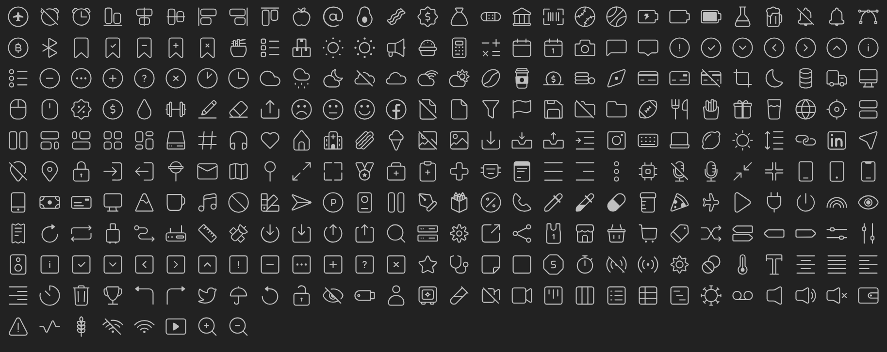
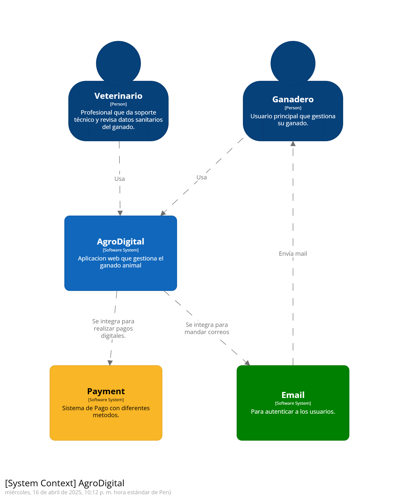
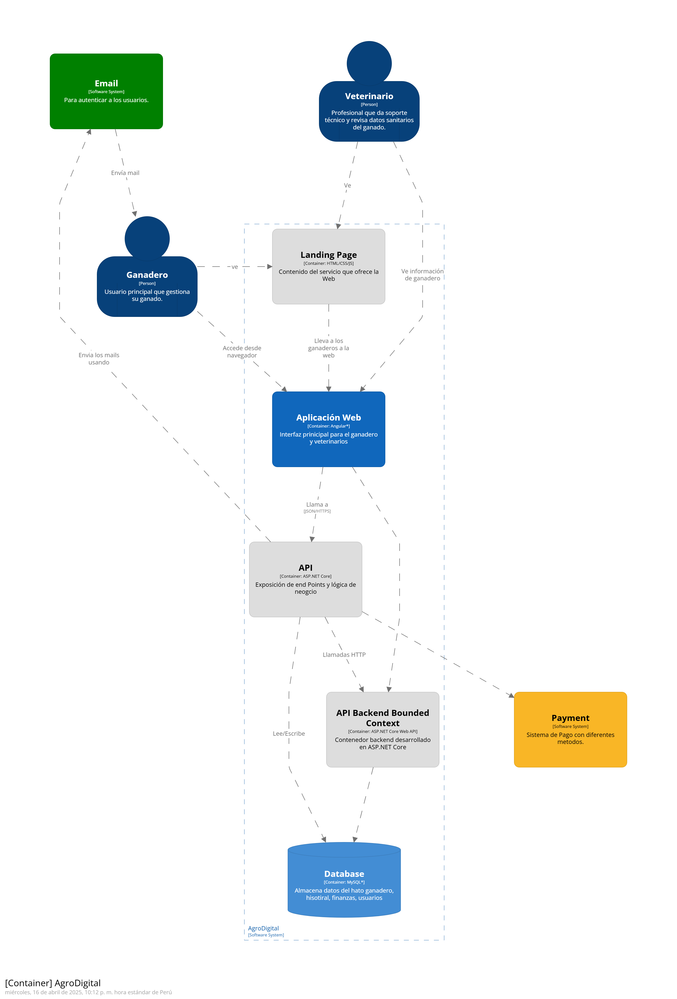
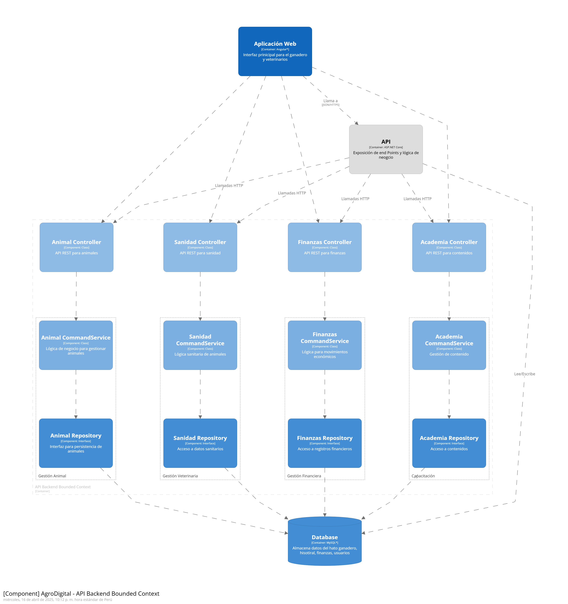
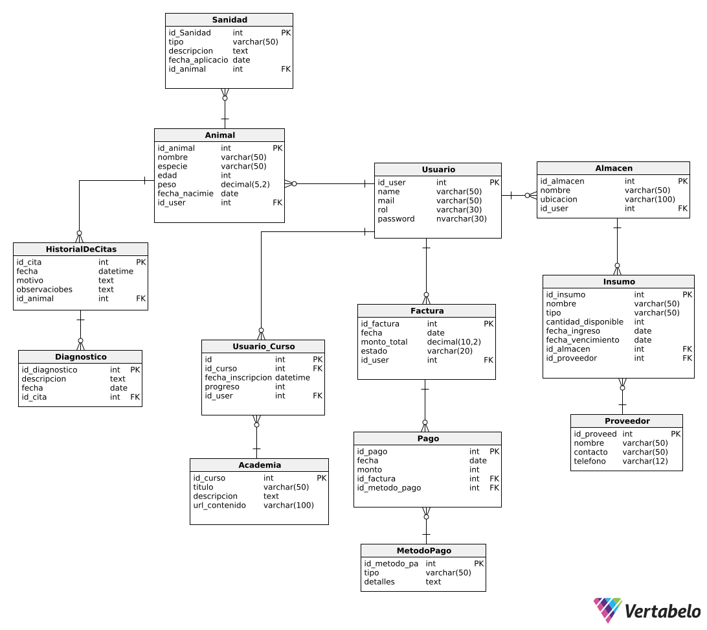

<h1 style="text-align: center;"> Informe del Trabajo Final </h1>
<h3 style="text-align: center;"> Universidad Peruana de Ciencias Aplicadas </h3>

<h5 style="text-align: center"> Ingeniería de Software </h5>

<h5 style="text-align: center"> Desarrollo de Aplicaciones Open Source - 1ASI0729 </h5>

<h5 style="text-align: center"> Docente: Rafael Oswaldo Castro Veramendi </h5>

<h5 style="text-align: center"> Startup: GanTrace </h5>

<h5 style="text-align: center"> Producto: AgroDigital </h5>

## Team members:

| Nombre                                      | Código     |
|:--------------------------------------------:|:----------:|
| Guerrero Tomas, Nelson Fabrizio             | U202222745 |
| Peña Riofrio, María Fernanda                | U202113279 |
| Pilares Pocohuanca, María                   | U202215528 |
| Salvador Rodriguez, Rodrigo Jesus            | U202213646 |
| Sanchez Silva, Luciana Celeste              | U202215979 |

<h5 style="text-align: center"> Ciclo 2025-010 </h5>

## Registro de versiones del informe

|Versión|Fecha|Autor|Descripción de modificación|
|:-:|:-:|:-:|-|
|1.0|09/04/2025|Guerrero, Peña, Pilares, Salvador, Sanchez|Creación del documento de trabajo en formato markdown|
|1.1|10/04/2025|Salvador R.|Desarrollo del capítulo 1 completo del documento en formato markdown|
|1.2|13/04/2025|Sanchez L.|Desarrollo del capítulo 4.1 del documento en formato markdown al 4.4|
|1.3|17/04/2025|Salvador R.|Creación del logo de la startup y el servicio/producto|
|1.4|17/04/2025|Salvador R.|Actualización de la información de la startup profile|
|1.5|19/04/2025|Sanchez L.|Actualización del ui design, incluyendo landing page y web application|

## Project Report Collaboration Insights

URL del repositorio para el reporte del proyecto: 

**TB1**

Para el desarrollo del informe perteneciente a la entrega TB1, se dividió la implementación de secciones de la siguiente forma para cada integrante del equipo:

|Integrante|Tareas Asignadas|
|-|-|
|Nelson Guerrero||
|María Peña||
|María Pilares| Desarrollo del capítulo 2, desde el punto 2.1 al 2.3.1 |
|Rodrigo Salvador|Desarrollo del capítulo 1 al 1.3, creación de los logos, landing page y capítulo 3|
|Luciana Sanchez|Desarrollo del capítulo 4.1 del documento en formato markdown al 4.4. Incluyendo diseño del landing page y web application|

El proceso de colaboración en el informe se realizó mediante commits constantes al repositorio de la organización GanTrace.

**Github Collaboration Insights**

Github también presenta un timeline de las ramas principales y los procesos de merge a los que se han sometido. Todas las ramas se crearon tomando en cuenta el diseño de GitFlow para una buena organización cuando se usa un software de control de versiones.

Los integrantes son:

* Nelson Guerrero (Nelsoondev)
* María Peña (mariafep)
* María Pilares (mariapilares)
* Rodrigo Salvador (Rodrigojsr12)
* Luciana Sanchez (Luccsss)

Se explican las ramas más prominentes:

- **main**: Es representada por el color ---. Se trata de la rama principal del proyecto y se actualiza para cada entregable.
- **develop**: Es representada por el color ---. Se trata de la rama principal para el proceso del desarrollo del proyecto.
- **feature-product-design**: Es representado por el color ---. Incluye el contenido de user flows y wireframes.
- **feature-sprint1**: Es representada por el color ---. Esta rama incluye los artefactos relacionados al sprint 1 en el informe.

Los siguientes gráficos representan analíticos de commits en el repositorio del informe. En los gráficos se incluye la cantidad de lineas de texto añadidas por cada integrante del equipo. 

**TB1**

## Student Outcomes
|Criterio especifico|Acciones realizadas|Conclusiones|
|-|:-|-|
|Comunica en forma escrita ideas y/o resultados con objetividad a público de diferentes especialidades y niveles jerarquicos, en el marco del desarrollo de un proyecto en ingeniería|**Nelson Guerrero**   TB1: En esta entrega se realizaron .   **María Peña**   TB1: Realizó .   **María Pilares**   TB1: Para la primera entrega, comuniqué por escrito de manera clara y efectiva el análisis de los competidores, el diseño de las entrevistas y la creación de user personas.   **Rodrigo Salvador**   TB1: En el informe .   **Luciana Sanchez**   TB1: Para el trabajo se definen las reglas de diseño y organización de un sitio web, incluyendo su estilo visual, estructura de contenido y navegación. |El documento redactado se presenta como un sustento escrito para todo aquel que desee conocer a detalle los pasos seguidos para planificar, desarrollar y enviar el proyecto a producción|
|Comunica oralmente sus ideas y/o resultados con objetividad a público de diferentes especialidades y niveles jerarquicos, en el marco del desarrollo de un proyecto en ingeniería.| **Nelson Guerrero**   TB1: Se llevó a cabo .   **María Peña**   TB1: Encargado de realizar.   **María Pilares**   TB1: A lo hora de realizar el trabajo comunique activamente mis avances y desarrollo del proyecto a mi equipo de trabajo.   **Rodrigo Salvador**   TB1: Para culminar la entrega de esta primera versión del trabajo final, resultó necesario .   **Luciana Sanchez**   TB1: Para el entregable fue necesario definir las reglas del estilo visual de nuestro producto. |Como equipo pudimos establecer medios de comunicación para poder entregar un trabajo completo ante el obstáculo que suponen los cortos períodos de tiempo para la entrega del proyecto. De la misma manera, se comunicaron los resultados obtenidos a los stakeholders, quienes a través de una serie de entrevistas demostraron su satisfacción con el programa. |

## Contenido
1. [**Capítulo I: Introducción.**](#1.)  
1.1. [Startup Profile.](#1.1.)  
1.1.1. [Descripción del startup.](#1.1.1.) 
1.1.2.[Perfiles de los integrantes del equipo.](#1.1.2.) 
1.2. [Solution Profile.](#1.2.) 
1.2.1. [Antecedentes y Problemática.](#1.2.1.) 
1.2.2. [Lean UX Process.](#1.2.2.) 
1.2.2.1. [Lean UX Problem Statements.](#1.2.2.1.) 
1.2.2.2. [Lean UX Assumptions.](#1.2.2.2.) 
1.2.2.3. [Lean UX Hypothesis Statements.](#1.2.2.3.) 
1.2.2.4. [Lean UX Canvas.](#1.2.2.4.) 
1.3. [Segmentos objetivo.](#1.3.) 
2. [**Capítulo II: Requirements Elicitation & Analysis.**](#2.) 
2.1. [Competidores.](#2.1.) 
2.1.1. [Análisis competitivo.](#2.1.1.) 
2.1.2. [Estrategias y tácticas frente a competidores.](#2.1.2.) 
2.2. [Entrevistas.](#2.2.) 
2.2.1. [Diseño de entrevistas.](#2.2.1.) 
2.2.2. [Registro de entrevistas.](#2.2.2.) 
2.2.3. [Análisis de entrevistas.](#2.2.3.) 
2.3. [Needfinding.](#2.3.) 
2.3.1. [User Personas.](#2.3.1.) 
2.3.2. [User Task Matrix.](#2.3.2.) 
2.3.3. [User Journey Mapping.](#2.3.3.) 
2.3.4. [Empathy Mapping.](#2.3.4.) 
2.3.5. [As-is Scenario Mapping.](#2.3.5.) 
3. [**Capítulo III: Requirements Specification.**](#3.) 
3.1. [To-Be Scenario Mapping.](#3.1.) 
3.2. [User Stories.](#3.2.) 
3.3. [Impact Mapping.](#3.3.) 
3.4. [Product Backlog.](#3.4.) 
4. [**Capítulo IV: Product Design.**](#4.) 
4.1. [Style Guidelines.](#4.1.) 
4.1.1. [General Style Guidelines.](#4.1.1.) 
4.1.2. [Web Style Guidelines.](#4.1.2.) 
4.2. [Information Architecture.](#4.2.) 
4.2.1. [Organization Systems.](#4.2.1.) 
4.2.2. [Labeling Systems.](#4.2.2.) 
4.2.3. [SEO Tags and Meta Tags](#4.2.3.) 
4.2.4. [Searching Systems.](#4.2.4.) 
4.2.5. [Navigation Systems.](#4.2.5.) 
4.3. [Landing Page UI Design.](#4.3.) 
4.3.1. [Landing Page Wireframe.](#4.3.1.) 
4.3.2. [Landing Page Mock-up.](#4.3.2.) 
4.4. [Web Applications UX/UI Design.](#4.4.) 
4.4.1. [Web Applications Wireframes.](#4.4.1.) 
4.4.2. [Web Applications Wireflow Diagrams.](#4.4.2.) 
4.4.3. [Web Applications Mock-ups.](#4.4.3.) 
4.4.4. [Web Applications User Flow Diagrams.](#4.4.4.) 
4.5. [Web Applications Prototyping.](#4.5.) 
4.6. [Domain-Driven Software Architecture.](#4.6.) 
4.6.1. [Software Architecture Context Diagram.](#4.6.1.) 
4.6.2. [Software Architecture Container Diagrams.](#4.6.2.) 
4.6.3. [Software Architecture Components Diagrams.](#4.6.3.) 
4.7. [Software Object-Oriented Design.](#4.7.) 
4.7.1. [Class Diagrams.](#4.7.1.) 
4.7.2. [Class Dictionary.](#4.7.2.) 
4.8. [Database Design.](#4.8.) 
4.8.1. [Database Diagram.](#4.8.1.) 
5. [**Capítulo V: Product Implementation, Validation & Deployment.**](#5.) 
5.1. [Software Configuration Management.](#5.1.) 
5.1.1. [Software Development Environment Configuration.](#5.1.1.) 
5.1.2. [Source Code Management.](#5.1.2.) 
5.1.3. [Source Code Style Guide & Conventions.](#5.1.3.) 
5.1.4. [Software Deployment Configuration.](#5.1.4.) 
5.2. [Landing Page, Services & Applications Implementation.](#5.2.) 
5.2.1. [Sprint 1.](#5.2.1.) 
5.2.1.1. [Sprint Planning 1.](#5.2.1.1.) 
5.2.1.2. [Sprint Backlog 1.](#5.2.1.2.) 
5.2.1.3. [Development Evidence for Sprint Review.](#5.2.1.3.) 
5.2.1.4. [Testing Suite Evidence for Sprint Review.](#5.2.1.4.) 
5.2.1.5. [Execution Evidence for Sprint Review.](#5.2.1.5.) 
5.2.1.6. [Services Documentation Evidence for Sprint Review.](#5.2.1.6.) 
5.2.1.7. [Software Deployment Evidence for Sprint Review.](#5.2.1.7.) 
5.2.1.8. [Team Collaboration Insights during Sprint.](#5.2.1.8.) 
6. [**Conclusiones.**](#6.) 
7. [**Bibliografía.**](#7.) 
8. [**Anexos.**](#8.) 

<h2>Capítulo I: Introducción</h2>

<h3> 1.1 Startup Profile.</h3>

En esta sección se presenta la descripción del startup y los perfiles de los miembros del equipo.

<h4> 1.1.1. Descripción del startup.</h4>

GanTrace es una startup enfocada en brindar soluciones tecnológicas accesibles y efectivas para los pequeños y medianos ganaderos de Latinoamérica. A través de una plataforma web intuitiva, GanTrace digitaliza la gestión del ganado, permitiendo llevar un control preciso sobre cada animal, su salud, productividad y trazabilidad, todo desde un celular o computadora.

La plataforma organiza la vida productiva del ganado en módulos clave: registro individual de animales (raza, edad, reproducción), calendario sanitario con alertas automáticas para vacunas y tratamientos, control económico (registro de leche, peso, ingresos y gastos), historial completo para cumplir con las exigencias de trazabilidad, y una academia ganadera con contenido educativo práctico.

Gracias a la integración de datos históricos y actualizados en tiempo real, GanTrace permite tomar decisiones informadas que mejoran la productividad, reducen pérdidas por descuidos y fortalecen la competitividad del pequeño ganadero en los mercados más exigentes. De esta forma, se transforma la gestión tradicional en una ganadería inteligente, eficiente y sostenible.

**Misión:** Revolucionar la gestión y trazabilidad del ganado en pequeños y medianos hatos ganaderos de Latinoamérica, a través de una plataforma digital accesible que optimice los procesos productivos y sanitarios.

**Visión:** AgroDigital se proyecta como la plataforma más destacada del sector ganadero en cuanto al registro y control de animales durante los próximos tres años.
La startup busca consolidarse como un modelo de negocio sostenible, confiable y comprometido con la mejora continua de la productividad rural mediante el uso de tecnología simple y efectiva.

##### Logotipo de la Startup:

##### Logotipo del servicio

<h4> 1.1.2. Perfiles de los integrantes del equipo.</h4>

|Biografía del los integrantes del equipo |Perfiles de los integrantes del equipo|
| :--------| :--------: |
| Mi nombre es **Nelson Fabrizio Guerrero Tomas**. tengo 20 años y vivo en Lima. Estoy estudiando en la universidad Peruana de Ciencias .|| 
|Mi nombre es **Maria Fernanda Peña Riofrio**, tengo 21 años, estudio el 6to ciclo de la carrera de Ingeniería de Software en la Universidad Peruana de Ciencias Aplicadas (UPC). Soy una persona responsable y me gusta ayudar a las demás personas, esto sera evidenciado en el transcuros del proyecto ayudando a mis demás compañeros de equipo. En mis tiempos libres me gusta mucho leer, escuchar música e investigar sobre temas de mi interes.|  |  
|Mi nombre es **Maria Pilares Pocohuanca** tengo 22 años y estudio la carrera de ingeniería de software en la UPC. Desde niña tuve mucho interés por las matemáticas y la tecnología, motivo por el cual estudio una ingeniería enfocada más a la programación. Me considero una persona perseverante aunque algo impaciente. Sin embargo, como miembro del equipo me comprometo a colaborar con mis compañeros y realizar todas las indicaciones que se dicten, todo con el fin de presentar un buen proyecto.|  | 
|Mi nombre es **Rodrigo Jesus Salvador Rodriguez**, tengo 19 años, estudio la carrera de Ingeniería de Software en la Universidad Peruana de Ciencias Aplicadas (UPC). Me considero una persona responsable y puntual en todo tipo de aspectos, esto lo voy a ver reflejado en este proyecto, como miembro de este equipo me comprometo a seguir las indicaciones al pie de la letra, seguir recomendaciones y apoyar siempre a mis compañeros para presentar el mejor proyecto grupal.||
|Mi nombre es **Luciana Celeste Sanchez Silva**, tengo 19 años y vivo en Lima. En la actualidad, me encuentro estudiando el 5to ciclo de la carrera de ingeniería de software en la UPC debido a que desde una edad temprana tuve una fascinación relacionada con el uso de la tecnología y la programación. En mi tiempo libre trato de crecer y expandir mi conocimiento en todas las áreas posibles. De igual forma, me gusta nadar, escuchar música y tocar la guitarra. Me comprometo a colaborar en todo momento con la elaboración de esta startup, y llegar a un trabajo sobresaliente. Mis habilidades son: responsabilidad, resolución de problemas, y disciplina.||

<h3> 1.2. Solution Profile.</h3>

<h4> 1.2.1. Antecedentes y Problemática.</h4>

###### What (Qué)
###### ¿Cuál es el problema?
Pequeños y medianos ganaderos no gestionan adecuadamente la información de su ganado. Usan métodos manuales (cuadernos, hojas sueltas) para llevar registros de salud, vacunas, productividad y reproducción, lo que genera errores, olvidos y baja eficiencia. Esto dificulta la trazabilidad, impide cumplir con normativas y limita el acceso a mejores precios en el mercado.

###### When (Cuando)
###### ¿Cuándo sucede el problema?
El problema ocurre de forma constante durante todo el ciclo de vida del ganado: desde el nacimiento, pasando por los controles sanitarios y reproductivos, hasta la venta o comercialización. La falta de control impacta día a día en la operación del productor.

###### Where (Dónde)
###### ¿A dónde se dirige?
Se dirige a convertirse en una problemática estructural que limita el crecimiento de la ganadería rural, afectando la competitividad y sostenibilidad del sector en los mercados nacionales e internacionales.

###### ¿Dónde surge el problema?
El problema surge principalmente en zonas rurales de América Latina, donde se concentra una gran parte de la producción ganadera de pequeña y mediana escala.

###### Who (Quién)
###### ¿Quiénes están involucrados?
Están involucrados pequeños y medianos ganaderos, asociaciones ganaderas, técnicos agropecuarios y entidades públicas que promueven la trazabilidad y formalización del sector.

###### ¿Quién lo utilizará?
Principalmente ganaderos que buscan mejorar la productividad, el control y la trazabilidad de su ganado, así como técnicos que los asesoran en el campo.

###### Why (Por qué)
###### ¿Cuál es la causa del problema?
La falta de acceso a herramientas tecnológicas adaptadas al contexto rural, el desconocimiento sobre la importancia de la trazabilidad y el escaso acompañamiento técnico hacen que muchos productores mantengan métodos manuales e ineficientes para el control de su ganado.

##### ¿Cuáles son las 2H?
###### How (Cómo)
###### ¿Cómo se utilizará el producto?
AgroDigital será una plataforma web accesible desde celular o computadora, en la que los ganaderos podrán registrar fácilmente los datos de cada animal, recibir alertas sanitarias, controlar ingresos y gastos, acceder a reportes, y consultar contenido educativo. Todo de forma intuitiva, aún sin conocimientos técnicos.

###### ¿Cómo lograremos desarrollar una gestión eficiente dentro de la plataforma?
A través del diseño de una interfaz sencilla, modular y adaptable, que permita registrar y visualizar información clave del ganado. Se integrarán funcionalidades como alertas automáticas, reportes descargables y acceso offline. Además, se ofrecerá capacitación mediante la “Academia Ganadera” para fomentar el uso adecuado de la plataforma.

###### How much (Cuánto)
###### ¿Cuál es la magnitud del problema?
Según datos de organismos agrícolas en la región, más del 70% de los pequeños ganaderos no cuentan con sistemas de registro adecuados. Esto repercute directamente en la pérdida de animales, baja productividad, incumplimiento de normas sanitarias y dificultades para acceder a mercados formales.

###### ¿Qué porcentaje del personal de la industria se verá beneficiado por el servicio?
Se estima que un 40% a 60% de los ganaderos familiares y asociaciones ganaderas podrían beneficiarse del uso de AgroDigital, especialmente en regiones rurales donde el acceso a tecnología aún es limitado pero creciente.

<h4> 1.2.2. Lean UX Process.</h4>

<h5> 1.2.2.1. Lean UX Problem Statements.</h5>

###### **Problem Statement:** 

El propósito de AgroDigital es brindar a pequeños y medianos ganaderos una plataforma digital simple y accesible que les permita registrar, organizar y supervisar la información clave de su hato ganadero, optimizando los procesos sanitarios, reproductivos y económicos que muchas veces se gestionan de forma manual y desordenada.

Actualmente, la mayoría de ganaderos lleva un control limitado o inexistente de su ganado, usando cuadernos físicos o herramientas digitales improvisadas. Esta dependencia de métodos tradicionales conlleva a errores en los registros, omisión de vacunas o tratamientos, pérdida de datos y baja trazabilidad, afectando directamente la productividad, el cumplimiento de normativas y la posibilidad de comercializar a mejores precios.

La falta de herramientas adecuadas impide que los productores tomen decisiones informadas y sostenibles, limitando su crecimiento y competitividad en el sector.

¿Cómo podríamos digitalizar y automatizar la gestión de información del ganado para que los pequeños productores puedan optimizar sus procesos sin depender de registros manuales ni perder datos relevantes?

<h5> 1.2.2.2. Lean UX Assumptions.</h5>

###### **Business Assumptions:**
1.  **Creemos que nuestros usuarios necesitan**  una forma más eficiente y confiable de registrar y monitorear la información relacionada con la salud, productividad y trazabilidad del ganado.
2.  **Estas necesidades se pueden satisfacer** mediante el desarrollo de una plataforma web accesible que permita registrar datos clave del hato ganadero, emitir alertas automáticas y generar reportes útiles para la toma de decisiones.
3.  **Nuestros clientes iniciales serán** pequeños y medianos ganaderos que cuenten con un teléfono móvil o una computadora, así como técnicos agropecuarios que brindan asistencia directa en el campo.
4.  **El valor más importante que un cliente quiere de nuestros servicios es** llevar un control ordenado y automatizado del ganado, evitar pérdidas por descuidos y cumplir con los requisitos de trazabilidad para vender mejor.
5.  **El cliente también va a obtener** beneficios adicionales como alertas sanitarias, reportes económicos, acceso a historial de cada animal, y contenido dentro de la plataforma.
6.  **Vamos a obtener la mayoría de los clientes mediante** alianzas con asociaciones ganaderas, programas rurales de desarrollo y campañas digitales dirigidas a zonas con alta actividad ganadera.
7.  **Vamos a obtener ingresos mediante** un modelo de suscripción mensual con planes diferenciados según el tamaño del hato ganadero, así como licencias institucionales para asociaciones o entidades del agro.
8.  **Nuestra competencia en el mercado serán** aplicaciones de gestión ganadera con modelos genéricos, hojas de cálculo digitales, o métodos tradicionales como cuadernos de registro.
9.  **Vamos a tener ventaja frente a nuestra competencia debido a** que ofrecemos una solución específica para el contexto rural, fácil de usar, con enfoque educativo y con funciones diseñadas especialmente para pequeños y medianos productores.
10.  **El mayor riesgo del servicio es** que algunos ganaderos, por factores culturales o falta de experiencia digital, no se adapten fácilmente al uso de una plataforma tecnológica para la gestión de su ganado.
11.  **Lo resolveremos realizando** capacitaciones virtuales, diseñando una interfaz intuitiva, integrando tutoriales paso a paso, y promoviendo el uso de la Academia Ganadera como soporte educativo.

###### **User Assumptions:**
###### **¿Quién es el usuario?**   
Los usuarios principales de AgroDigital son pequeños y medianos ganaderos, así como técnicos agropecuarios que brindan asesoría directa en el campo. En una segunda etapa, la plataforma también podría ser utilizada por asociaciones ganaderas, cooperativas y entidades públicas que trabajan con productores rurales en programas de formalización, sanidad y trazabilidad.

###### **¿Qué problemas tiene nuestro producto? ¿Resolver?**
Uno de los principales problemas que AgroDigital busca resolver es la desorganización en el manejo de la información ganadera, así como la pérdida de datos clave por el uso de registros manuales. Actualmente, muchos productores no tienen una forma clara de hacer seguimiento a vacunas, partos, tratamientos, ni control económico, lo que afecta su rentabilidad y cumplimiento de requisitos de mercado.

###### **¿Qué características son importantes?**
Las características más valoradas por el usuario incluyen: el registro individual de cada animal (edad, raza, salud, productividad), alertas automáticas para vacunas y tratamientos, reportes económicos simples, historial completo de cada animal, y el acceso a contenido educativo práctico en video o audio. La facilidad de uso, incluso sin conexión a internet, es clave para la adopción en zonas rurales.

###### **¿Dónde encaja nuestro producto en su trabajo o vida?**
El producto se integra directamente en las actividades cotidianas del ganadero, ya que mejora su capacidad de planificación, reduce pérdidas por descuido, facilita el cumplimiento de normativas, y permite tomar decisiones informadas sobre la gestión del hato. Esto se traduce en mayor rentabilidad y en una mejora de su calidad de vida.

###### **¿Cuándo y cómo es nuestro producto? ¿Usado?**
El producto se usa cada vez que el productor necesita registrar un nuevo animal, aplicar un tratamiento, ingresar un parto, controlar ingresos o revisar la productividad. También se utiliza para evaluar datos históricos del hato y tomar decisiones estratégicas, como vender, separar animales o planificar la reproducción. La plataforma está diseñada para ser usada desde el celular o computadora, en el campo o en casa.

###### **¿Cómo debe verse nuestro producto y cómo debe comportarse?**
AgroDigital debe tener una interfaz visualmente amigable, intuitiva y fácil de usar, pensada para usuarios con poca experiencia tecnológica. Debe comportarse de forma estable y segura, protegiendo los datos personales del productor y su información ganadera. El diseño debe transmitir confianza, ruralidad tecnológica y eficiencia, y ofrecer una experiencia cálida, sin tecnicismos innecesarios.

###### **Feature Assumptions:**

**Creemos que** la plataforma debe contar con una interfaz intuitiva, accesible desde dispositivos móviles y computadoras, que permitirá a los ganaderos usarla fácilmente incluso si no tienen experiencia tecnológica previa.

**Creemos que** AgroDigital debe incluir un sistema de alertas personalizables que notifique al usuario sobre vacunas, tratamientos sanitarios, partos y fechas clave, ayudando a prevenir pérdidas por descuidos.

**Creemos que** la plataforma debe permitir el registro detallado de cada animal (peso, salud, reproducción, ingresos y egresos), lo que facilitará el análisis histórico del desempeño productivo y económico.

**Creemos que** AgroDigital debe contar con un módulo de reportes y gráficos visuales para que los ganaderos puedan entender rápidamente la evolución de su hato, tomar decisiones informadas y demostrar trazabilidad ante compradores o autoridades.

<h5> 1.2.2.3. Lean UX Hypothesis Statements.</h5>

* **Hypothesis Statement 01:**
    
    **Creemos que** los pequeños y medianos ganaderos estarán dispuestos a adoptar AgroDigital para registrar digitalmente la información sanitaria, productiva y económica de su ganadero.
  
    **Sabremos** que hemos tenido éxito.
    
    **Cuando** al menos el 50% de los usuarios registrados usen activamente la plataforma durante el primer trimestre posterior al lanzamiento.
  
* **Hypothesis Statement 02:**
    
    **Creemos que** la inclusión de alertas automáticas sobre vacunas, partos y tratamientos sanitarios ayudará a los ganaderos a reducir los descuidos y pérdidas relacionadas con la salud del ganado.
    
    **Sabremos** que hemos tenido éxito.
    
    **Cuando** al menos un 40% de los usuarios reporten haber evitado incidentes sanitarios importantes gracias a las alertas emitidas por la plataforma.

* **Hypothesis Statement 03:**
    
    **Creemos que** el acceso a reportes visuales y al historial individual de los animales permitirá a los usuarios tomar mejores decisiones económicas y reproductivas.
    
    **Sabremos** que hemos tenido éxito.
    
    **Cuando** al menos un 60% de los ganaderos indiquen haber tomado decisiones de venta, reproducción o tratamiento basadas en la información provista por AgroDigital.

* **Hypothesis Statement 04:**
    
    **Creemos que** el uso de AgroDigital reducirá los errores de registro comunes en los métodos tradicionales (cuadernos, hojas de cálculo) y mejorará la organización de la información ganadera.
    
    **Sabremos** que hemos tenido éxito.
    
    **Cuando** se identifique una disminución del 50% en errores de registro (omisiones, datos incompletos o duplicados) tras tres meses de uso continuo de la plataforma.

<h5> 1.2.2.4. Lean UX Canvas.</h5>

El Lean UX Canvas es una herramienta empleada dentro del enfoque de diseño centrado en el usuario (UX) y la metodología Lean, destinada a facilitar la creación y evolución de productos de forma ágil y eficiente. Su finalidad es ofrecer una estructura organizada que promueva la colaboración entre equipos multidisciplinarios. A continuación, se muestra el Lean UX Canvas desarrollado por el equipo mediante el uso de la plataforma digital **Mural**:

Enlace para acceder al [Canvas](https://app.mural.co/t/gantrace0893/m/gantrace0893/1744306574834/552a13a829bb727c323c017d591c372115eb601a?sender=u10ba1755a935234d144c5633)

<h3> 1.3. Segmento objetivo.</h3>

Según el Ministerio de Desarrollo Agrario y Riego (MIDAGRI, 2023), el Perú cuenta con más de 5 millones de cabezas de ganado vacuno, siendo la ganadería una de las actividades más relevantes en regiones como Cajamarca, Puno, Cusco y La Libertad. El valor bruto de la producción ganadera en el país supera los 3 mil millones de soles anuales, y más del 65 % de las unidades ganaderas son gestionadas por pequeños y medianos productores, quienes muchas veces carecen de acceso a herramientas tecnológicas para el manejo eficiente de sus hatos.
A pesar del avance en otros sectores agropecuarios, la ganadería peruana aún depende, en su mayoría, de métodos manuales para el registro de eventos como vacunaciones, nacimientos, control de peso, alimentación y reproducción. Esta falta de sistematización impide una adecuada trazabilidad y toma de decisiones estratégicas en el negocio ganadero.
Frente al crecimiento de la demanda mundial de alimentos en un 70 % para el año 2050 (FAO, 2021), se vuelve necesario implementar tecnologías digitales en el sector ganadero. GanTrace propone automatizar y centralizar la gestión del ganado mediante una plataforma accesible, capaz de registrar datos en tiempo real y proyectar indicadores clave de desempeño. Esto no solo elevaría la rentabilidad y eficiencia de las unidades ganaderas, sino que también aumentaría la competitividad del país frente a mercados de exportación de carne y leche.
Empresas formales como Gloria S.A., Laive, o cooperativas ganaderas como COLPA de Cajamarca, podrían convertirse en usuarios potenciales, al igual que asociaciones de pequeños productores que buscan digitalizar sus procesos y facilitar su acceso a créditos, certificaciones sanitarias o mercados más exigentes.

<h4> 1.3.1 Stakeholders.</h4>

* **Stakelholder Internos:** Equipo GanTrace y resto de integrantes del equipo de desarrollo.
* **Stakelholder Externos:** Técnicos ganaderos, veterinarios y responsables de campo en unidades ganaderas, Administradores de cooperativas o asociaciones ganaderas, estudiantes de medicina veterinaria y carreras agropecuarias.

<!-- capitulo 2 -->

<h2> Capítulo II: Requirements Elicitation & Analysis.</h2>

<h3> 2.1. Competidores.</h3>

<h4> 2.1.1. Análisis competitivo.</h4>

Realizar un análisis competitivo es fundamental para identificar las oportunidades y amenazas en el mercado, así como para posicionar estratégicamente a GanTrace. Este proceso permite entender cómo los competidores satisfacen las necesidades del cliente, qué brechas existen y cómo nuestra solución puede destacar mediante ventajas diferenciadoras. Además, ayuda a diseñar estrategias de marketing, precios y distribución más efectivas, asegurando una propuesta de valor única y sostenible.

<!-- capitulo 3 -->

<h2> Capítulo III: Requirements Specification.</h2>

<h3> 3.1. To-Be Scenario Mapping.</h3>

Para la realizar el To-be Scenario Mapping el equipo determinó como se vería el flujo de trabajo luego de que nuestra solución, AgroDigital, haya sido implementada para ambos segmentos objetivos.
* Ganadero:

Enlace para acceder al [Miro](https://miro.com/app/board/uXjVIA6IBtM=/?share_link_id=517790232719)

* Veterinario:

Enlace para acceder al [Miro](https://miro.com/app/board/uXjVIA6IBtM=/?share_link_id=517790232719)

<h3> 3.2. User Stories.</h3>

Las user stories son una forma de convertir el lenguaje informal de los clientes del producto a un requisito de software que debe ser considerado en el desarrollo del sistema. Una user story construida adecuadamente explica al desarrollador la naturaleza de la funcionalidad que construyen, su razón de ser, y el valor que esta genera para el usuario. Para el producto AgroDigital, GanTrace presenta un conjunto de user stories para el desarrollo de la Landing Page, la aplicación web y user stories técnicas.

|Epic/User Story ID| Título | Descripción | Criterios de aceptación |Relacionado con (Epic ID)|
|-|-|:-|:-|:-|
|EP01|Contacto con Soporte|**Como** visitante de la landing page **Quiero** contactar al equipo de la aplicación AgroDigital **Para** resolver dudas o solicitar información.|No corresponde|No corresponde|
|EP02|Información relacionada con la aplicación|**Como** visitante de la landing page **Quiero** entender los beneficios y funcionalidad clave de Agrodigital **Para** tener un alcance sobre el propósito del producto|No corresponde|No corresponde|
|EP03|Establecer vínculo entre la landing page y la aplicación|**Como** visitante de la landing page **Quiero** acceder rápidamente a la aplicación web **Para** comenzar a disfrutar de los beneficios y funcionalidades que AgroDigital ofrece |No corresponde|No corresponde| 
|EP04|Gestión Básica de Animales|**Como** ganadero **Quiero** registrar y actualizar información básica de cada animal **Para** mantener un inventario digitalizado y accesible desde cualquier dispositivoa|No corresponde|No corresponde|
|EP05|Registro de Eventos Clave|**Como** ganadero **Quiero** anotar manualmente eventos importantes (vacunas, partos, enfermedades) **Para** tener un historial completo que me ayude a tomar decisiones sanitarias y reproductivas|No corresponde|No corresponde|
|EP06|Control Económico|**Como** ganadero **Quiero** registrar ingresos por ventas y gastos **Para** calcular la rentabilidad de mi hato ganadero y optimizar recursos|No corresponde|No corresponde|
|EP07|Historial Clínico|**Como** veterinario **Quiero** acceder y registrar detalles médicos de cada animal **Para** garantizar un seguimiento preciso y personalizado de su salud|No corresponde|No corresponde|
|EP08|Gestión de Visitas|**Como** veterinario **Quiero** programar visitas a fincas y asignar tareas específicas a los ganaderos **Para** optimizar el tiempo y asegurar que se cumplan los protocolos sanitarios|No corresponde|No corresponde|
|EP09|Reportes Básicos|**Como** veterinario **Quiero** generar informes sanitarios (ej: tratamientos pendientes) **Para** cumplir con normativas y compartir datos con asociaciones ganaderas.|No corresponde|No corresponde|
|US01|Contactar a la startup|**Como** visitante de la landing page **Quiero** proporcionar mi correo electrónico **Para** que los desarrolladores reciban mis comentarios, dudas e inquietudes relacionadas con la aplicación|**Escenario 1: Enviar mensaje al equipo de desarrollo**   **Dado que** el usuario tenga una consulta y/o comentario relacionado con la aplicación   **Cuando** redacte un mensaje y adjunte una dirección de correo electrónico para contactar al equipo de desarrollo   **Entonces** el sistema remitirá la consulta a los desarrolladores|EP01|
|US02|Obtener información de la aplicación|**Como** visitante de la landing page **Quiero** quiero obtener información relacionada con el producto ofrecido **Para** conocer los beneficios que puedo adquirir mediante el uso de la aplicación |**Escenario 1: Visualizar información**   **Dado que** el visitante se encuentre dentro de la landing page   **Cuando** navegue a través de todas las secciones de la página   **Entonces** podrá encontrar información clara y concisa que me permita entender de inmediato el propósito principal del software |EP02|
|US03|Acceder a la aplicación desde la landing page|**Como** visitante de la landing page **Quiero** poder acceder a la aplicación directamente desde la landing page **Para** comenzar a utilizar las funcionalidades ofrecidas en la aplicación| **Escenario 1: Usuario ingresa a aplicación**   **Dado que** el usuario desee comenzar a utilizar la aplicación   **Cuando** ingrese a la landing page y seleccione la opción que permite el acceso al software elaborado   **Entonces** deberá ser redirigido a la página desplegada   **Escenario 2: Fallo en el acceso a la aplicación**   **Dado que** el usuario desee comenzar a utilizar la aplicación   **Cuando** ingrese a la landing page y seleccione la opción que permite el acceso al software elaborado y ocurra un error en el proceso de redirección o el servidor de la aplicación no responde **Entonces** el usuario deberá obtener el mensaje de error generado. |EP03|
|US04|Registrar nuevo animal|**Como** ganadero **Quiero** agregar animales al sistema **Para** tener un inventario digital|**Escenario 1: Registro exitoso**   **Dado que** el usuario completa los campos obligatorios (ID, raza, nacimiento)   **Cuando** haga clic en "Guardar"   **Entonces** el animal aparecerá en mi listado.   **Escenario 2: Registro Fallido**   **Dado que** el usuario dejó el campo "ID" vacío   **Cuando** intente guardar   **Entonces** el sistema mostrará "Campo obligatorio" en rojo y no guardará los datos|EP04|
|US05|Buscar animal por ID|**Como** ganadero **Quiero** encontrar un animal específico **Para** consultar su información|**Escenario 1: Búsqueda exitosa**   **Dado que** el ganadero ingresó el ID existente   **Cuando**  haga clic en "Buscar"   **Entonces** el sistema mostrará la ficha completa del animal   **Escenario 2: Búsqueda sin resultados**   **Dado que** ingresó un ID inexistente   **Cuando** haga clic en "Buscar"   **Entonces** el sistema mostrará "No se encontraron coincidencias" |EP04|

<h2>Capítulo IV: Product Design</h2>

<h3>Style Guidelines</h3>

Estas directrices de estilo establecen los principios visuales y de diseño que deben seguirse al desarrollar la interfaz de usuario (UI) de AgroTrace. El objetivo es crear una experiencia digital clara, accesible e intuitiva que responda a las necesidades de pequeños y medianos ganaderos en Latinoamérica.

El concepto visual se centra en transmitir confianza, simplicidad y eficiencia rural. A través del uso de una paleta de colores naturales (verdes, marrones suaves y tonos tierra), combinada con tipografías limpias y legibles, AgroTrace busca generar una atmósfera amigable y funcional que conecte con el entorno productivo del usuario.

El diseño debe priorizar la facilidad de uso, incluso para personas con poca experiencia tecnológica, reforzando así la inclusión digital en el campo. La interfaz debe permitir una navegación fluida desde cualquier dispositivo, y ofrecer información clara y accesible para fomentar la toma de decisiones informadas. Este enfoque visual fortalece la misión de AgroTrace de modernizar la gestión ganadera con herramientas tecnológicas simples pero poderosas.

<h4>General Style Guidelines</h4>

Los colores resultan ser fundamental para transmitir la identidad visual de la marca. En este sector, la paleta cromática seleccionada fue inspirada en la naturaleza y el entorno rural, utilizando tonos tierra, verdes orgánicos y acentos neutros. Colores que reflejan sostenibilidad, confianza y cercanía con el campo.

Además, la selección de colores debe estar alineada con los valores de innovación, simplicidad y eficiencia, transmitiendo al usuario una sensación de claridad y profesionalismo sin perder la conexión con el entorno agrícola.

<h5> Colores principales:</h5>
 

|Código HEX|Color|
|-|-|
|#925930||
|#79B267||
|#f5f0e6||

<h5> Colores secundarios:</h5>
 

|Código HEX|Color|
|-|-|
|#A3794F||
|#A3C4A8||
|#d1bfa5||

<h5>Typography</h5>
La combinación de Tajawal y Work Sans aporta una estética moderna y accesible que conecta tanto con el origen humano del campo como con la eficiencia del mundo digital. Tajawal, con su estilo limpio pero con un sutil toque cultural, transmite cercanía y adaptabilidad, ideal para un sector que valora la conexión entre la tradición agrícola y la innovación tecnológica. Por su parte, Work Sans añade una estructura profesional y contemporánea, optimizada para la lectura en plataformas digitales.

Juntas comunican una marca que se dedica al agro digital con un enfoque en la inclusión, sostenibilidad e innovación, logrando un balance perfecto entre raíces locales y visión global.

 

<h5>Icons</h5>
Se ha seleccionado el set de íconos Circum Icons diseñado por Klarr Agency. Este set, disponible en Iconify.design, ofrece una estética limpia, redondeada y moderna, ideal para reflejar los valores de accesibilidad, innovación y cercanía del sector agropecuario digital.

Los íconos utilizados mantienen una línea uniforme y amigable, facilitando la navegación y mejorando la experiencia de usuario.

  

<h4>Web Style Guidelines</h4>

El Web Style Guide de AgroTrace nos ayudó a mostrar una identidad visual coherente y accesible en toda la plataforma. Definimos colores, tipografías y elementos de diseño inspirados en el entorno rural para transmitir confianza, tecnología cercana y facilidad de uso.

Nuestra paleta refleja valores como sostenibilidad y cercanía, mientras que las tipografías priorizan la legibilidad. Esta guía fortalece la presencia visual de AgroTrace y mejora la experiencia del usuario.

Se incluyen imágenes que ilustran los principales lineamientos: colores, fuentes, espaciado y componentes clave, garantizando una interfaz clara y funcional.

<h3>Information Architecture</h3>

<h4>Organization Systems</h4>

En esta sección, se han aplicado sistemas de organización adaptados a las necesidades de los pequeños y medianos ganaderos, facilitando el acceso y comprensión de la información ganadera. La organización visual del contenido ha sido implementada de las siguientes formas:

- Jerárquica (visual hierarchy): Para destacar módulos clave como el registro de animales, alertas sanitarias y reportes económicos, asegurando que los usuarios identifiquen rápidamente las funciones más relevantes para su gestión diaria.

- Organización secuencial (step-by-step): Aplicada en procesos que requieren seguimiento cronológico, como el registro de eventos sanitarios, partos o tratamientos, permitiendo al usuario llevar un control ordenado y lógico del historial del ganado.

Además, se categorizó el contenido según las funcionalidades de la plataforma: módulos de gestión (sanidad, reproducción, economía), tipo de usuario (ganadero, técnico, asociación), y acceso a recursos educativos (videos, guías, alertas). Estas estructuras permiten una navegación intuitiva y adaptada al entorno rural.

<h4>Labeling Systems</h4>

Se han definido cuidadosamente los sistemas de etiquetado y categorización para asegurar que los usuarios naveguen de forma intuitiva y eficiente en la plataforma, implementando lo siguiente:

- Jerarquía visual: Aplicada en la estructura de módulos clave como "Sanidad", "Reproducción" y "Economía", destacando primero los datos más relevantes (por ejemplo, alertas de salud o gastos recientes). Esto permite a los usuarios tomar decisiones informadas rápidamente.

- Organización secuencial: Utilizada en procesos como el registro de eventos ganaderos (partos, tratamientos, vacunaciones), donde los pasos siguen una lógica temporal clara y guiada. Esto ayuda a evitar errores en la carga de datos y mejora la experiencia del usuario.

- Organización matricial: Empleada en los paneles de reportes y análisis, donde los usuarios pueden comparar indicadores entre animales, hatos o periodos de tiempo, con etiquetas claras que facilitan la interpretación visual.

Estos esquemas de etiquetado se han diseñado con base en el lenguaje y jerga ganadera, utilizando términos familiares como “Peso al destete” o “Última monta”, para que cualquier usuario, independientemente de su nivel técnico, pueda comprender y usar la plataforma sin dificultad.

<h4>SEO Tags and Meta Tags</h4>

<h5 align="center">Landing Page</h5>

- **Title:** AgroDigital - Plataforma Digital para la Gestión del Ganado  
- **Description:** AgroDigital es una plataforma accesible que permite a los ganaderos pequeños y medianos gestionar la salud, reproducción, y productividad de su ganado, optimizando procesos con tecnología innovadora.
- **Keywords:** gestión ganadera, plataforma ganaderos, AgroDigital, trazabilidad ganadera, ganadería digital, salud animal, control de ganado, plataforma para ganaderos, tecnología rural, organizador de ganado.
- **Author:** GanTrace

<h5 align="center">Aplication Web</h5>

- **Title:** AgroDigital - Gestión Completa del Ganado para Pequeños y Medianos Productores
- **Description:** Accede a AgroDigital, la plataforma web que digitaliza la gestión del ganado, con módulos de salud, productividad y trazabilidad para optimizar los procesos ganaderos.
- **Keywords:** plataforma ganadera, software para ganaderos, AgroDigital, gestión de ganado, salud animal, trazabilidad, control de ganado, aplicaciones para ganaderos, ganadería inteligente, ganadería digital, control de ganado.
- **Author:** GanTrace

<h4>Searching Systems</h4>

El sistema de búsqueda en AgroDigital debe ser intuitivo y eficiente para que los usuarios puedan encontrar rápidamente la información relacionada con su ganado. A continuación, se detallan las opciones de búsqueda y los filtros disponibles: 

- **Barra de busqueda por ganado:** Los usuarios podrán buscar información sobre un animal específico usando filtros como número de identificación, raza, edad, fecha de nacimiento, estado de salud, entre otros.
- **Barra de busqueda por evento:** Los usuarios podrán buscar eventos específicos relacionados con el ganado, tales como vacunaciones, tratamientos, partos, inspecciones sanitarias, entre otros.
- **Filtro por categorias:** Los usuarios podrán filtrar por diferentes módulos como Sanidad, Reproducción o Economía, mejorando la accesibilidad a la información relevante.
- **Opciones de Ordenación:** Los resultados se pueden ordenar por criterios como relevancia

<h4>Navigation Systems</h4>

Los sistemas de navegación deben estar diseñados para ser intuitivos, adaptados al contexto rural de los usuarios y fáciles de usar, incluso para aquellos con poca experiencia en tecnología. Aquí se detallan algunos de los aspectos a tener en cuenta:

<h5 >Menú Principal:</h5>

- Inicio: Acceso rápido a la página principal donde se visualizan las estadísticas más recientes del ganado.
- Registro de Ganado: Sección para registrar nuevos animales y sus detalles.
- Historial: Consulta de eventos pasados, como vacunas, tratamientos y eventos reproductivos.
- Reportes: Generación de informes económicos y sanitarios del ganado.
- Academia Ganadera: Acceso a contenido educativo y tutoriales sobre el cuidado del ganado.

<h5>Menú Secundario:</h5>

- Alertas: Notificaciones automáticas sobre eventos de salud, vacunación o reproducción.
- Soporte: Acceso a preguntas frecuentes, tutoriales y asistencia técnica.

<h5>Menú para Iniciar Sesión (Login):</h5>

- El diseño del menú debe ser limpio y directo para que los usuarios puedan acceder fácilmente a lo que necesitan, especialmente si no están familiarizados con la tecnología.
- Opción para nuevos usuarios que aún no tienen cuenta en AgroDigital
- Página de ayuda, preguntas frecuentes (FAQ), contacto para asistencia técnica.

<h5>Navegación por Categorías:</h5>

- Los usuarios podrán navegar por categorías de ganado, tipos de eventos o fechas, todo con una jerarquía visual clara que facilite el acceso a la información relevante.
- Este diseño asegura que AgroDigital sea accesible y fácil de usar para los ganaderos, maximizando su eficiencia en el uso de la plataforma.

<h3>Landing Page UI Design</h3>

<h4>Landing Page Wireframe</h4>

El wireframe de la landing page de AgroDigital actúa como una guía visual preliminar que organiza los elementos esenciales de la página sin entrar en detalles gráficos. Este esquema muestra la distribución de secciones clave como el encabezado con el logo y menú de navegación, una propuesta de valor centrada en la digitalización ganadera, testimonios de usuarios reales del campo, y llamadas a la acción destacadas que invitan a conocer la aplicación. El objetivo es garantizar una experiencia intuitiva para el visitante y facilitar su conversión en usuario activo de la plataforma. Enlace para acceder al [Diseño en Figma](https://www.figma.com/design/KC4w4IRG6LaWaMxuSxhKNp/AgroDigital?node-id=26-132&t=qT7oJSn8VnYsfiTX-1)

  

<h4>Landing Page Mock-up</h4>

El mock-up de la landing page de AgroDigital representa una versión detallada y cercana al diseño final, integrando colores, tipografías e imágenes que reflejan la identidad visual de la plataforma. Este diseño ofrece una vista realista de cómo se presentará la página a los usuarios, destacando una estética moderna, accesible y alineada con el sector agroindustrial ganadero. Además, refuerza la importancia de mantener coherencia visual y claridad en la propuesta de valor, transmitiendo confianza, profesionalismo y compromiso con la innovación tecnológica en el campo. Enlace para acceder al [Diseño en Figma](https://www.figma.com/design/KC4w4IRG6LaWaMxuSxhKNp/AgroDigital?node-id=0-1&t=qT7oJSn8VnYsfiTX-1)

  

<h3>Web Applications UX/UI Design</h3>

<h4>Web Applications Wireframes</h4>

Los wireframes de la aplicación web de AgroDigital representan la estructura y organización de las pantallas clave orientadas al sector agroindustrial, específicamente ganadero. Estos esquemas visuales muestran la disposición de los elementos de la interfaz y la navegación entre secciones, ofreciendo una guía clara para el diseño final. De esta forma, se garantiza una experiencia de usuario intuitiva, eficiente y adaptada a las necesidades reales del productor.Fueron desarrollados a través de Figma. Enlace para acceder al [Diseño en Figma](https://www.figma.com/design/KC4w4IRG6LaWaMxuSxhKNp/AgroDigital?node-id=9-4&t=qT7oJSn8VnYsfiTX-1)

  
  
  
  
  
  
  
  

<h4>Web Applications Wireflow Diagrams</h4>

En esta sección se presentan los Wireflows para cada objetivo del usuario. Para ello se consideró los User Persona correspondientes. Cada diagrama muestra el flujo de interacción.

- **Registro y Perfil del ganadero** El presente user flow corresponde con el formulario de registro que solicita el ingreso de la información del usuario.

 

- **Gestión de Usuario** El presente user flow corresponde con la gestión de usuario, en el cual el usuario puede iniciar sesión, registrarse e interatuar con las funciones elementales de la aplicación.

 

 - **Agregar un animal** El presente user flow corresponde con la agregación de un animal al registro de ganado, especificando sus detalles.

 - **Control Ganado y Finanzas** El presente user flow corresponde con el control de los animales, registro de finanzas del ganadero y cuadros estadísticos del ganado.

<h4>Web Applications Mock-ups</h4>

En esta sección se presentan y explican los mock-ups de la aplicación web de AgroDigital, orientada al sector ganadero. Se evidencia la aplicación de principios clave de diseño visual, accesibilidad, arquitectura de información y el Design System desarrollado para este producto digital. Cada mock-up refleja cómo estos conceptos se integran en una interfaz pensada para facilitar la trazabilidad, el control sanitario y la gestión eficiente del ganado. Enlace para acceder al [Diseño en Figma](https://www.figma.com/design/KC4w4IRG6LaWaMxuSxhKNp/AgroDigital?node-id=21-575&t=qT7oJSn8VnYsfiTX-1)

  
  
  
  
  
  
  
  

<h4>Web Applications User Flow Diagrams</h4>

  A continuación un diagrama que representa los user goals de AgroDigital:

  

<h3>Web Applications Prototyping</h3>

<h3>Domain-Driven Software Architecture</h3>

Se presenta tres niveles del modelo C4 trabajado con structurizr para el proyecto con el que veremos un mejor enfoque de lo que se está desarrollando

<h4>Software Architecture Context Diagram</h4>

<h4>Software Architecture Container Diagrams</h4>

<h4>Software Architecture Components Diagrams</h4>

<h3>Software Object-Oriented Design</h3>

<h4>Class Diagrams</h4>

 

Link del diagrama en [Lucidchart](https://lucid.app/lucidchart/0a62f2c2-3118-4a1d-8828-580a70e3321e/edit?viewport_loc=-3835%2C-5934%2C4252%2C1417%2C0_0&invitationId=inv_d46d805a-ec6c-4f2f-b48f-024381f58440)

<h4>Class Dictionary</h4>

Diccionario de clases usado para el desarrollo de AgroDigital

- **Animal:** Clase que representa un animal en el sistema, con atributos como especie, raza, edad y peso.
- **HistorialDeCitas:** Clase que registra las citas veterinarias asociadas a un animal, incluyendo motivo y observaciones.
- **Diagnostico:** Clase que almacena diagnósticos médicos generados a partir de citas veterinarias.
- **Sanidad:** Clase que gestiona tratamientos o vacunas aplicados a un animal (fecha, tipo y descripción).
- **Factura:** Clase que registra transacciones financieras (monto total, fecha y estado).
- **MetodoPago:** Clase que define los métodos de pago disponibles (tarjeta, transferencia, etc.).
- **Pago:** Clase que almacena los pagos realizados, asociados a una factura y un método.
- **Academia:** Clase que gestiona cursos o materiales de capacitación (título, descripción y URL).
- **Almacen:** Clase que representa un almacén físico (nombre, ubicación).
- **Insumo:** Clase que gestiona productos en inventario (nombre, tipo, cantidad y fechas clave).
- **Proveedor:** Clase que almacena información de proveedores de insumos (nombre y contacto).
- **Usuario:** Clase que representa a los usuarios del sistema (nombre, correo y rol).

<h3>Database Design</h3>

<h4>Database Diagram</h4>

Link del diagrama en [Vertabello](https://my.vertabelo.com/doc/HkMfD4RBQlSQgfXH9BeNvzXrga6xjzzb)
